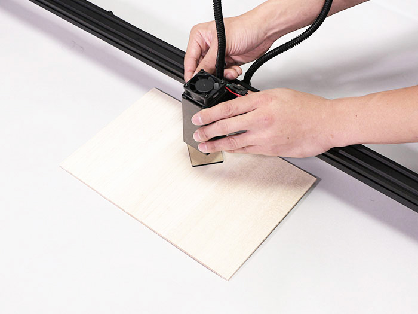
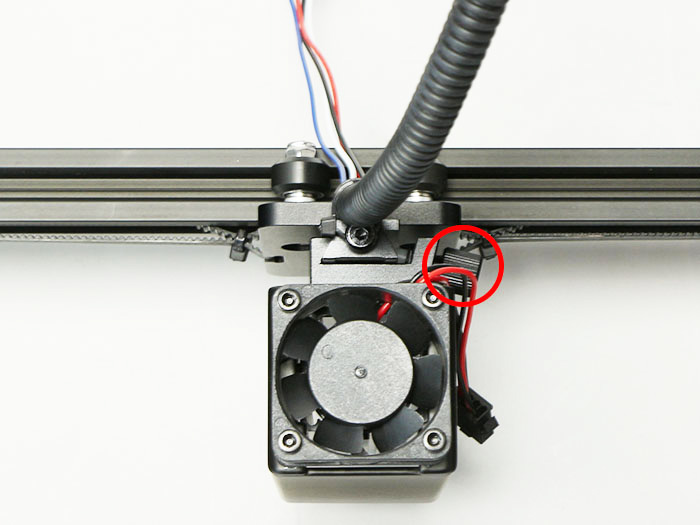
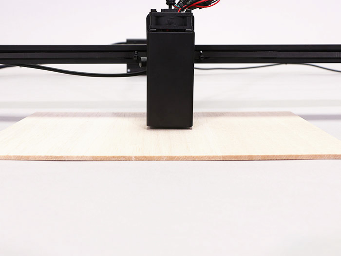
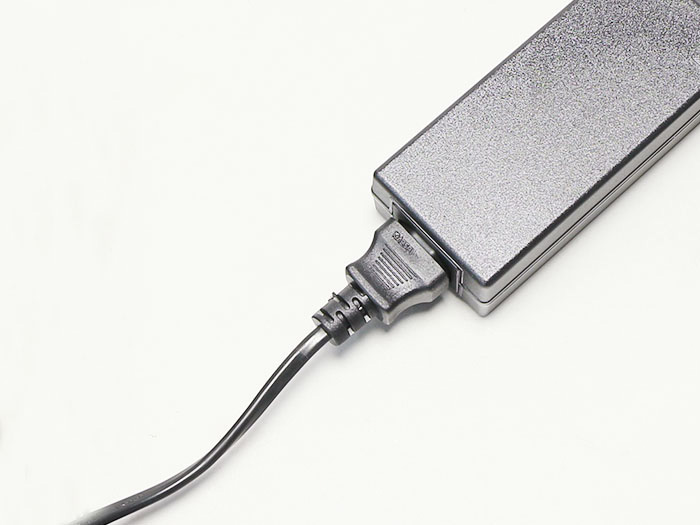
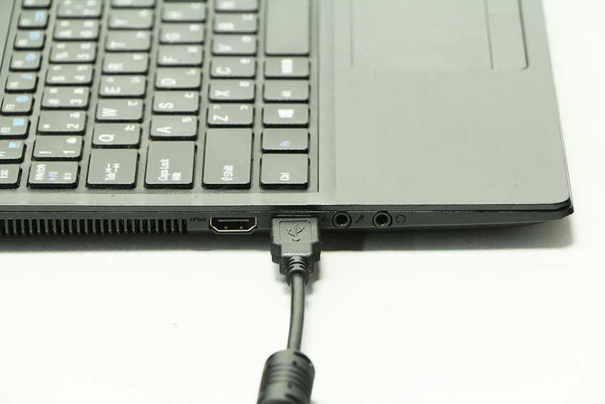

FABOOL Laser Miniで加工を行う際、加工する素材の厚さが変わるごとに、付属の高さ調整用アクリルを使い、以下の手順でレーザーユニットの高さの調整をってください。

## 高さ調整方法
加工対象素材を本装置にセットした状態で、高さ調整用アクリルを素材の上に置き、レーザーヘッドの下に来るようにします。

光学キャリアのネジを緩め、レーザーユニットが高さ調整用アクリルに当たるまで下げます。

光学キャリアのネジを締め、高さ調整用アクリルを抜き取ります。  
※手前に僅かにユニットが傾く場合がありますが、加工に影響のある傾斜ではありません。

## 動作確認
本工程において、電源を接続しただけではレーザーは照射されない仕様になっておりますが、万が一照射されてしまう場合は、直ちに電源を引き抜き組み立てを中止した上で、弊社までご連絡ください。   
※付属の保護メガネを着用し、レーザーユニットの下に床面を保護する素材（木板など）をセットした上で通電してください。

ACアダプタにACケーブルを接続します。

PCBケースにACアダプタを接続します。

PCBケースにUSBケーブルを接続します。

USBケーブルをPCに接続します。

ACケーブルを家庭用のコンセント（AC100V）に接続します。PCBケースのDCファンが回っていることを確認してください。

レーザーユニットのDCファンが回っていることを確認してください。

## 底面の保護素材設置
底面を保護する板を必ず設置してください。鉄板、ステンレス板などの不燃素材（レーザー光が反射しにくい暗い色のもの）の使用を推奨します。必ず加工範囲をカバーできる大きさのものをご使用ください。
