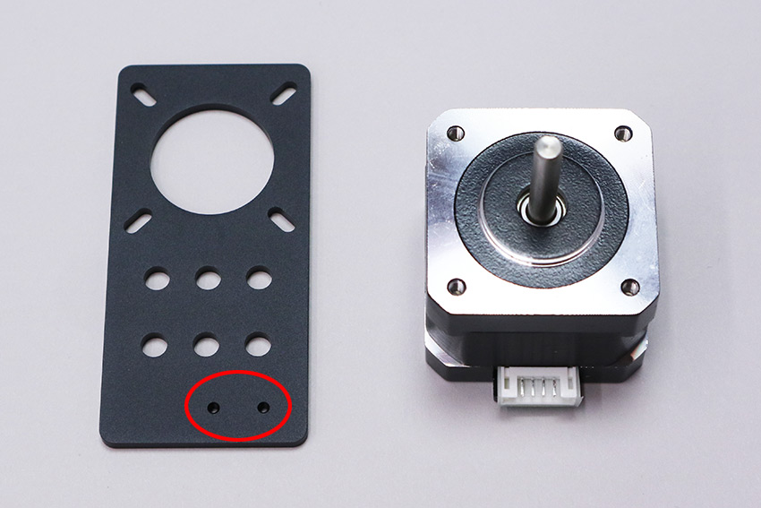
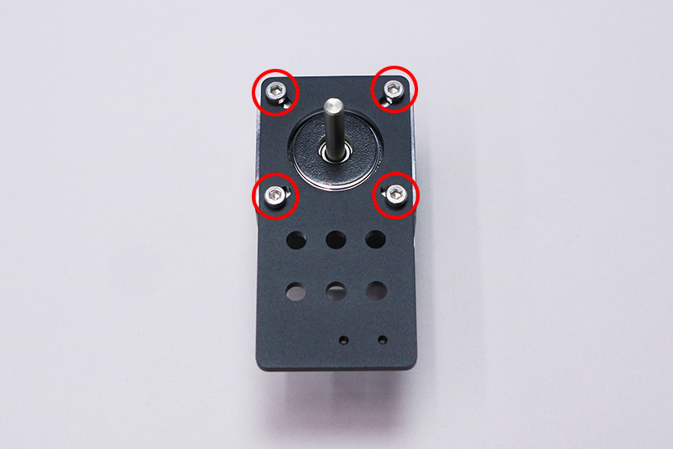
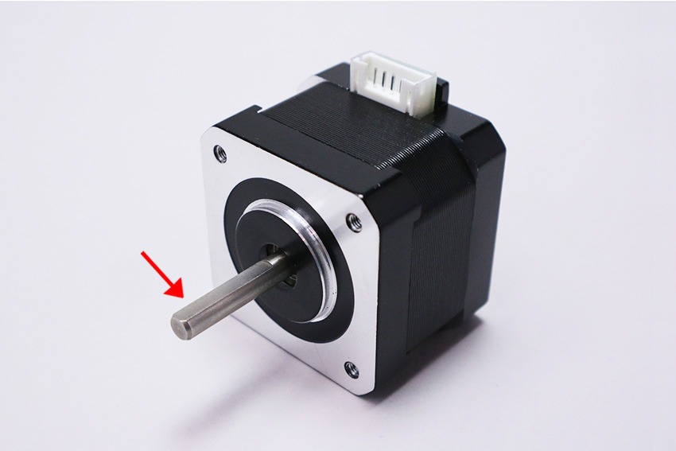
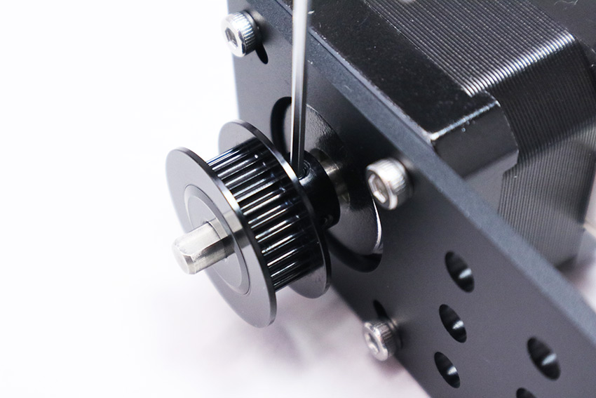
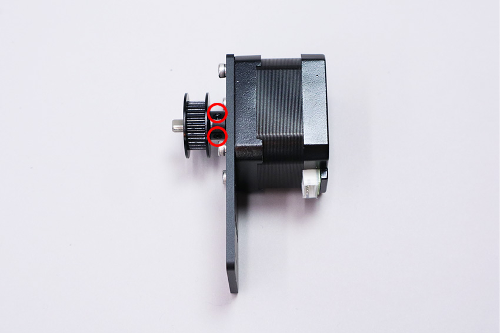
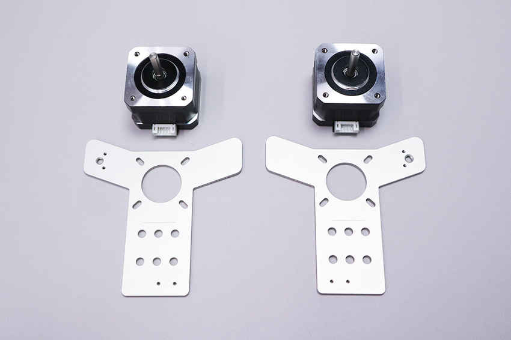
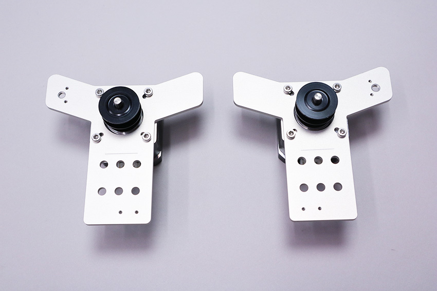

## 部品リスト
<table class="packing-list">
<tbody>
<tr>
<td>No</td>
<td>部品名</td>
<td>備考</td>
<td class="packing-img">画像</td>
<td>個数</td>
</tr>
<tr>
<td>32</td>
<td>ステッピングモーター</td>
<td></td>
<td></td>
<td>3</td>
</tr>
<tr>
<td>27</td>
<td>motor mount plate x-axis</td>
<td></td>
<td></td>
<td>1</td>
</tr>
<tr>
<td>28</td>
<td>motor mount plate y-axis</td>
<td></td>
<td></td>
<td>2</td>
</tr>
<tr>
<td>20</td>
<td>タイミングプーリー</td>
<td></td>
<td></td>
<td>3</td>
</tr>
<tr>
<td>38</td>
<td>M3&times;6 六角穴付きボルト</td>
<td>ネジケース</td>
<td></td>
<td>12</td>
</tr>
<tr>
<td>36</td>
<td>M3&times;3 イモネジ</td>
<td>ネジケース</td>
<td></td>
<td>6</td>
</tr>
</tbody>
</table>

## X軸モーターユニットの組み立て
### motor mount plate x-axisを取り付ける
ステッピングモーターに、motor mount plate x-axisをM3&times;6六角穴付きボルト4個で取り付けます。  
※motor mount plate x-axisには取り付ける向きがあるので注意してください。小さい2つの穴が右下に来るようにします。

### タイミングプーリーを取り付ける
ステッピングモーターにタイミングプーリーをM3イモネジ2個で取り付けます。どちらか片方のネジ穴をステッピングモーターのシャフト切りかけ部分に合わせて取り付けて下さい。  
※タイミングプーリーで取り付けたイモネジは後で高さを調整するので仮止めして下さい。

## Y軸モーターユニットの組み立て
### motor mount plate y-axisを取り付ける
ステッピングモーターにmotor mount plate y-axisをM3&times;6六角穴付きボルト8個で取り付けます。  
※motor mount plate y-axisのには取り付ける向きがあるので注意してください。

### タイミングプーリーを取り付ける
ステッピングモーターにタイミングプーリーをM3イモネジ2個で取り付けます。どちらか片方のネジ穴をステッピングモーターのシャフト切りかけ部分に合わせて取り付けてください。  
※タイミングプーリーで取り付けたイモネジは後で高さを調整するので仮止めしてください。

