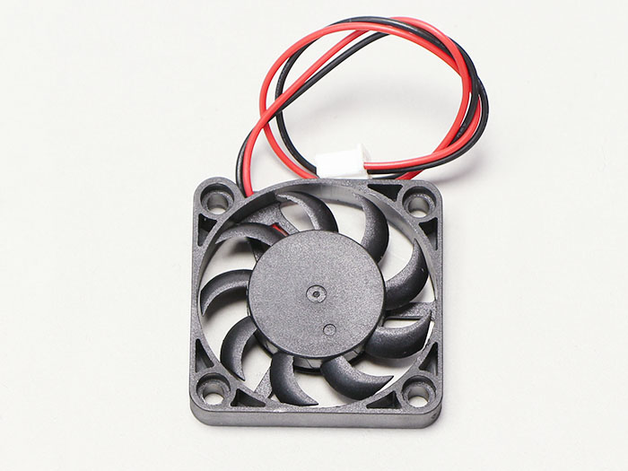
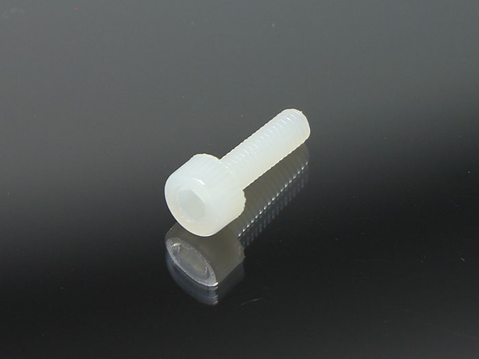

## 部品リスト
<table class="packing-list">
<tbody>
<tr>
<td>No</td>
<td>部品名</td>
<td>備考</td>
<td class="packing-img">画像</td>
<td>個数</td>
</tr>
<tr>
<td>23</td>
<td>PCBケース</td>
<td>フロントカバー、サイドカバー</td>
<td></td>
<td>1</td>
</tr>
<tr>
<td>34</td>
<td>DCファン</td>
<td></td>
<td></td>
<td>1</td>
</tr>
<tr>
<td>39</td>
<td>M3&times;6六角穴付き皿ボルト</td>
<td>ネジケース</td>
<td></td>
<td>8</td>
</tr>
<tr>
<td></td>
<td>M3&times;10ナイロンネジ</td>
<td>ネジケース</td>
<td></td>
<td>4</td>
</tr>
<tr>
<td>25</td>
<td>結束バンド</td>
<td></td>
<td></td>
<td>1</td>
</tr>
</tbody>
</table>

本工程は1.6Wモデルと3.5Wモデルで手順が異なります。3.5Wモデルの方は<a href="/manual/fabool-laser-mini-plus-1000-1000-pcb-case-assembly/#PCB35W">こちら</a>。

## PCBケースの組み立て（1.6W）
### DCファン取り付け
PCBケースにDCファンをM3&times;10ナイロンネジ4個で取り付けます。  
※DCファンには取り付ける向きがあるので注意して下さい。

DCファンケーブルをコントロール基板（FAN1かFAN2）に接続します。

DCファンケーブルとPCBケーブルを結束バンドで固定します。結束バンドの不要な部分を切り取ります。

### サイドカバーの取り付け
PCBケースにサイドカバーをM3&times;6六角穴付皿ボルト4個で取り付けます。  
※サイドカバーには取り付ける向きがあるので注意して下さい。

### フロントカバーの取り付け
フロントカバーをM3&times;6六角穴付皿ボルト4個で取り付けます。  
※カバーが閉じない場合はヒートシンクを5ｍｍ程傾けてください。

## PCBケースの組み立て（3.5W）
### DCファンの取り付け
PCBケースにDCファンをM3&times;10ナイロンネジ4個で取り付けます。  
※DCファンには取り付ける向きがあるので注意して下さい。

DCファンケーブルをコントロール基板（FAN1かFAN2）に接続します。

DCファンケーブルとPCBケーブルを結束バンドで固定します。

結束バンドの不要な部分を切り取ります。

### サイドカバーの取り付け
PCBケースにサイドカバーをM3&times;6六角穴付皿ボルト4個で取り付けます。  
※サイドカバーには取り付ける向きがあるので注意して下さい。

### フロントカバーの取り付け
フロントカバーをM3&times;6六角穴付皿ボルト4個で取り付けます。

