## 部品リスト
本工程は1.6Wモデルと3.5Wモデルで手順が異なります。以下にてそれぞれ説明しておりますので、該当箇所をご参照ください。

## PCBケースの組み立て（1.6W）
### DCファン取り付け
PCBケースにDCファンをM3&times;10ナイロンネジ4個で取り付けます。  
※DCファンには取り付ける向きがあるので注意して下さい。

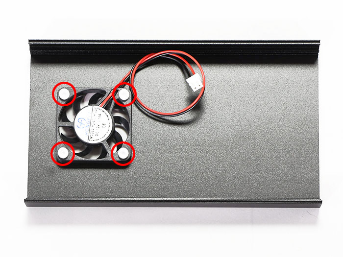

DCファンケーブルをコントロール基板（FAN1）に接続します。
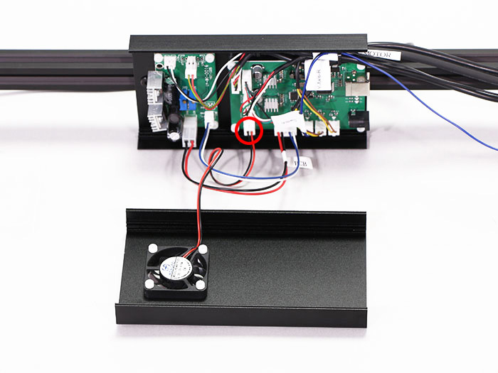

DCファンケーブルとPCBケーブルを結束バンドで固定します。
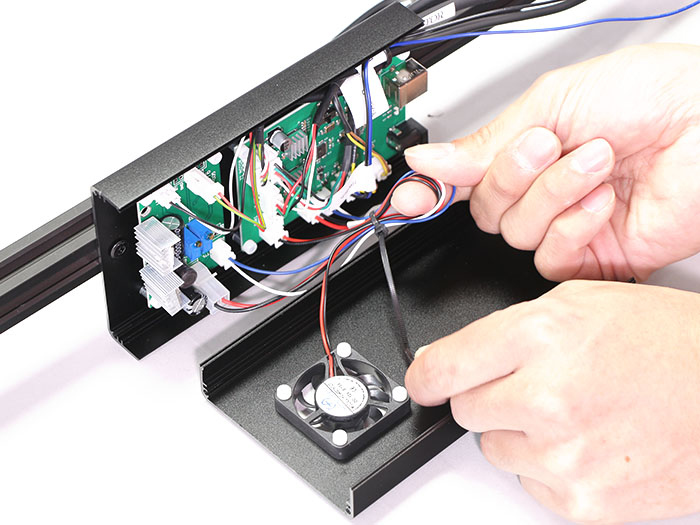

結束バンドの不要な部分を切り取ります。

### サイドカバーの取り付け
PCBケースにサイドカバーをM3&times;6六角穴付皿ボルト4個で取り付けます。  
※サイドカバーには取り付ける向きがあるので注意して下さい。
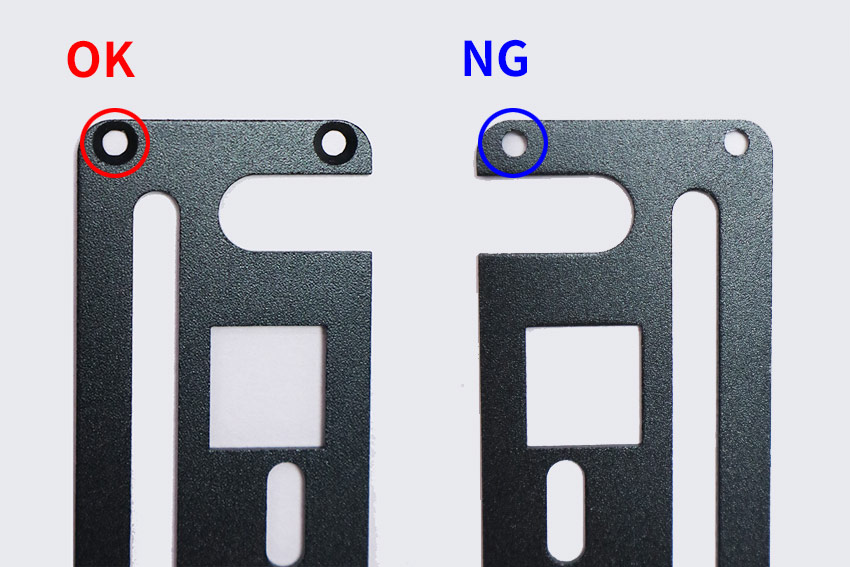

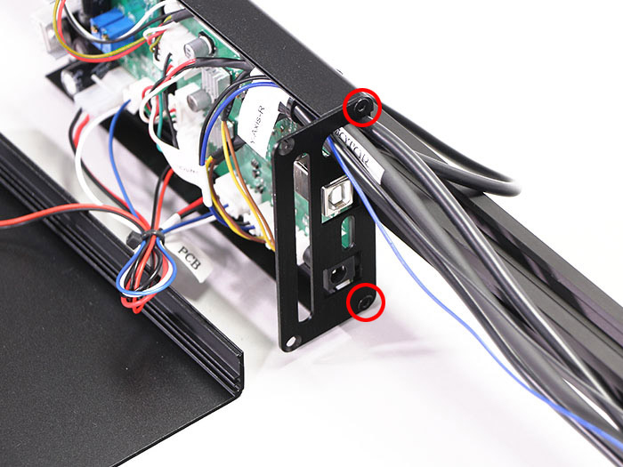

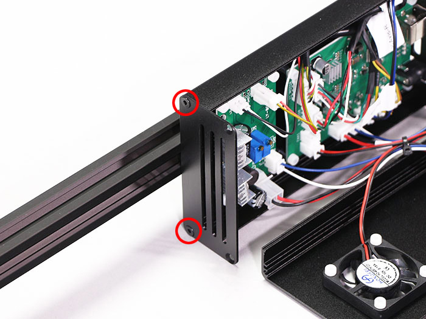

### フロントカバーの取り付け
フロントカバーをM3&times;6六角穴付皿ボルト4個で取り付けます。  
※カバーが閉じない場合はヒートシンクを5ｍｍ程傾けてください。
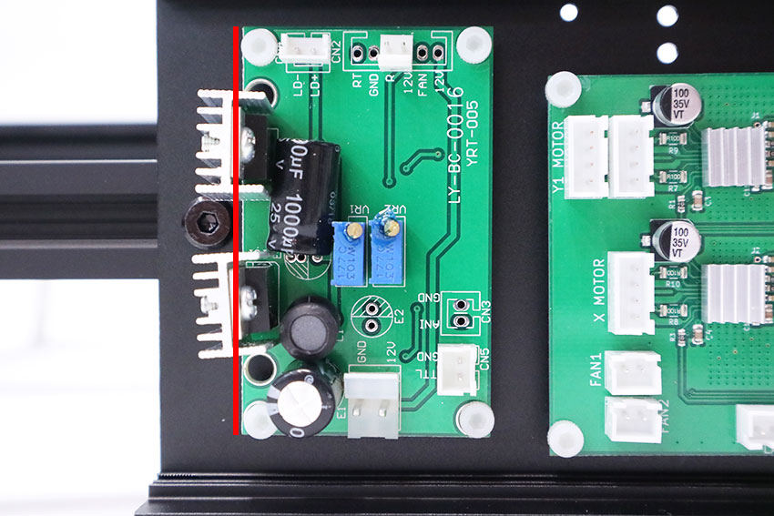

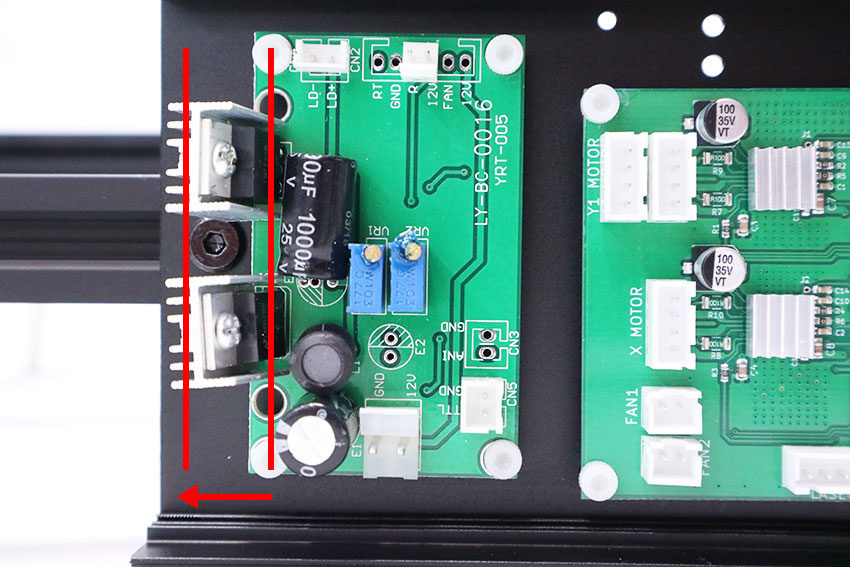

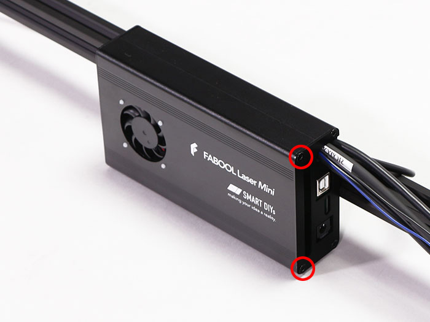

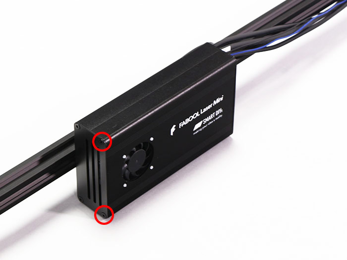

## PCBケースの組み立て（3.5W）
### DCファンの取り付け
PCBケースにDCファンをM3&times;10ナイロンネジ4個で取り付けます。  
※DCファンには取り付ける向きがあるので注意して下さい。

DCファンケーブルをコントロール基板（FAN1）に接続します。
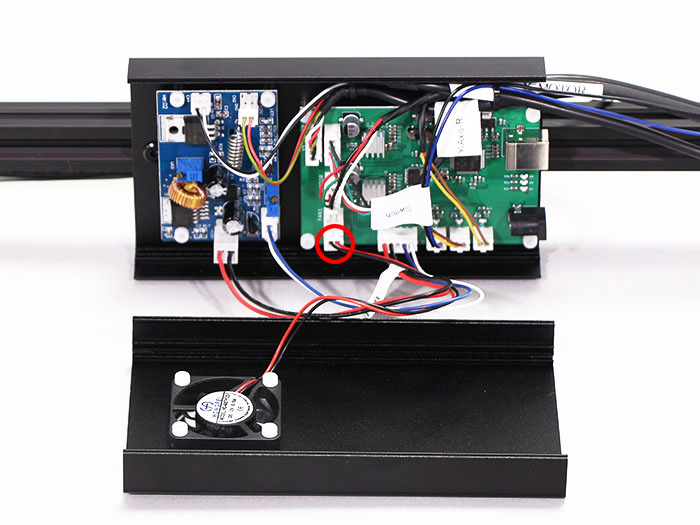

DCファンケーブルとPCBケーブルを結束バンドで固定します。

結束バンドの不要な部分を切り取ります。

### サイドカバーの取り付け
PCBケースにサイドカバーをM3&times;6六角穴付皿ボルト4個で取り付けます。  
※サイドカバーには取り付ける向きがあるので注意して下さい。

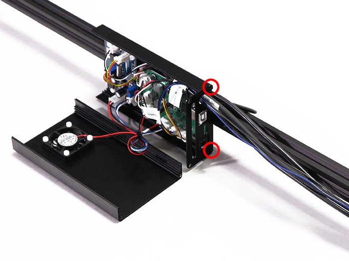

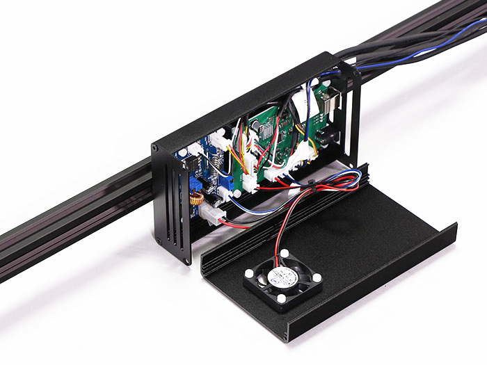

### フロントカバーの取り付け
フロントカバーをM3&times;6六角穴付皿ボルト4個で取り付けます。

