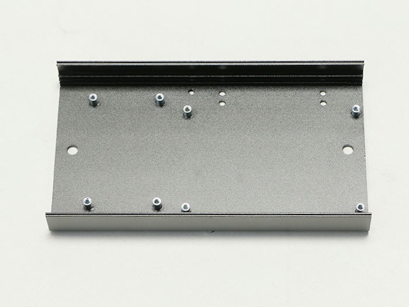
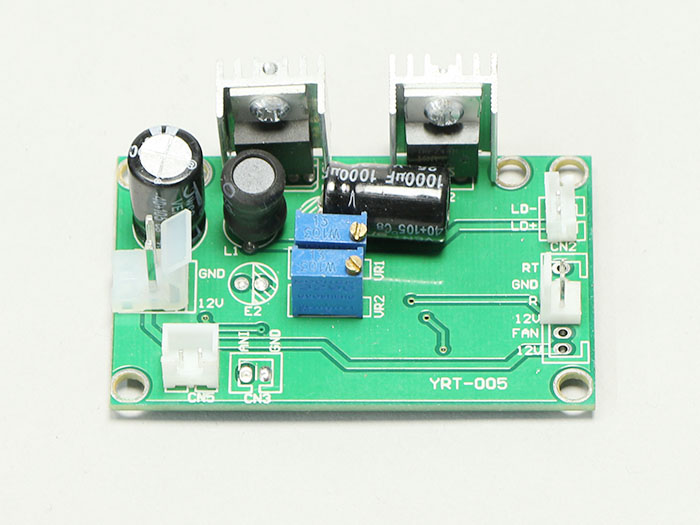
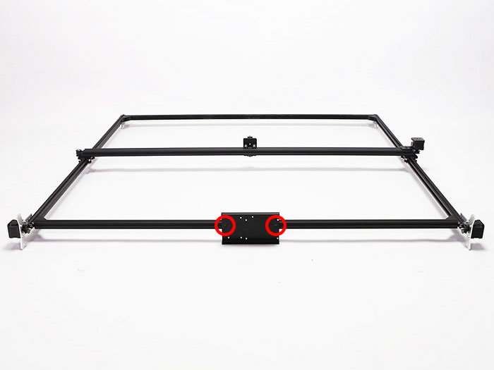
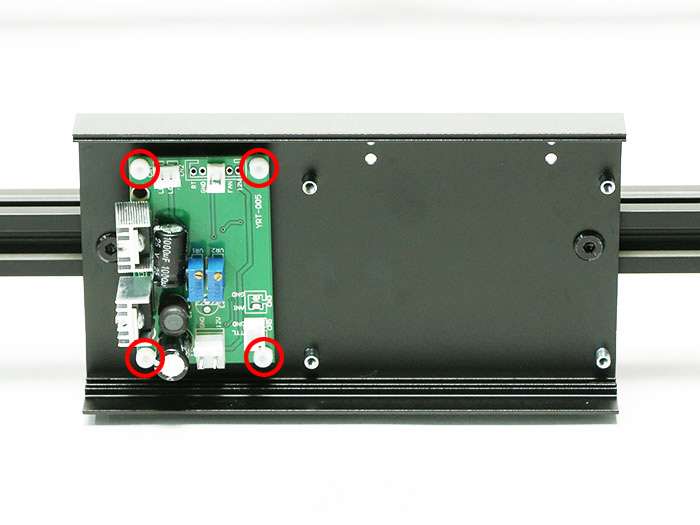
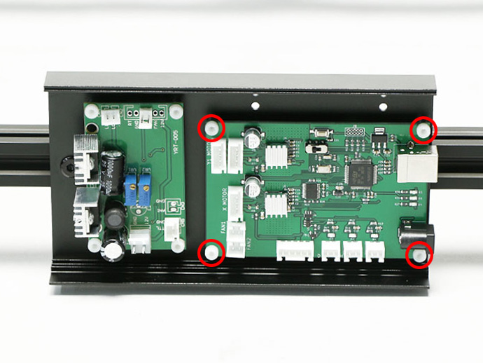
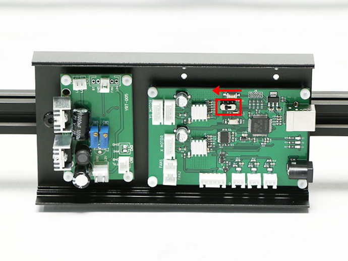
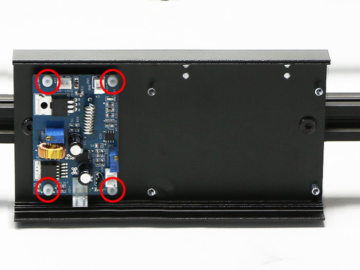
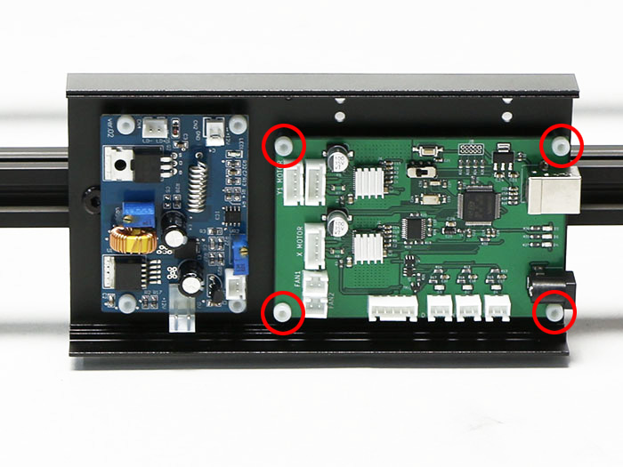
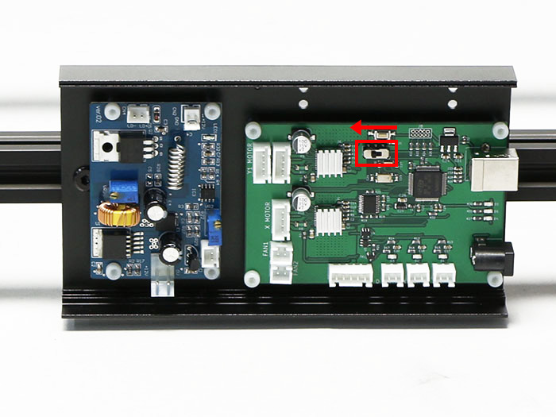

## 部品リスト
<table class="packing-list">
<tbody>
<tr>
<td>No</td>
<td>部品名</td>
<td>備考</td>
<td class="packing-img">画像</td>
<td>個数</td>
</tr>
<tr>
<td>24</td>
<td>PCBケース</td>
<td></td>
<td></td>
<td>1</td>
</tr>
<tr>
<td></td>
<td>レーザー基板 （1.6W/3.5W）</td>
<td></td>
<td></td>
<td>1</td>
</tr>
<tr>
<td>34</td>
<td>コントロール基板</td>
<td></td>
<td></td>
<td>1</td>
</tr>
<tr>
<td>45</td>
<td>M5×6 低頭ボルト</td>
<td>ネジケース</td>
<td></td>
<td>4</td>
</tr>
<tr>
<td>38</td>
<td>M3×5 ナイロンネジ</td>
<td>ネジケース</td>
<td></td>
<td>11</td>
</tr>
</tbody>
</table>

 

本工程は1.6Wモデルと3.5Wモデルで手順が異なります。以下にてそれぞれ説明しておりますので、該当箇所をご参照ください。

## 基板の取り付け（1.6W）
<a href="http://manual/fabool-laser-mini-plus-y-axis-assembly">Y軸の組み立て</a>で予め入れておいたM5Tナットを使用しPCBケースをM5&times;6低頭ボルト2個で取り付けます。

PCBケースにレーザー基板をM3&times;5ナイロンネジ4個で取り付けます。

PCBケースにコントロール基板をM3&times;5ナイロンネジ4個で取り付けます。

コントロール基板のスイッチが左側にあることを確認してください。

## 基板の取り付け（3.5W）
<a href="http://manual/fabool-laser-mini-plus-y-axis-assembly">Y軸の組み立て</a>で予め入れておいたM5Tナットを使用しPCBケースをM5&times;6低頭ボルト2個で取り付けます。

PCBケースにレーザー基板をM3&times;5ナイロンネジ4個で取り付けます。

PCBケースにコントロール基板をM3&times;5ナイロンネジ4個で取り付けます。

コントロール基板のスイッチが左側にあることを確認してください。

