## 部品リスト
<table class="packing-list">
<tbody>
<tr>
<td>部品名</td>
<td>備考</td>
<td class="packing-img">画像</td>
<td>個数</td>
</tr>
<tr>
<td>ケーブルキャリア</td>
<td></td>
<td>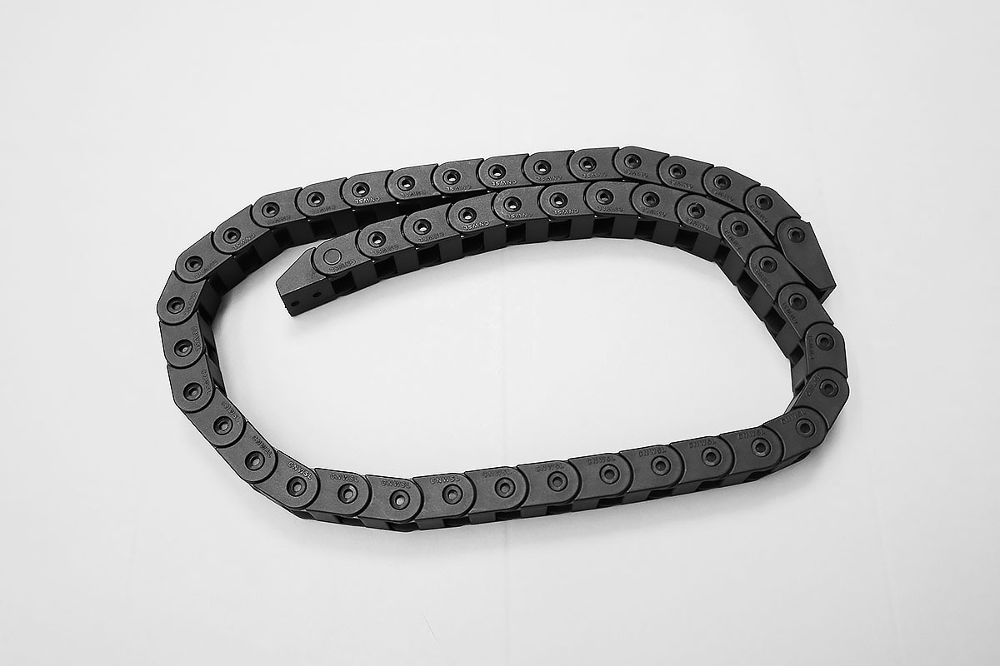</td>
<td>1</td>
</tr>
<tr>
<td>PCBケーブル</td>
<td></td>
<td></td>
<td>1</td>
</tr>
<tr>
<td>Laserケーブル</td>
<td>一部の製品には形状の違うケーブルが入っています</td>
<td></td>
<td>1</td>
</tr>
<tr>
<td>X-Axisケーブル</td>
<td></td>
<td>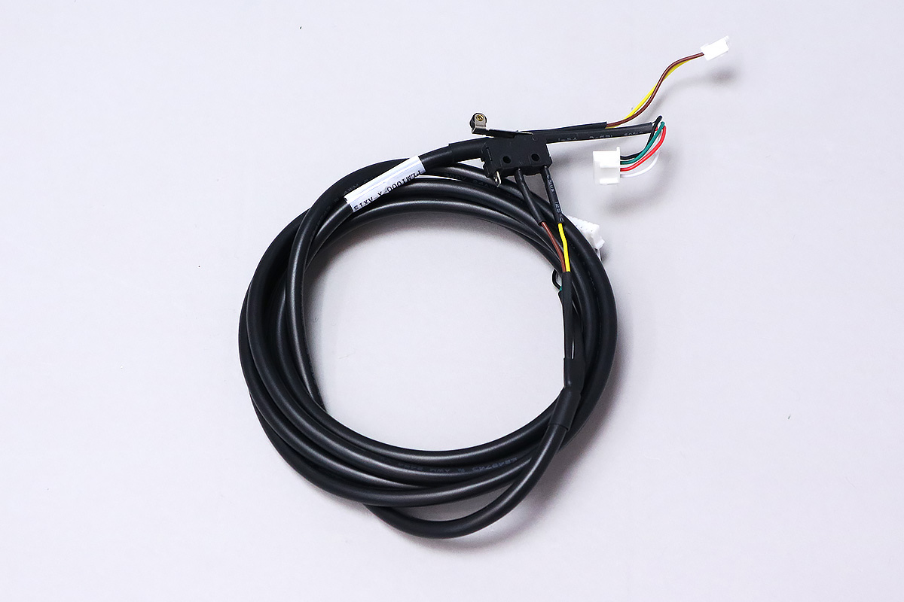</td>
<td>1</td>
</tr>
<tr>
<td>Y-Axis-Rケーブル</td>
<td></td>
<td>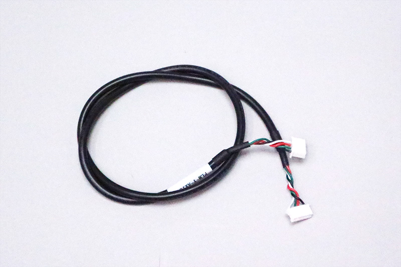</td>
<td>1</td>
</tr>
<tr>
<td>Y-Axis-Lケーブル</td>
<td></td>
<td>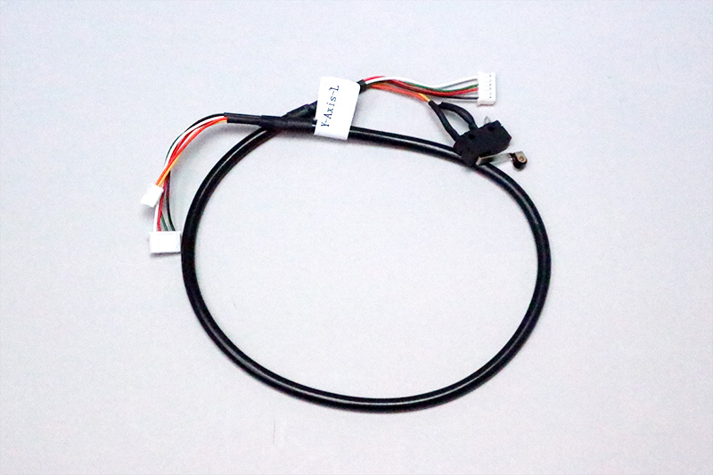</td>
<td>1</td>
</tr>
<tr>
<td>Foot Switchケーブル</td>
<td></td>
<td></td>
<td>1</td>
</tr>
<tr>
<td>結束バンド</td>
<td></td>
<td></td>
<td>2</td>
</tr>
</tbody>
</table>

## ケーブルキャリア準備
ケーブルキャリアにLaserケーブルを通します。
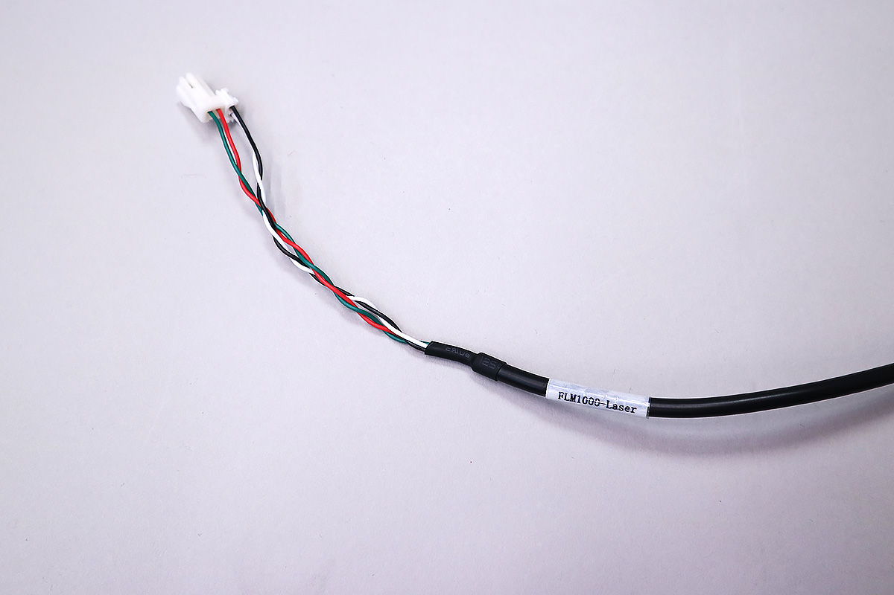
ケーブルキャリアは折り曲げられる向きがあります。写真の用にケーブルキャリアを置き、赤丸の側から
Laserケーブルを通してください。
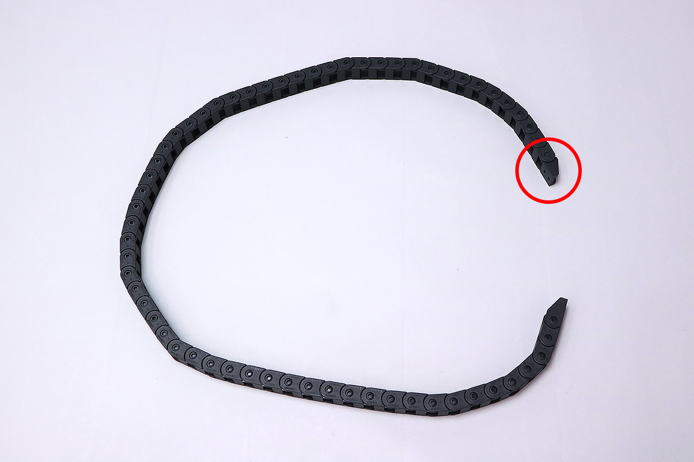

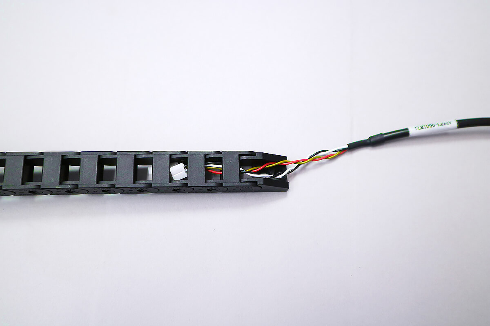

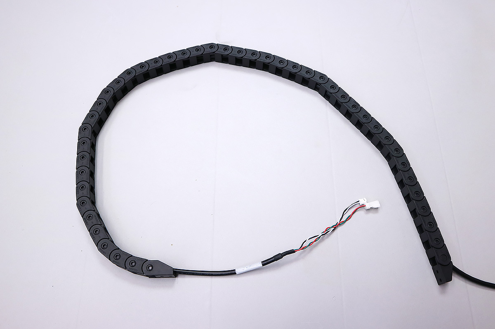

以下工程は1.6Wモデルと3.5Wモデルで手順が異なります。3.5Wモデルの方は<a href="#35W">こちら</a>。

## 配線（1.6W）
以下の写真を参考に計6種類のケーブルの配線を行います。

### PCBケーブル
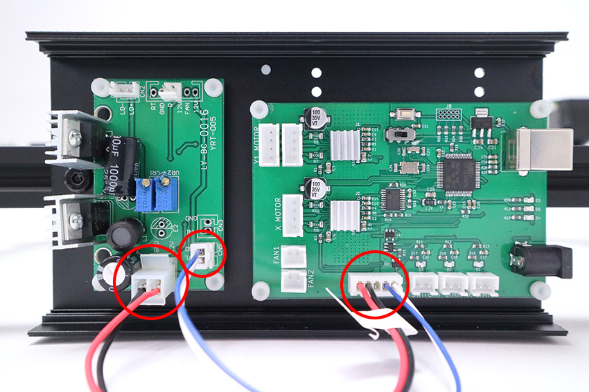

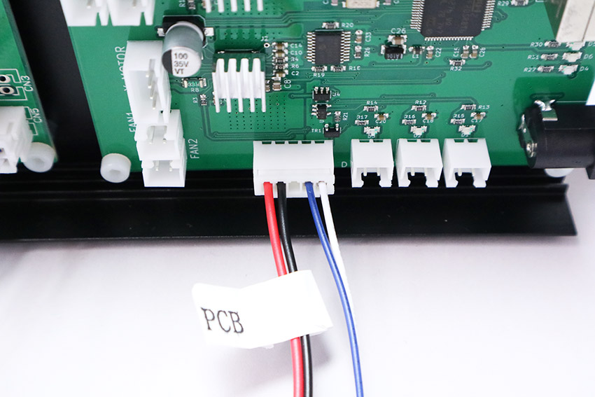

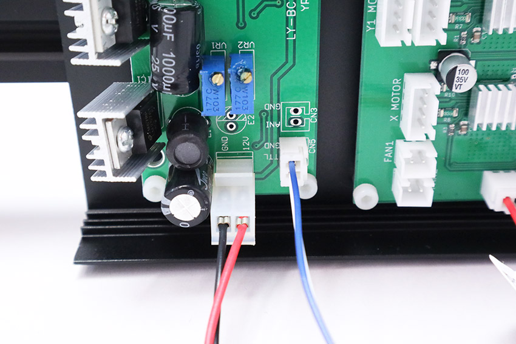

### Laserケーブル
※反対側は後ほど配線

### X-Axisケーブル
※反対側は後ほど配線

### Y-Axis-Rケーブル
※反対側は後ほど配線

### Y-Axis-Lケーブル
※反対側は後ほど配線

### Foot Switchケーブル
※反対側は後ほど配線

### ケーブルをすべて接続した状態
PCBケース内の配線を2本の結束バンドを使ってまとめます。
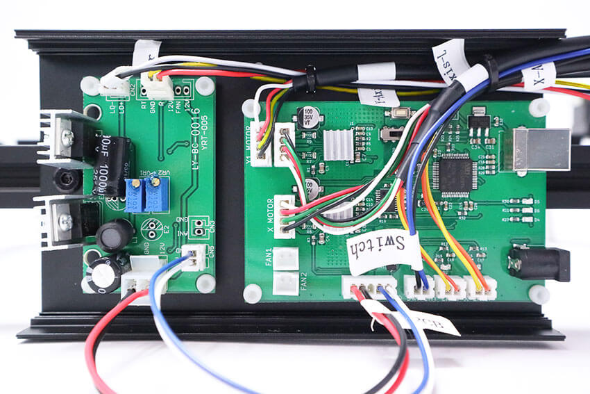

配線まとめ後の結束バンドを裏から見ると写真の通りになります。結束バンドの不要な部分を切り取ります。
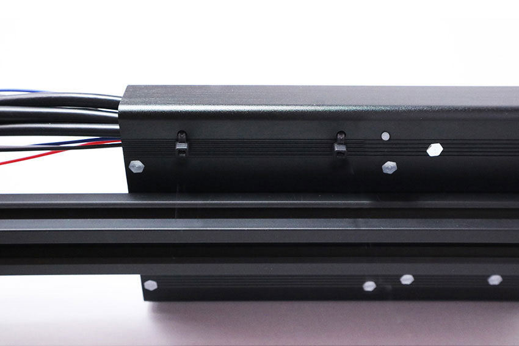

## 配線（3.5W）
以下の写真を参考に計6種類のケーブルの配線を行います。

### PCBケーブル
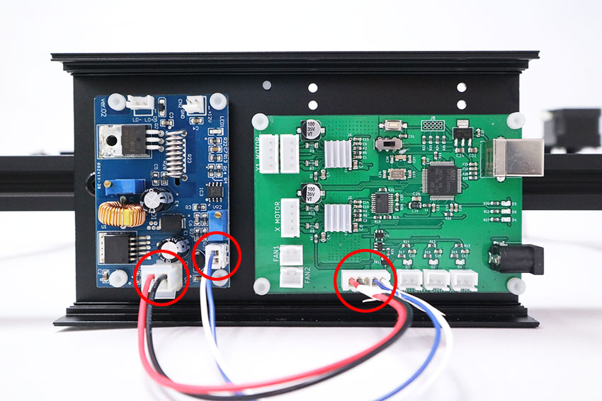

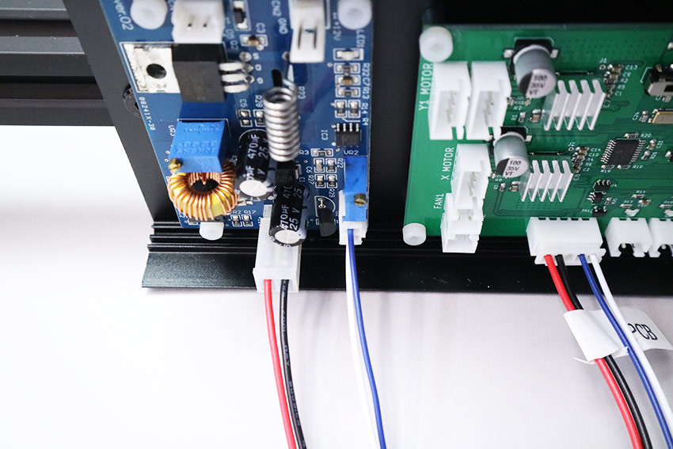

### Laserケーブル
※反対側は後ほど配線
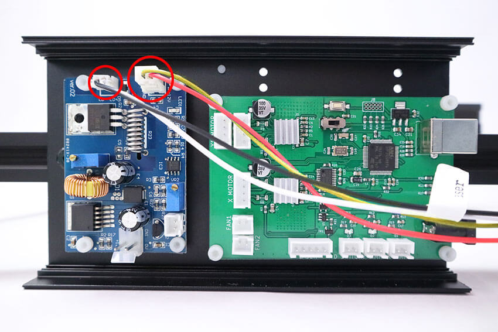

### X-Axisケーブル
※反対側は後ほど配線
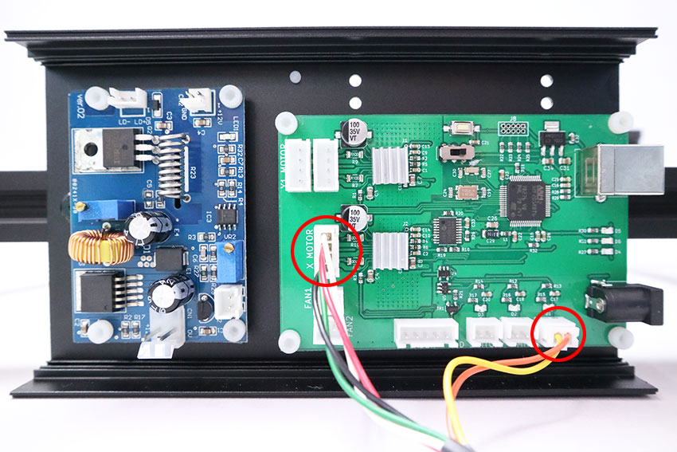

### Y-Axis-Rケーブル
※反対側は後ほど配線

### Y-Axis-Lケーブル
※反対側は後ほど配線
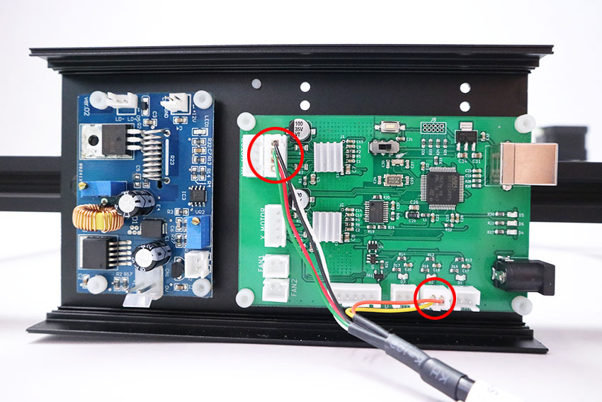

### Foot Switchケーブル
※反対側は後ほど配線

### ケーブルをすべて接続した状態
PCBケース内の配線を2本の結束バンドを使ってまとめます。
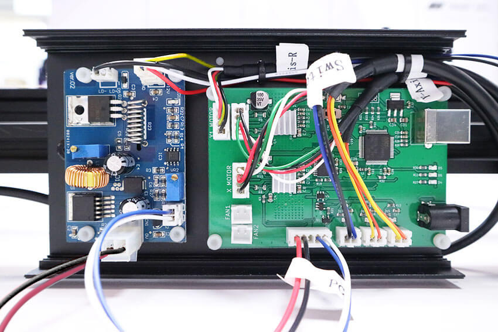

配線まとめ後の結束バンドを裏から見ると写真の通りになります。結束バンドの不要な部分を切り取ります。

