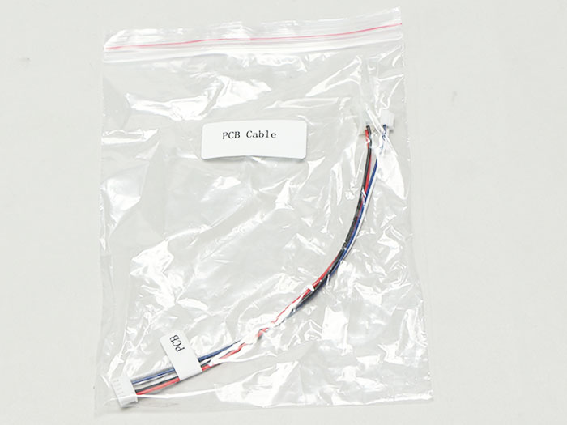
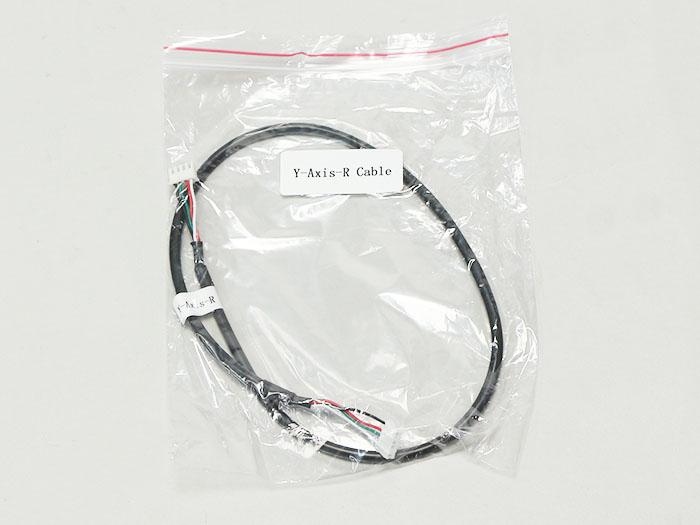

## 部品リスト
<table class="packing-list">
<tbody>
<tr>
<td>No</td>
<td>部品名</td>
<td>備考</td>
<td class="packing-img">画像</td>
<td>個数</td>
</tr>
<tr>
<td>13</td>
<td>PCBケーブル</td>
<td></td>
<td></td>
<td>1</td>
</tr>
<tr>
<td>14</td>
<td>Laserケーブル</td>
<td></td>
<td></td>
<td>1</td>
</tr>
<tr>
<td>15</td>
<td>X-Axisケーブル</td>
<td></td>
<td></td>
<td>1</td>
</tr>
<tr>
<td>16</td>
<td>Y-Axis-Rケーブル</td>
<td></td>
<td></td>
<td>1</td>
</tr>
<tr>
<td>17</td>
<td>Y-Axis-Lケーブル</td>
<td></td>
<td></td>
<td>1</td>
</tr>
<tr>
<td>18</td>
<td>Foot Switchケーブル</td>
<td></td>
<td></td>
<td>1</td>
</tr>
<tr>
<td>26</td>
<td>結束バンド</td>
<td></td>
<td></td>
<td>1</td>
</tr>
</tbody>
</table>

 

本工程は1.6Wモデルと3.5Wモデルで手順が異なります。以下にてそれぞれ説明しておりますので、該当箇所をご参照ください。

## 配線（1.6W）
以下の写真を参考に計6種類のケーブルの配線を行います。

### PCBケーブル

