## 部品リスト
<table class="packing-list">
<tbody>
<tr>
<td>No</td>
<td>部品名</td>
<td>備考</td>
<td class="packing-img">画像</td>
<td>個数</td>
</tr>
<tr>
<td>19</td>
<td>コルゲートチューブ</td>
<td></td>
<td>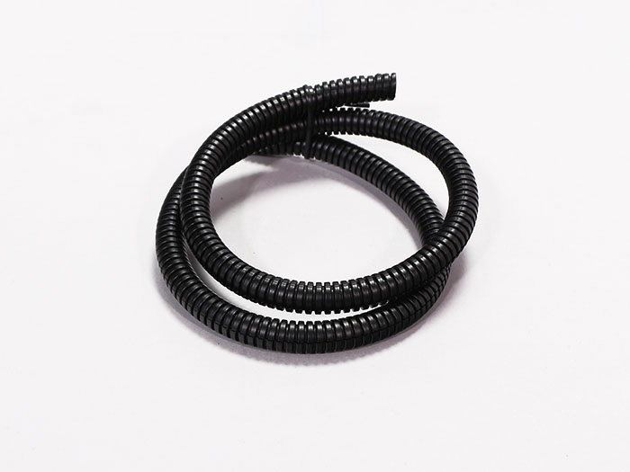</td>
<td>1</td>
</tr>
<tr>
<td>42</td>
<td>M3後入れナット</td>
<td>ネジケース</td>
<td></td>
<td>3</td>
</tr>
<tr>
<td>39</td>
<td>M3×6六角穴付きボルト</td>
<td>ネジケース</td>
<td></td>
<td>22</td>
</tr>
<tr>
<td>25</td>
<td>結束バンド固定具</td>
<td></td>
<td></td>
<td>1</td>
</tr>
<tr>
<td>26</td>
<td>結束バンド</td>
<td></td>
<td>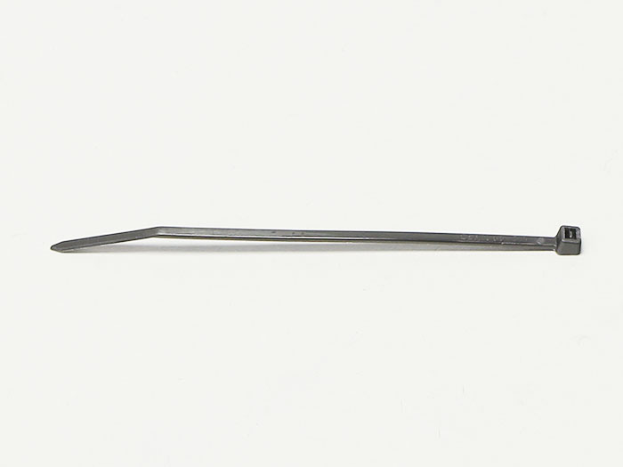</td>
<td>1</td>
</tr>
<tr>
<td>36</td>
<td>M2x10六角穴付ボルト</td>
<td>ネジケース</td>
<td></td>
<td>8</td>
</tr>
</tbody>
</table>

## 結束バンド固定具を取り付ける
写真は本体背面から見ています。  
赤丸と矢印の位置に結束バンド固定具を取り付けていきます。  
※矢印はPCBを取り付けたフレームの底面を表しています。
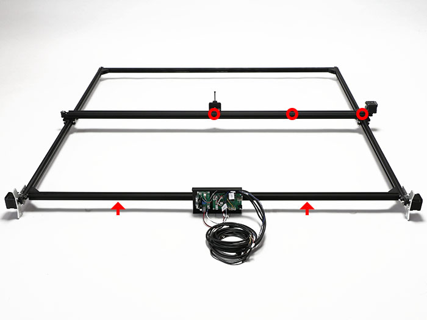

本体を立て、赤丸の箇所にM3後入ナット2個をフレームの溝に入れ、M3&times;6六角穴付きボルト2個で結束バンド固定具2個を取り付けます。
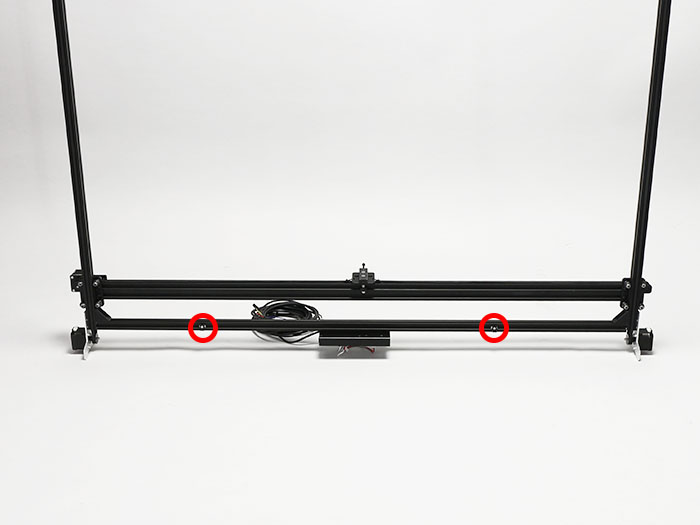

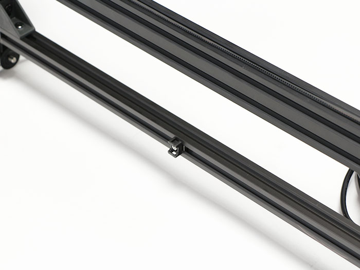

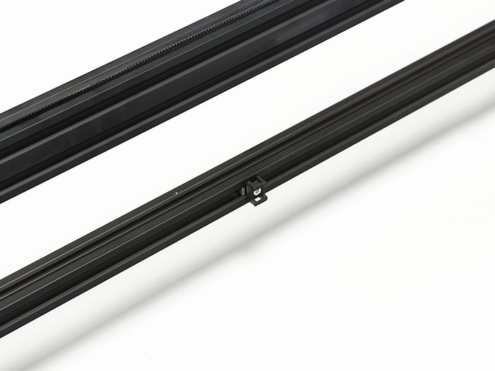

次に赤丸の位置に結束バンド固定具を取り付けます。

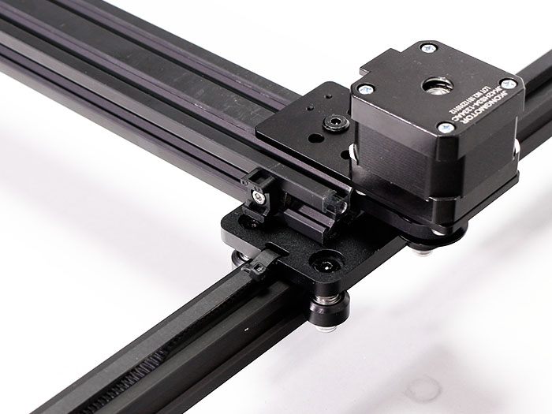

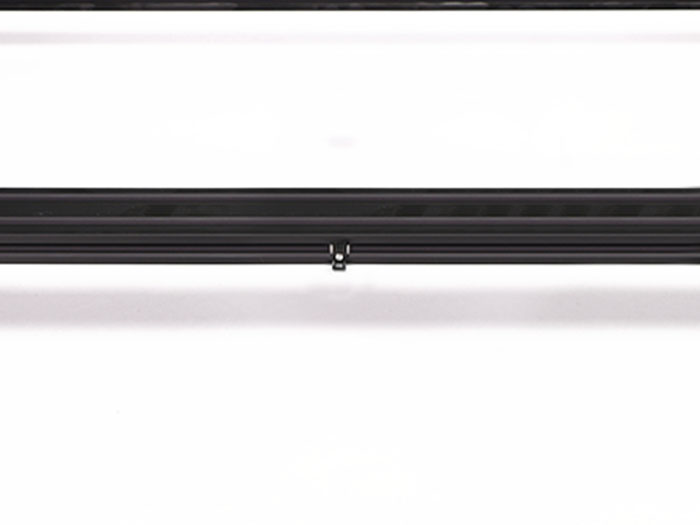

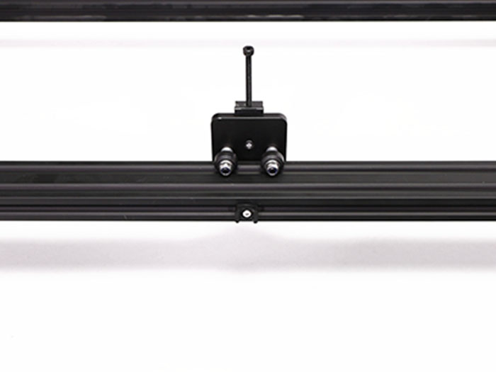

## 本体右側配線
Y-Axis-Rケーブルを配線します。  
写真を参考に、Y-Axis-Rケーブルを結束バンドで結束バンド固定具に固定します。
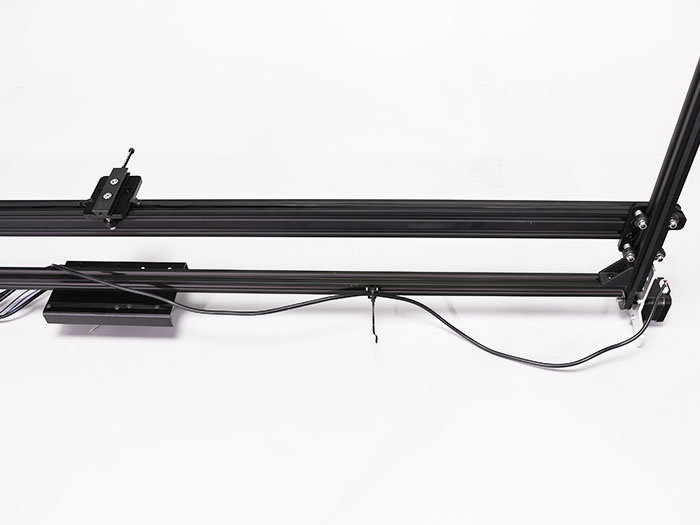

Y-Axis-Rケーブルのコネクタをステッピングモーターに接続します。

## 本体左側配線
写真を参考に、以下ケーブルを結束バンドで結束バンド固定具に固定します。  
・Laserケーブル  
・X-Axisケーブル  
・Y-Axis-Lケーブル  
・Foot Switchケーブル
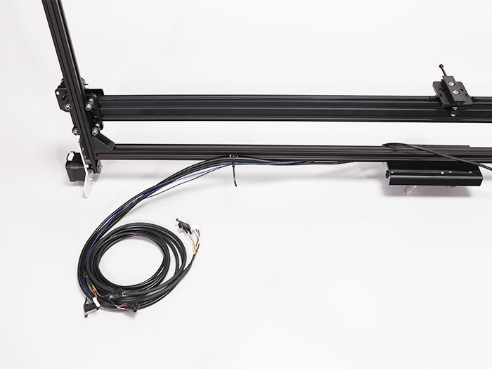

Foot SwitchケーブルをM2&times;10 六角穴付きボルト2個で取り付けます。
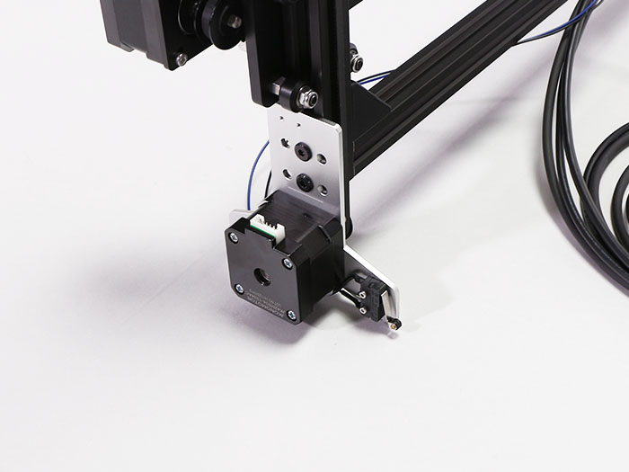

立てている本体を倒します。
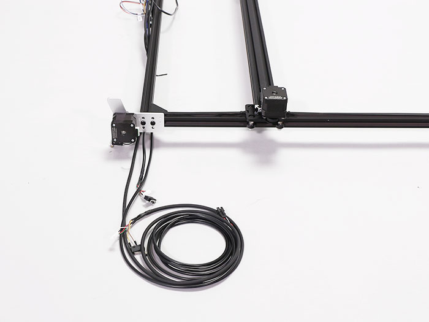

Y-Axis-Lケーブルのコネクタをステッピングモーターに接続します。
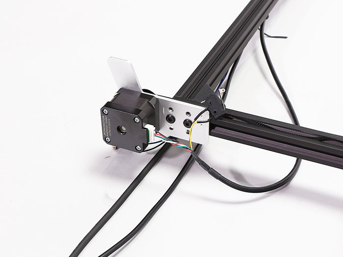

Y-Axis-Lケーブルのリミットスイッチの向きに注意してM2&times;10 六角穴付きボルト2個で取り付けます。
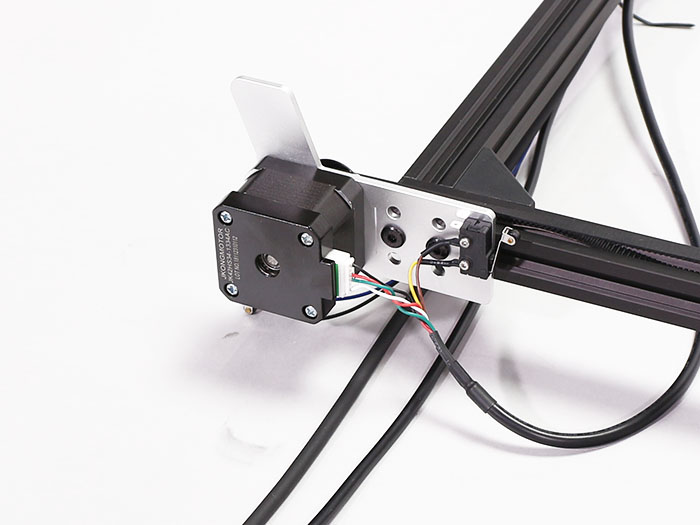

X-Axisケーブルのリミットスイッチの向きに注意してM2&times;10六角穴付きボルト2個で取り付けます。
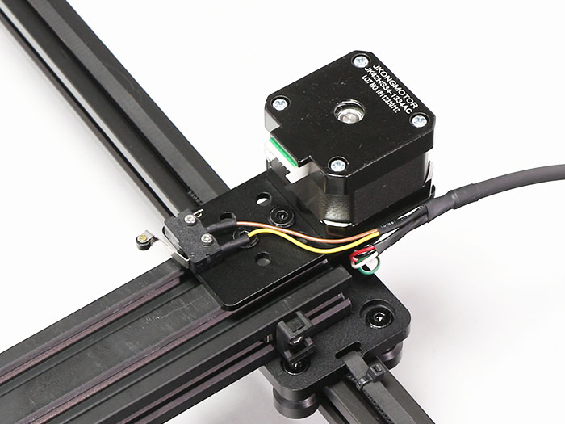

X-Axisケーブルのモーターコネクタをステッピングモーターに接続します。
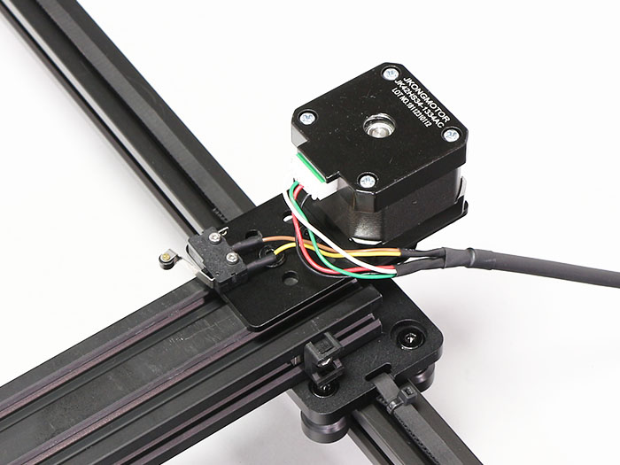

写真を参考に、X-AxisケーブルとLaserケーブルを赤丸の位置の結束バンド固定具と結束バンドで固定します。  
結束バンドをきつく締める際にX軸ユニットを写真を参考にPCBから最大まで離してケーブルの長さを調節してください。
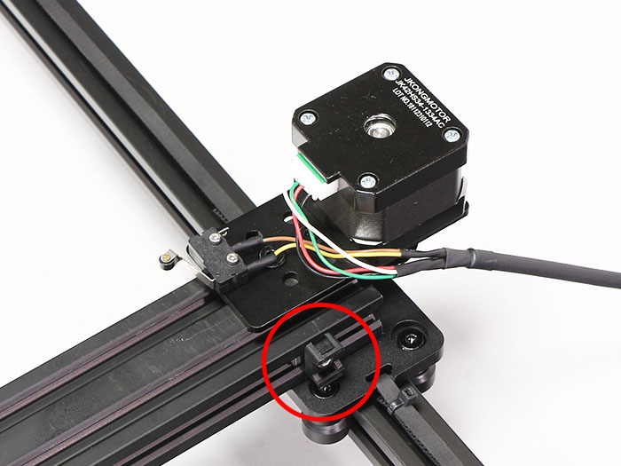

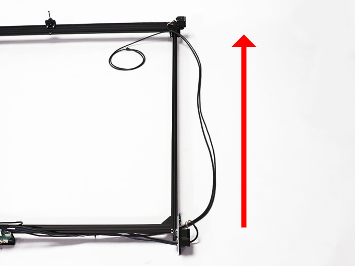

Laserケ－ブルにコルゲートチューブを通します。  
コルゲートチューブの切れ目にLaserケーブルを押し込んで入れます。
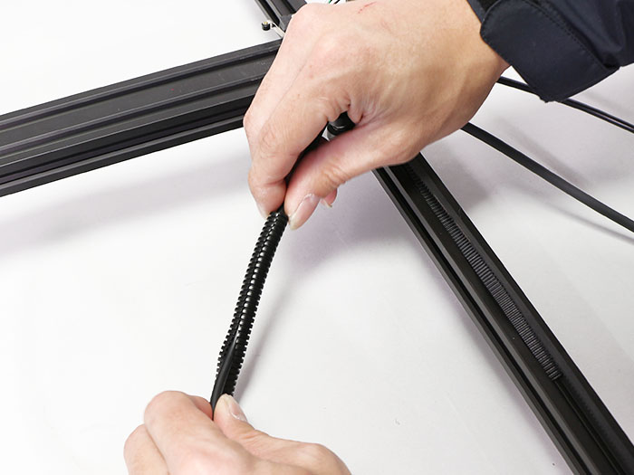

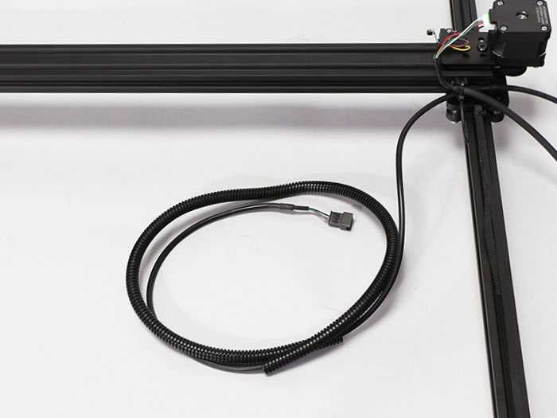

写真を参考に取り付けた結束バンド固定具に結束バンドでLaserケーブルを固定します。
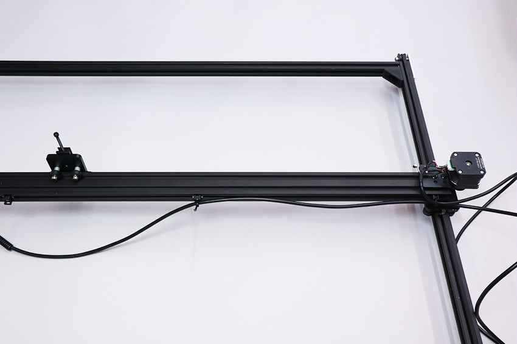

Laserケーブルのコルゲートチューブ先端をX軸中央に取り付けた結束バンド固定具に結束バンドで固定します。
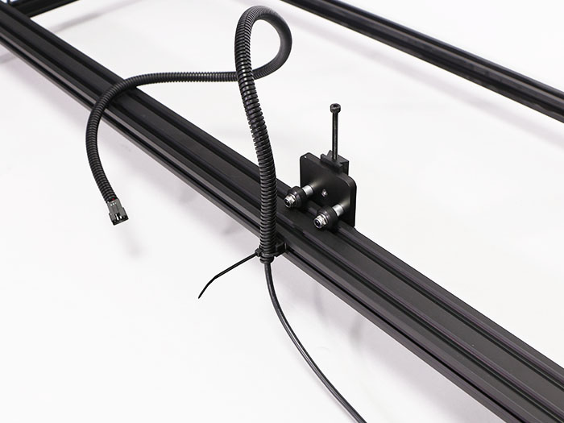

コルゲートチューブの反対側はmini v plate_Cの上部に取り付けたM4&times;40六角穴付きボルトに結束バンド2本で取り付けます。
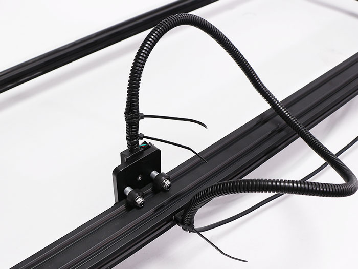

最後に、結束バンドの不要な部分は切り取ります。
