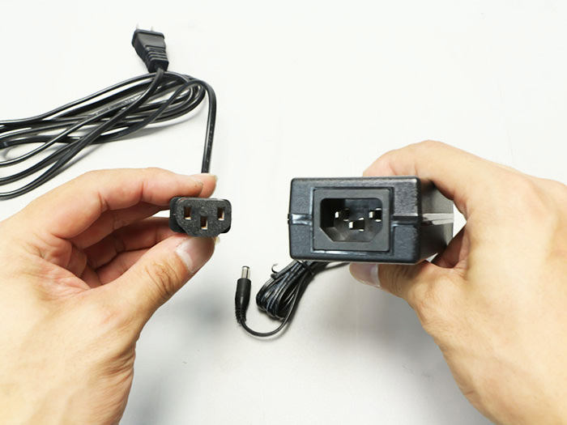
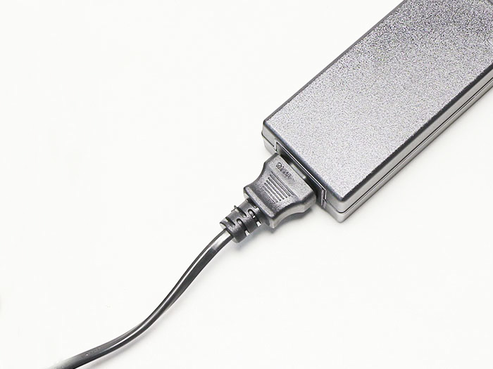
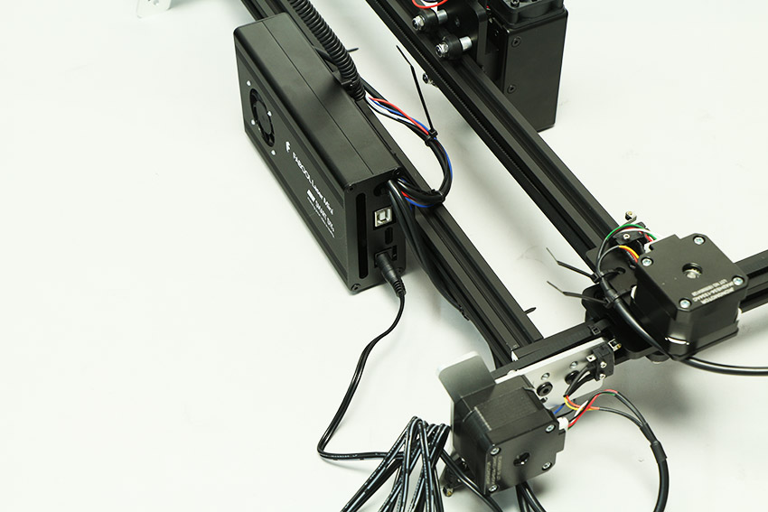
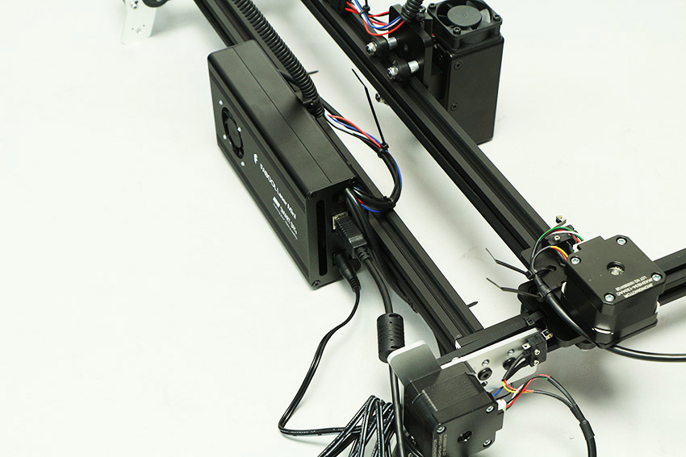
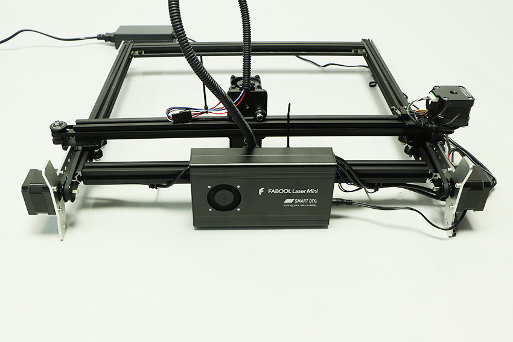
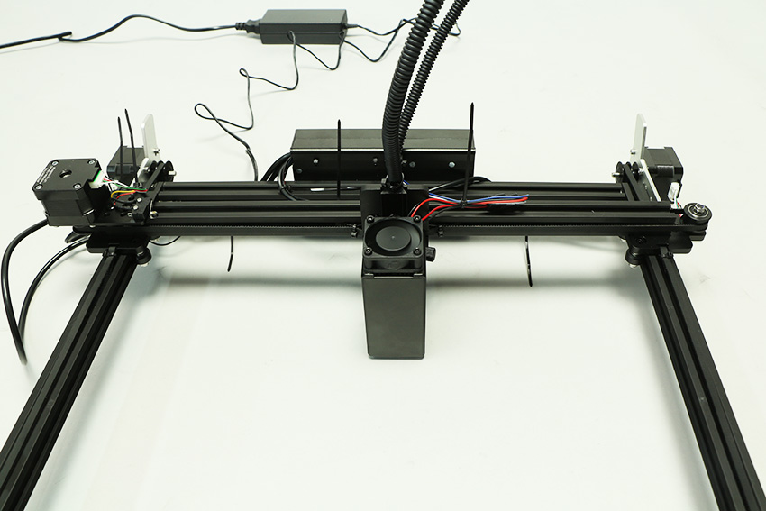
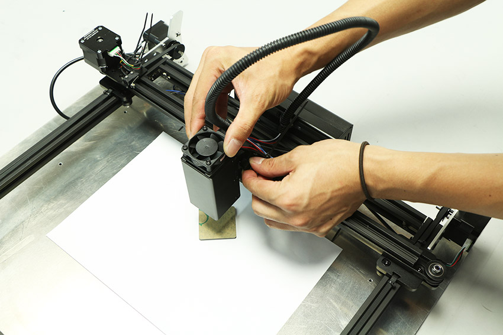
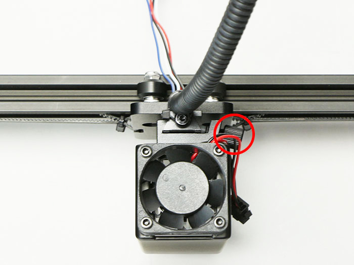
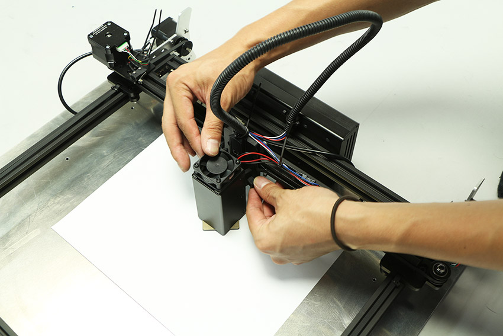
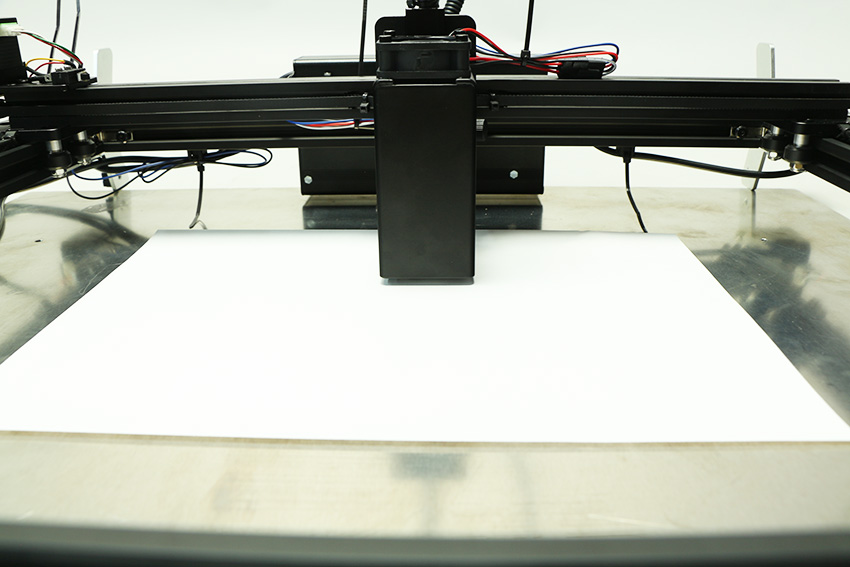

実際に素材を加工しながら動作チェックをしていきます。PCと素材（コピー用紙などの白い素材は避けてください）、並びに底面を保護する板をご用意ください。底面を保護する板は鉄板、ステンレス板などの不燃素材（レーザー光が反射しにくい暗い色のもの）の使用を推奨します。必ず加工範囲をカバーできる大きさのものをご使用ください。

## 電源を入れる
電源を接続しただけではレーザーは照射されない仕様になっておりますが、万が一照射されてしまう場合は、直ちに電源を引き抜き組み立てを中止した上で、弊社までご連絡ください。
※付属の保護メガネを着用し、レーザーユニットの下に床面を保護する素材（木板など）をセットした上で通電してください。

ACアダプタにACケーブルを接続します。

PCBケースにACアダプタを接続します。

PCBケースにUSBケーブルを接続します。

USBケーブルをPCに接続します。

ACケーブルを家庭用のコンセント（AC100V）に接続します。PCBケースのDCファンが回っていることをご確認ください。

レーザーユニットのDCファンが回っていることをご確認ください。

#### トラブルシューティング
**電源が入らない**
- ACアダプターのLEDが点灯していますか？点灯していない場合、ACケーブルの接続をご確認ください。

- コントロール基板のLEDの下部、青色のLEDは点灯していますか？点灯していない場合、コントーロール基盤のケーブルの配線が正常でない可能性があります。<a href="/manual/fabool-laser-mini-300-230-wiring-1/">配線1</a>をご覧いただき、配線をご確認ください。

**ファンが回転しない**
ファンが回転しない場合、こちらもコントーロール基盤のケーブルの配線が正常でない可能性があります。<a href="/manual/fabool-laser-mini-300-230-wiring-1/">配線1</a>をご覧いただき、配線をご確認ください。

すべて確認いただいても電源が入らない・ファンが回転しない場合は製品の不良が考えられます。お手数ですが弊社までご連絡ください。

## PC接続・ソフトウェア起動
ソフトウェアのダウンロード・並びにインストールを、<a href="/manual/fabool-laser-mini-300-230-wiring-1/" target="_blank">インストール</a>のページを参考に行ってください。
ソフトウェアインストール後、ソフトウェアを立ち上げてください。ソフトウェアの画面説明については、<a href="/manual/fabool-laser-mini-300-230-wiring-1/" target="_blank">ソフトウェア画面</a>をご覧ください。
PCと製品が問題なく接続できている場合、ソフトウェアの画面左上に接続済みと表示されます。またエラーがある場合はエラー内容も表示されます。

#### トラブルシューティング
**製品と接続しているのに未接続と表示される**
  USBを何回か抜き差ししてください。また、USBハブを使用している場合は、使用せずにUSBとPCを直接接続してください。

**エラーリスト**
- **フットスイッチが接地していません**
  製品左後方に取り付けたフットスイッチ（リミットスイッチ）が地面と接地しておらず、スイッチが押されていない状態になっています。水平で平らな場所に装置を置いた状態で、フットスイッチが押されているかご確認ください。<a href="/manual/fabool-laser-mini-300-230-wiring-2/#Foot_Switch/" target="_blank">Foot Switchケーブル配線</a>

## 高さ調整
FABOOL Laser Miniで加工を行う際、加工する素材の厚さが変わるごとに、付属の高さ調整用アクリルを使い、レーザーユニットの高さの調整を行ってください。

加工対象素材を本装置にセットした状態で、高さ調整用アクリルを素材の上に置き、レーザーヘッドの下に来るようにします。

光学キャリアのネジを緩め、レーザーユニットが高さ調整用アクリルに当たるまで下げます。

光学キャリアのネジを締め、高さ調整用アクリルを抜き取ります。
※手前に僅かにユニットが傾く場合がありますが、加工に影響のある傾斜ではありません。

## ソフトウェア操作
ソフトウェアを操作し、製品が問題なく組み立てられているかチェックをします。

### 原点復帰
「原点復帰」をクリックしてください。レーザーヘッドが原点（左上）に移動します。正常に動作している場合、下記動画の用に動作します。

<iframe src="//www.youtube-nocookie.com/embed/A5dh1QN4Z8M" width="560" height="315" frameborder="0" allowfullscreen=""></iframe>

#### トラブルシューティング
**原点復帰ボタンをクリックしても動作しない**
  表示が接続済みになっているかご確認ください。また、USBを抜き差ししてください。

**原点に戻ってもレーザーヘッドが停止しない**
  リミットスイッチの取り付け位置、または配線が原因の可能性があります。<a href="/manual/fabool-laser-mini-300-230-wiring-2/#X-Axis" target="_blank">X-Axisケーブルの配線</a>と<a href="/manual/fabool-laser-mini-300-230-wiring-2/#Y-Axis-L/" target="_blank">Y-Axis-Lケーブルの配線</a>、ならびに<a href="/manual/fabool-laser-mini-300-230-wiring-1/">配線1</a>をご覧いただき取り付け位置と部品の向き、配線をご確認ください。

### 位置確認
「位置確認」をクリックしてください。グラフィックエリアにレーザヘッドのアイコンが表示され（左上）、このアイコンをドラッグすることで、レーザーヘッドを任意の場所に移動させます。移動に問題がないかレーザーヘッドを何回か移動させ確認します。

#### トラブルシューティング
**X軸・Y軸に引っかかりがある**
  - タイミングプーリーがモーターの軸に対してしっかりと固定されているか、イモネジを再度ご確認ください。<a href="/manual/fabool-laser-mini-300-230-motor-unit-assembly/" target="_blank">X軸・Y軸モーターユニット組み立て</a>
  - タイミングベルトを張り過ぎた場合、ステッピングモーターに負荷が掛かってしまい、正常動作をしない場合が御座います。タイミングベルトを少し緩めて動作を再度動作をご確認ください。<a href="/manual/fabool-laser-mini-300-230-y-axis-assembly/#i-3" target="_blank">タイミングベルトの取り付け</a>
  - 手動でX軸・Y軸を動かしていただき、可動域全体でスムーズに動くか確認をお願い致します。 どこかで引っかかりやカタさを感じる場合は、偏心スペーサーを回して調整してください。<a href="/manual/fabool-laser-mini-300-230-y-axis-assembly/#YV-slot" target="_blank">Y軸確認、V-slot調整</a>

### 加工開始
実際に加工をします。画面右側の「アイテムを追加」をクリックし、「アセットカタログ」、「四角」を選択し、インポートします。グラフィックエリアに四角が配置されます。任意の大きさに調整してください。

「範囲確認」をクリックすると、データの外周をレーザーヘッドが示すので、それをもとに素材の位置を調整してください。

次にパラメータを設定します。パラメータについては、<a href="/manual/smartdiys-creator-parameter/" target="_blank">パラメータ設定</a>をご覧ください。ここでは、スピード2000、パワー50、回数1を設定します。

画面右上のスタートをクリックし、表示された内容を確認後、OKをクリックしてください。加工が開始されます。

#### トラブルシューティング
**レーザーが照射されない**
  - レーザーユニットとLaserケーブルの接続、ピンの抜けがなくしっかりと接続されているかご確認ください。
    

    
  - フットスイッチが接地していないとレーザーは照射されません。製品左後方に取り付けたフットスイッチ（リミットスイッチ）が地面と接地しているかご確認ください。

以上で加工・動作チェックは終了です。
