## 部品リスト
<table class="packing-list">
<tbody>
<tr>
<td>部品名</td>
<td>備考</td>
<td class="packing-img">画像</td>
<td>個数</td>
</tr>
<tr>
<td>ACアダプター</td>
<td></td>
<td></td>
<td>1</td>
</tr>
<tr>
<td>ACケーブル</td>
<td></td>
<td></td>
<td>1</td>
</tr>
<tr>
<td>USBケーブル</td>
<td></td>
<td></td>
<td>1</td>
</tr>
<tr>
<td>高さ調整用アクリル</td>
<td></td>
<td></td>
<td>1</td>
</tr>
<tr>
<td>保護メガネ</td>
<td></td>
<td>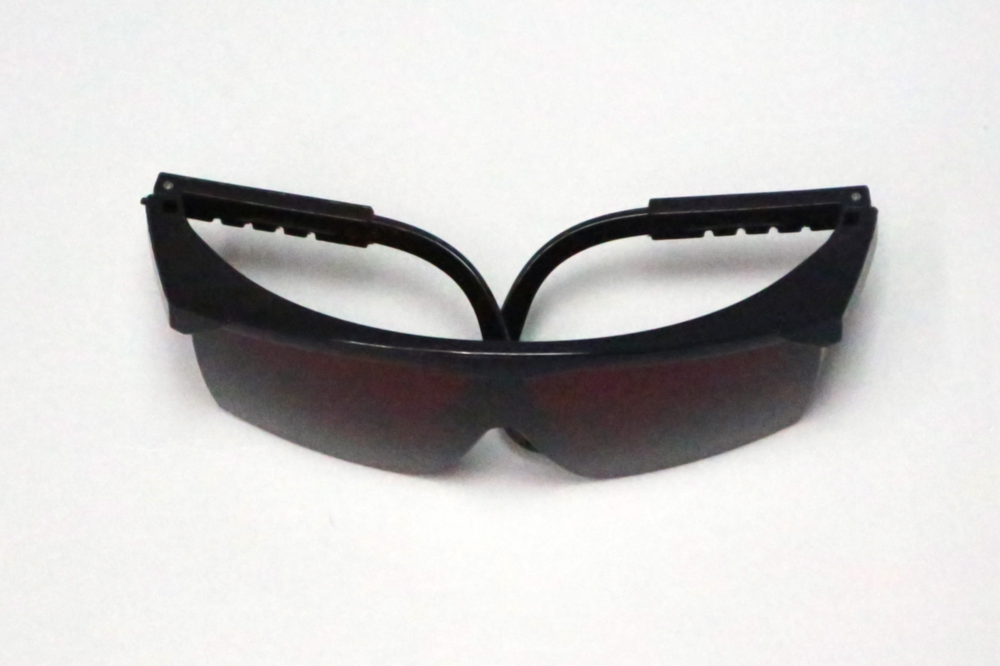</td>
<td>1</td>
</tr>
</tbody>
</table>

実際に素材を加工しながら動作チェックをしていきます。PCと素材（A4程度の大きさ。コピー用紙などの白い素材は避けてください）、並びに底面を保護する板をご用意ください。底面を保護する板は鉄板、ステンレス板などの不燃素材（レーザー光が反射しにくい暗い色のもの）の使用を推奨します。必ず加工範囲をカバーできる大きさのものをご使用ください。

## 電源を入れる
電源を接続しただけではレーザーは照射されない仕様になっておりますが、万が一照射されてしまう場合は、直ちに電源を引き抜き組み立てを中止した上で、弊社までご連絡ください。
※付属の保護メガネを着用してください。

ACアダプタにACケーブルを接続します。

PCBケースにACアダプタを接続します。
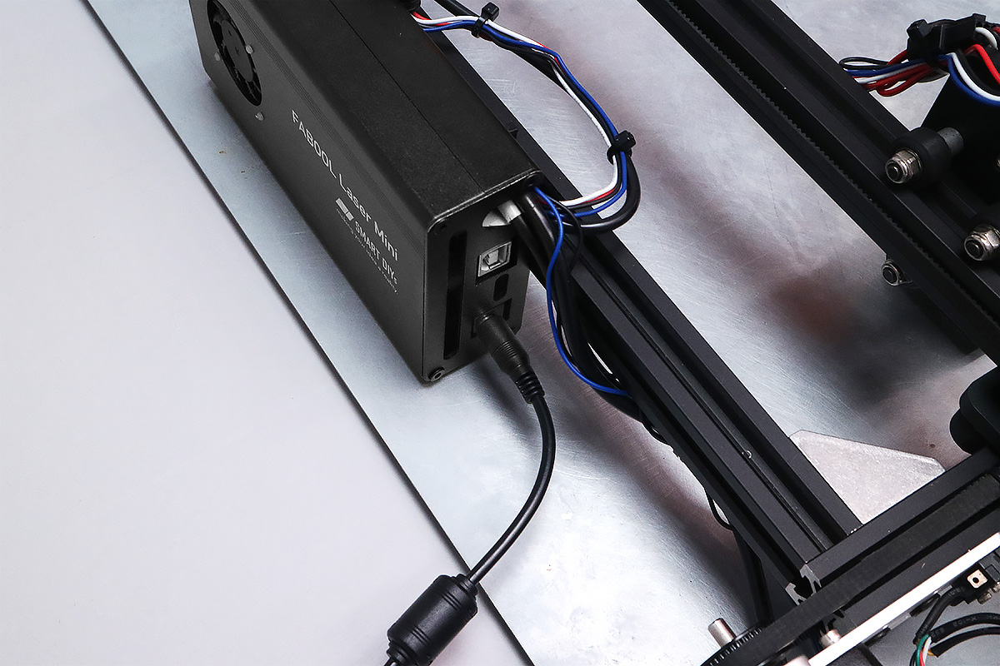

PCBケースにUSBケーブルを接続します。
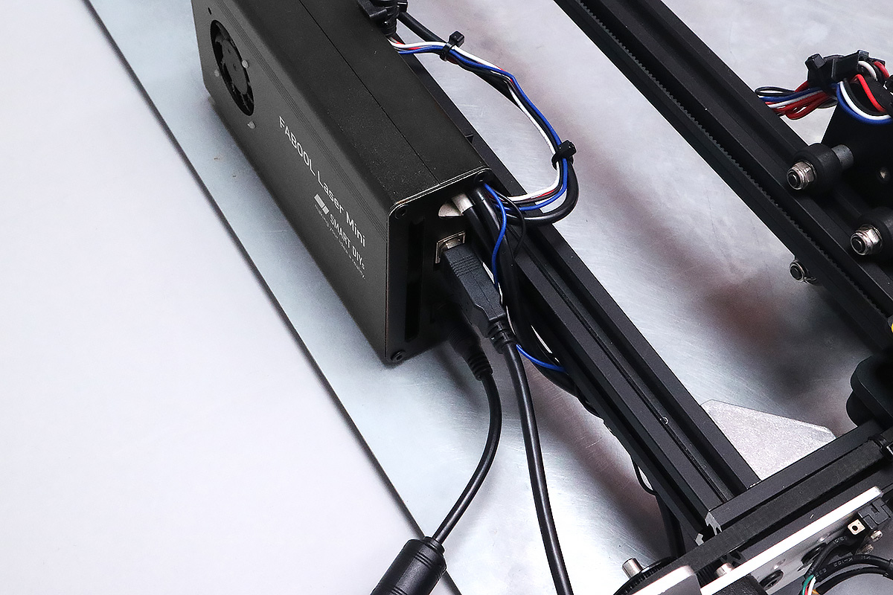

USBケーブルをPCに接続します。
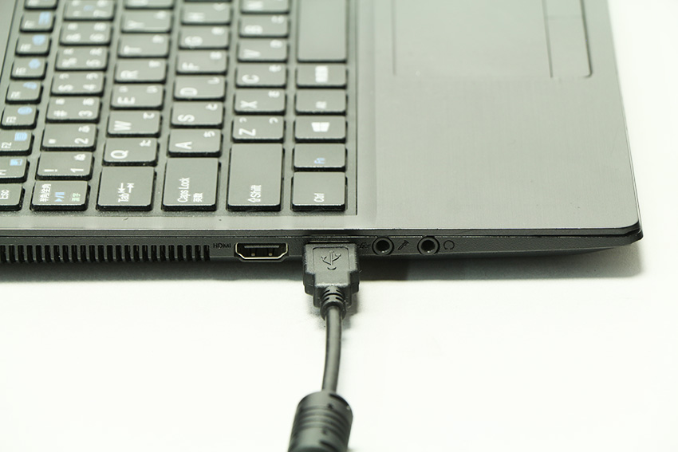

ACケーブルを家庭用のコンセント（AC100V）に接続します。PCBケースのDCファンが回っていることをご確認ください。
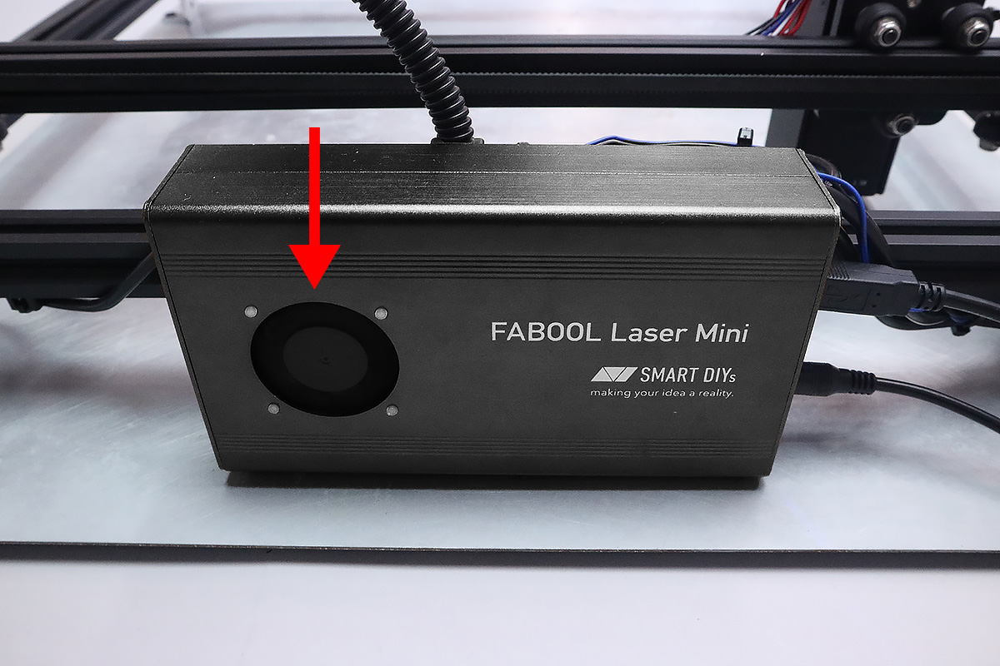

レーザーユニットのDCファンが回っていることをご確認ください。
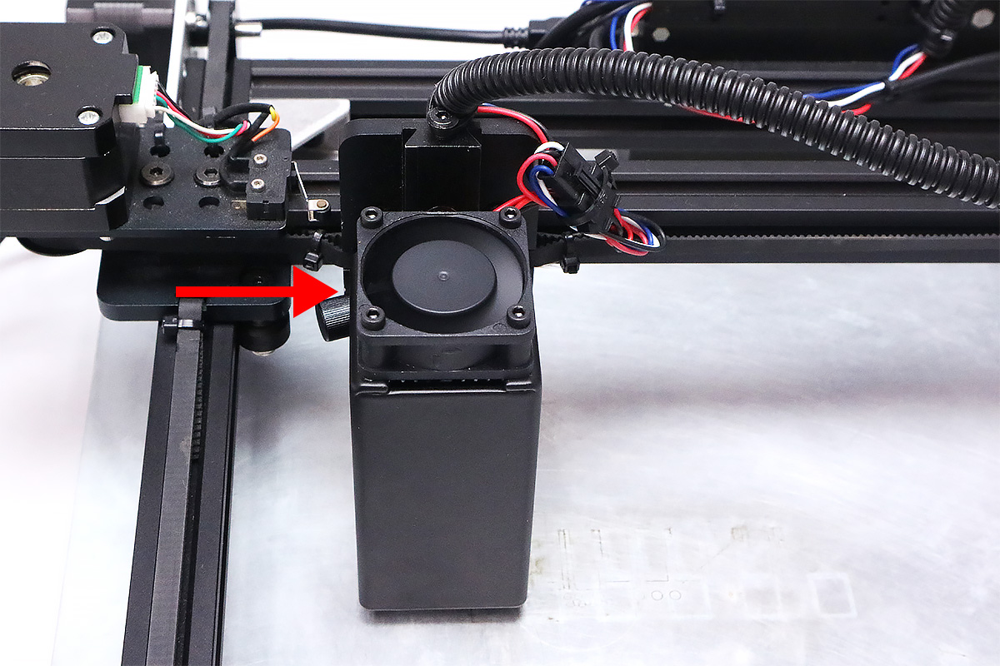

#### トラブルシューティング

**電源が入らない**
- ACアダプターのLEDが点灯していますか？点灯していない場合、ACケーブルの接続をご確認ください。

- コントロール基板のLEDの下部、青色のLEDは点灯していますか？点灯していない場合、コントロール基板のケーブルの配線が正常でない可能性があります。<a href="/manual/fabool-laser-mini-300-230-wiring-1/">配線1</a>をご覧いただき、配線をご確認ください。

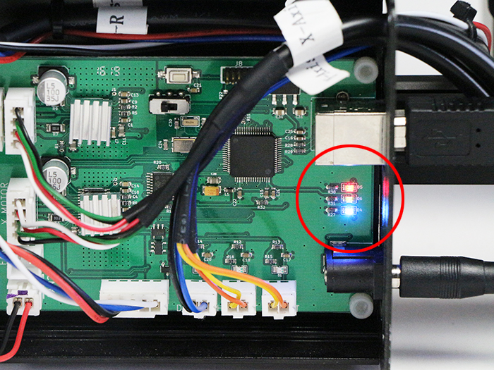

**ファンが回転しない**  ファンが回転しない場合、こちらもコントロール基板のケーブルの配線が正常でない可能性があります。<a href="/manual/fabool-laser-mini-300-230-wiring-1/">配線1</a>をご覧いただき、配線をご確認ください。

すべて確認いただいても電源が入らない・ファンが回転しない場合は製品の不良が考えられます。お手数ですが弊社までご連絡ください。

## PC接続・ソフトウェア起動
ソフトウェアのダウンロード・並びにインストールを、<a href="/manual/smartdiys-creator-install/" target="_blank">インストール</a>のページを参考に行ってください。
ソフトウェアインストール後、ソフトウェアを立ち上げてください。ソフトウェアの画面説明については、<a href="/manual/smartdiys-creator-names/" target="_blank">各部名称</a>をご覧ください。
PCと製品が問題なく接続できている場合、ソフトウェアの画面左上に接続済みと表示されます。またエラーがある場合はエラー内容も表示されます。

#### トラブルシューティング
**製品と接続しているのに未接続と表示される**
USBを何回か抜き差ししてください。また、USBハブを使用している場合は、使用せずにUSBとPCを直接接続してください。

####エラーリスト
- **フットスイッチが接地していません**  製品左後方に取り付けたフットスイッチ（リミットスイッチ）が地面と接地しておらず、スイッチが押されていない状態になっています。水平で平らな場所に装置を置いた状態で、フットスイッチが押されているかご確認ください。<a href="/manual/fabool-laser-mini-300-230-wiring-2/#Foot_Switch" target="_blank">Foot Switchケーブル配線</a>
- **リミットスイッチに接触しています**  <a href="/manual/fabool-laser-mini-300-230-wiring-2/#X-Axis" target="_blank">X-Axisケーブルの配線</a>と<a href="/manual/fabool-laser-mini-300-230-wiring-2/#Y-Axis-L" target="_blank">Y-Axis-Lケーブルの配線</a>、で配線したリミットスイッチに、X軸またはレーザーヘッドが接触しています。下記で説明する原点復帰を行ってください。改善しない場合は<a href="/manual/fabool-laser-mini-300-230-wiring-2/#X-Axis" target="_blank">X-Axisケーブルの配線</a>と<a href="/manual/fabool-laser-mini-300-230-wiring-2/#Y-Axis-L" target="_blank">Y-Axis-Lケーブルの配線</a>、ならびに<a href="/manual/fabool-laser-mini-300-230-wiring-1/">配線1</a>をご覧いただき、リミットスイッチの取り付け位置と部品の向き、配線をご確認ください。

## 高さ調整
FABOOL Laser Miniで加工を行う際、加工する素材の厚さが変わるごとに、付属の高さ調整用アクリルを使い、レーザーユニットの高さの調整を行ってください。

加工対象素材を本装置にセットした状態で、高さ調整用アクリルを素材の上に置き、レーザーヘッドの下に来るようにします。

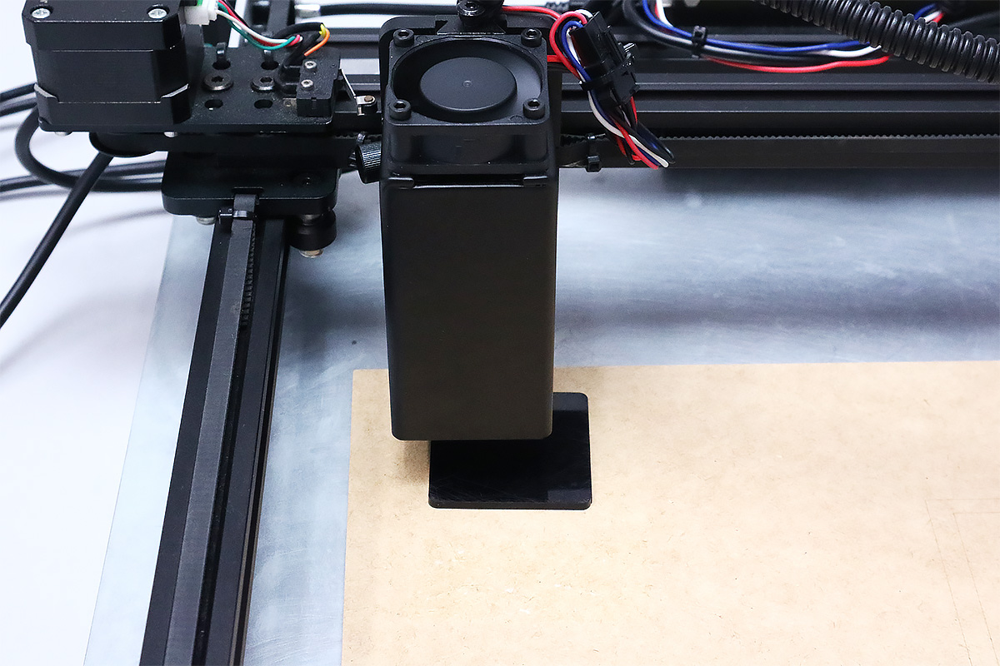

光学キャリアのネジを緩め、レーザーユニットが高さ調整用アクリルに当たるまで下げます。

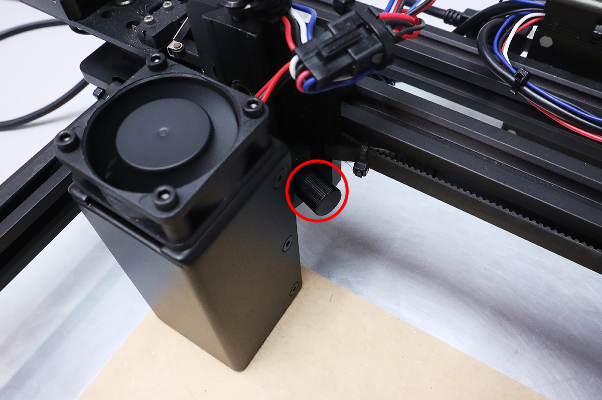
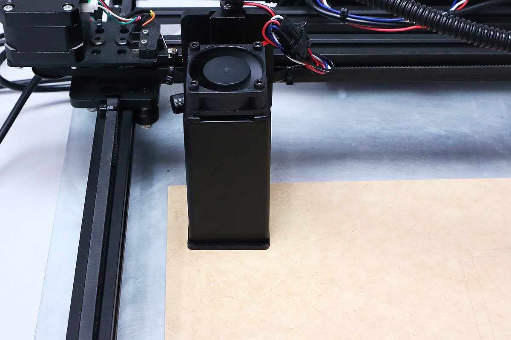

光学キャリアのネジを締め、高さ調整用アクリルを抜き取ります。
※手前に僅かにユニットが傾く場合がありますが、加工に影響のある傾斜ではありません。

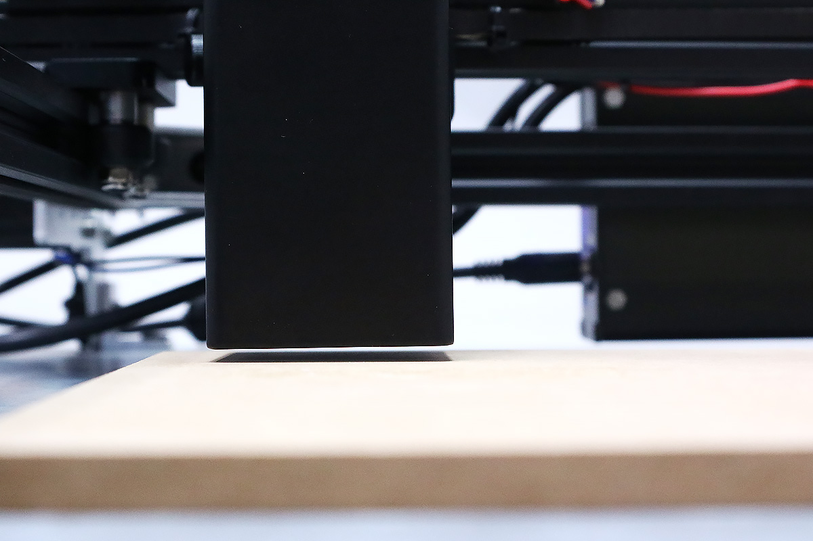

## ソフトウェア操作
ソフトウェアを操作し、製品が問題なく組み立てられているかチェックをします。
下記動画を参考にソフトウェアの操作、製品の動作をチェックしてください。

<iframe width="560" height="315" src="https://www.youtube.com/embed/bL22aSkHsHs" frameborder="0" allow="accelerometer; autoplay; encrypted-media; gyroscope; picture-in-picture" allowfullscreen></iframe>

### 原点復帰
「原点復帰」をクリックしてください。レーザーヘッドが原点（左上）に移動します。

#### トラブルシューティング
**原点復帰ボタンをクリックしても動作しない**
表示が接続済みになっているかご確認ください。また、USBを抜き差ししてください。

**原点に戻ってもレーザーヘッドが停止しない**
リミットスイッチの取り付け位置、または配線が原因の可能性があります。<a href="/manual/fabool-laser-mini-300-230-wiring-2/#X-Axis" target="_blank">X-Axisケーブルの配線</a>と<a href="/manual/fabool-laser-mini-300-230-wiring-2/#Y-Axis-L" target="_blank">Y-Axis-Lケーブルの配線</a>、ならびに<a href="/manual/fabool-laser-mini-300-230-wiring-1/">配線1</a>をご覧いただき取り付け位置と部品の向き、配線をご確認ください。

### 位置確認
「位置確認」をクリックしてください。グラフィックエリアにレーザヘッドのアイコンが表示され、このアイコンをドラッグすることで、レーザーヘッドを任意の場所に移動させます。移動に問題がないかレーザーヘッドを何回か移動させ確認します。

#### トラブルシューティング
**X軸・Y軸に引っかかりがある**
- タイミングプーリーがモーターの軸に対してしっかりと固定されているか、イモネジを再度ご確認ください。<a href="/manual/fabool-laser-mini-300-230-motor-unit-assembly/" target="_blank">X軸・Y軸モーターユニット組み立て</a>
- タイミングベルトを張り過ぎた場合、ステッピングモーターに負荷が掛かってしまい、正常動作をしない場合が御座います。タイミングベルトを少し緩めて動作を再度動作をご確認ください。<a href="/manual/fabool-laser-mini-300-230-y-axis-assembly/#i-3" target="_blank">タイミングベルトの取り付け</a>
- 手動でX軸・Y軸を動かしていただき、可動域全体でスムーズに動くか確認をお願い致します。 どこかで引っかかりやカタさを感じる場合は、偏心スペーサーを回して調整してください。<a href="/manual/fabool-laser-mini-300-230-y-axis-assembly/#YV-slot" target="_blank">Y軸確認、V-slot調整</a>

### 加工開始
実際に加工をします。まず<a href="/manual/wp-content/uploads/2019/07/test-data.zip" target="_blank">テスト用データ</a>のダウンロードをします。zipファイルを解凍し、ダウンロードファイルをダブルクリックするとテスト用データがソフトウェアに読み込まれます。グラフィックエリアに「テスト用データ」が配置され、アイテムリストエリアにアイテムが３つが表示されます。

「範囲確認」をクリックすると、データの外周をレーザーヘッドが示すので、それをもとに素材の位置を調整してください。

次にパラメータを設定します。パラメータについては、<a href="/manual/smartdiys-creator-parameter/" target="_blank">パラメータ設定</a>をご覧ください。アイテムをクリックするとパラメータ設定ダイアログが表示されます。プリセットタブをクリックし、用意した素材に近いものを選択し、適用をクリック。マニュアルタブに移動するとパラメータが反映されています。

画面右上のスタートをクリックし、表示された注意内容を確認後、OKをクリックしてください。加工が開始されます。

加工結果が写真のようになっていれば正常に組み立てできています。

#### トラブルシューティング
**レーザーが照射されない**
  - レーザーユニットとLaserケーブルの接続、ピンの抜けがなくしっかりと接続されているかご確認ください。
    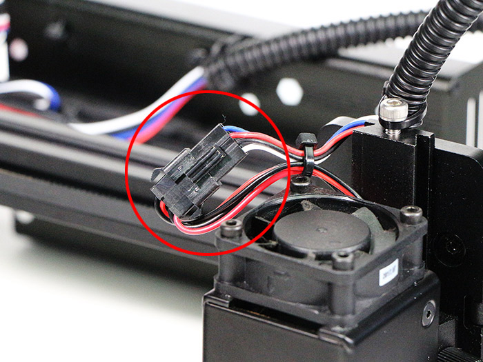

    
  - フットスイッチが接地していないとレーザーは照射されません。製品左後方に取り付けたフットスイッチ（リミットスイッチ）が地面と接地しているかご確認ください。

**円に歪みがある・レーザーが照射されていない部分がある（ドット抜け）**
- タイミングプーリーがモーターの軸に対してしっかりと固定されているか、イモネジを再度ご確認ください。<a href="/manual/fabool-laser-mini-300-230-motor-unit-assembly/" target="_blank">X軸・Y軸モーターユニット組み立て</a>
- タイミングベルトを張り過ぎた場合、ステッピングモーターに負荷が掛かってしまい、正常動作をしない場合が御座います。タイミングベルトを少し緩めて動作を再度動作をご確認ください。<a href="/manual/fabool-laser-mini-300-230-y-axis-assembly/#i-3" target="_blank">タイミングベルトの取り付け</a>
- 手動でX軸・Y軸を動かしていただき、可動域全体でスムーズに動くか確認をお願い致します。 どこかで引っかかりやカタさを感じる場合は、偏心スペーサーを回して調整してください。<a href="/manual/fabool-laser-mini-300-230-y-axis-assembly/#Y_2" target="_blank">チェックポイント　Y軸確認 2</a>
