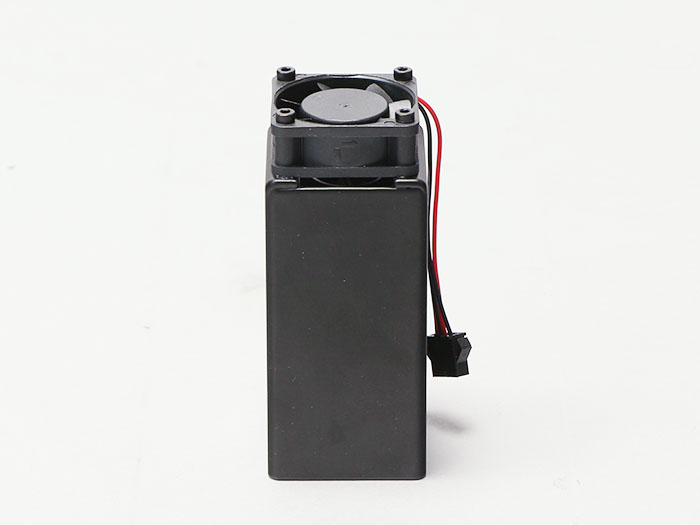
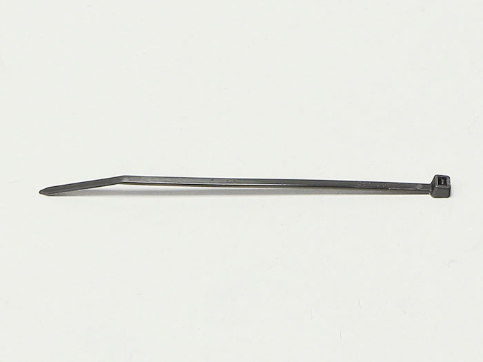
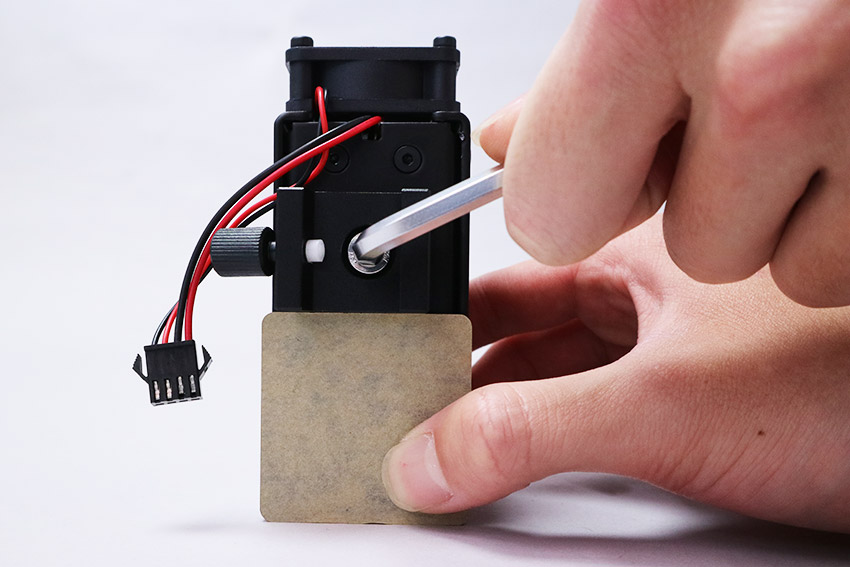
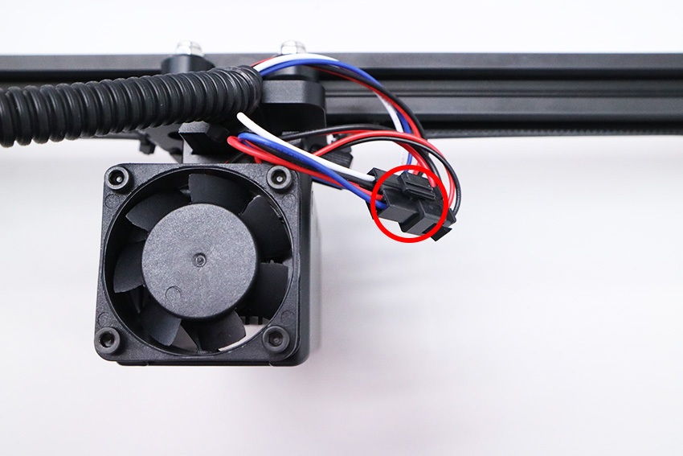
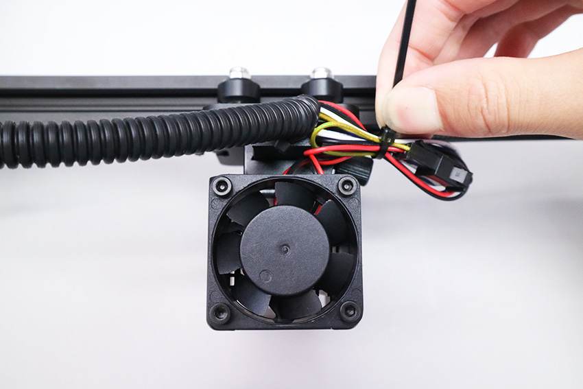

## 部品リスト
<table class="packing-list">
<tbody>
<tr>
<td>No</td>
<td>部品名</td>
<td>備考</td>
<td class="packing-img">画像</td>
<td>個数</td>
</tr>
<tr>
<td>19</td>
<td>レーザーユニット</td>
<td></td>
<td></td>
<td>1</td>
</tr>
<tr>
<td>22</td>
<td>光学キャリア</td>
<td></td>
<td></td>
<td>1</td>
</tr>
<tr>
<td></td>
<td>高さ調整用アクリル</td>
<td></td>
<td></td>
<td>1</td>
</tr>
<tr>
<td>47</td>
<td>M6&times;8 六角穴付きボルト</td>
<td>ネジケース</td>
<td></td>
<td>1</td>
</tr>
<tr>
<td>25</td>
<td>結束バンド</td>
<td></td>
<td></td>
<td>1</td>
</tr>
</tbody>
</table>

 

高さ調整用アクリルを使用し、レーザーユニットに光学キャリアをM6&times;8六角穴付ボルトで取り付けます。

光学ステージに光学キャリアを取り付け、レーザーユニットとLaserケーブルを接続します。

ケーブルを結束バンドで固定し、結束バンドの不要な部分は切り取ります。

