## 部品リスト
<table class="packing-list">
<tbody>
<tr>
<td>部品名</td>
<td>備考</td>
<td class="packing-img">画像</td>
<td>個数</td>
</tr>
<tr>
<td>ステッピングモーター</td>
<td></td>
<td></td>
<td>3</td>
</tr>
<tr>
<td>motor mount plate x-axis</td>
<td></td>
<td>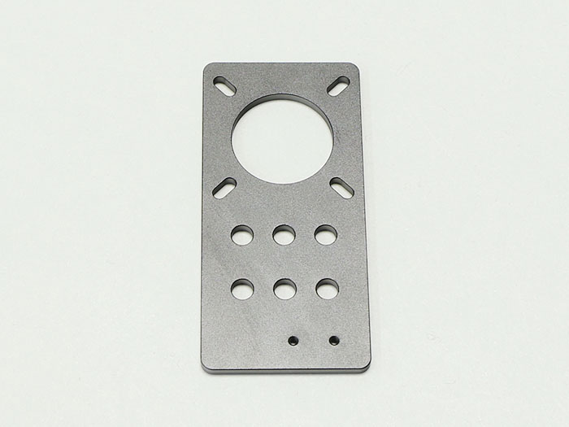</td>
<td>1</td>
</tr>
<tr>
<td>motor mount plate y-axis</td>
<td></td>
<td></td>
<td>2</td>
</tr>
<tr>
<td>タイミングプーリー</td>
<td></td>
<td></td>
<td>3</td>
</tr>
<tr>
<td>M3&times;6 六角穴付きボルト</td>
<td>ネジケース</td>
<td>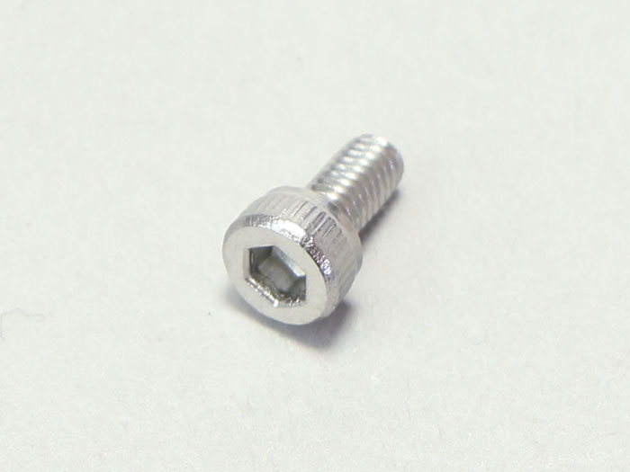</td>
<td>12</td>
</tr>
<tr>
<td>M3&times;3 イモネジ</td>
<td>ネジケース</td>
<td></td>
<td>6</td>
</tr>
</tbody>
</table>

## X軸モーターユニットの組み立て
### motor mount plate x-axisを取り付ける
ステッピングモーターに、motor mount plate x-axisをM3&times;6六角穴付きボルト4個で取り付けます。  
※motor mount plate x-axisには取り付ける向きがあるので注意してください。小さい2つの穴が右下に来るようにします。
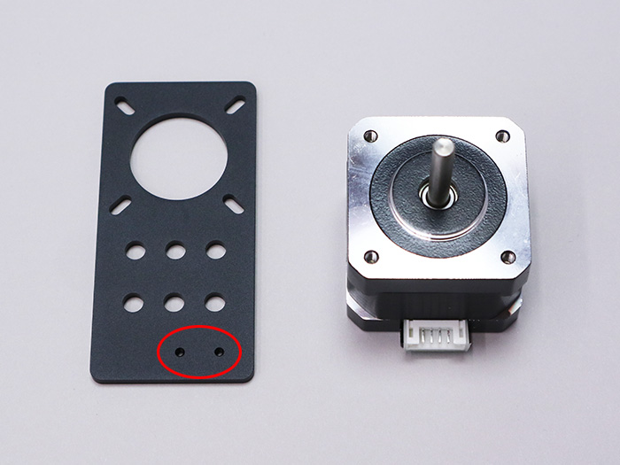

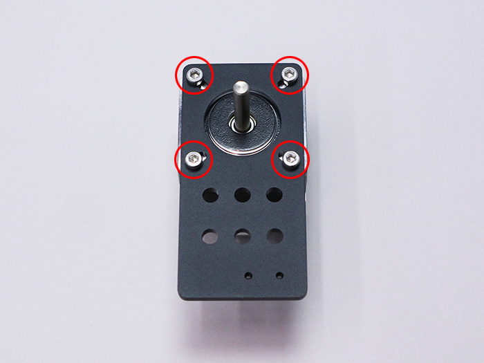

### タイミングプーリーを取り付ける
ステッピングモーターにタイミングプーリーをM3&times;3イモネジ2個で取り付けます。どちらか片方のネジ穴を、シャフトの切りかけ部分（矢印の平らな箇所）に合わせて取り付けてください。  
※イモネジは後で位置を調整するので仮止めして下さい。
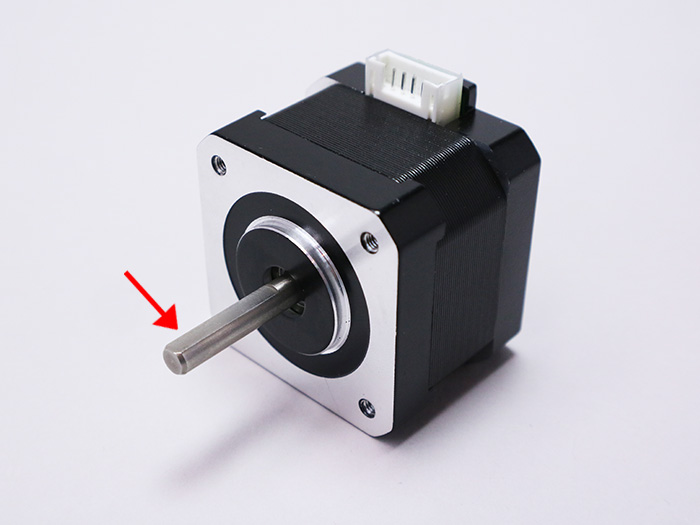

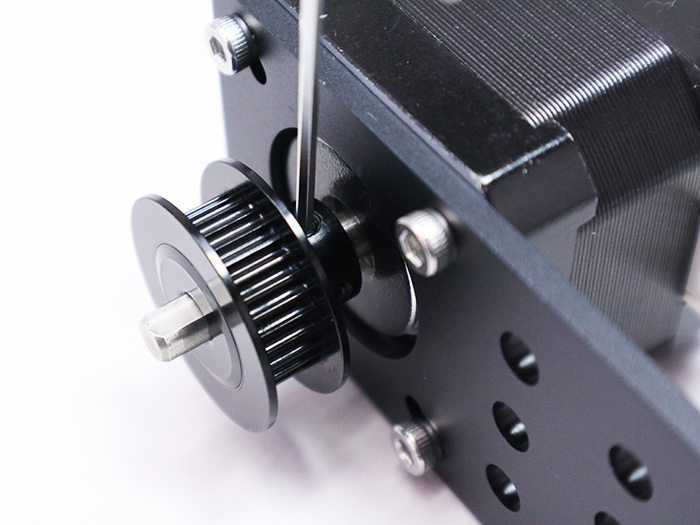

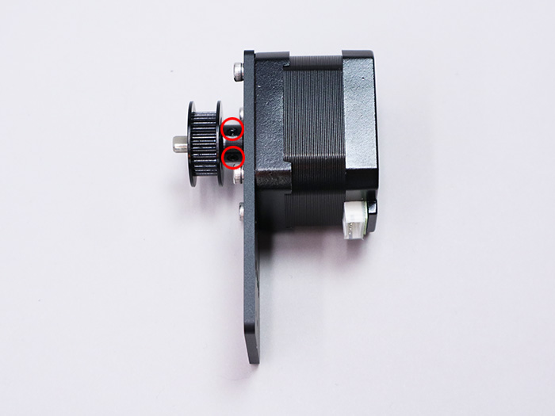

切りかけ部分にしっかりと合わせてください。
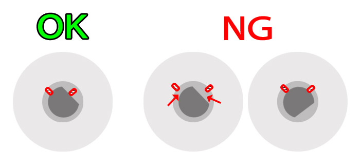

## Y軸モーターユニットの組み立て
### motor mount plate y-axisを取り付ける
ステッピングモーターにmotor mount plate y-axisをM3&times;6六角穴付きボルト4個で取り付けます。合計2個組み立てます。
※motor mount plate y-axisには取り付ける向きがあるので注意してください。穴の位置が左右対称になるようにします。
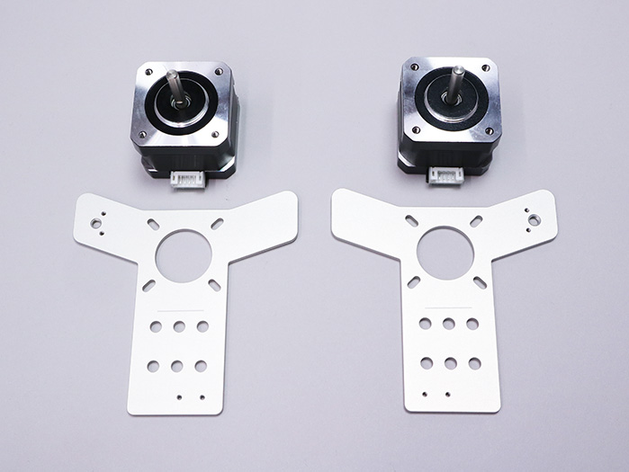

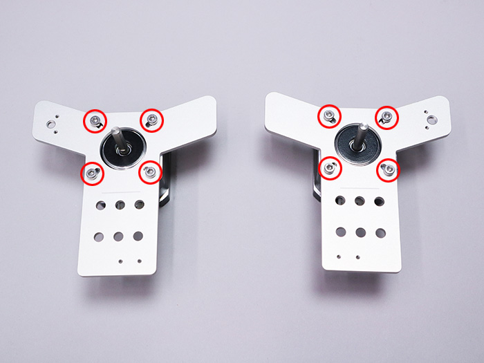

### タイミングプーリーを取り付ける
ステッピングモーターにタイミングプーリーをM3&times;3イモネジ2個で取り付けます。どちらか片方のネジ穴を、シャフトの切りかけ部分に合わせて取り付けて下さい。    
※イモネジは後で位置を調整するので仮止めしてください。

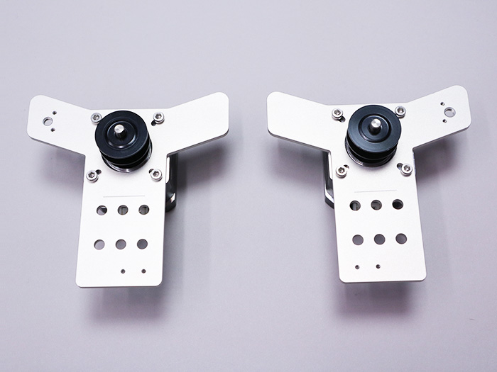
