<table class="packing-list">
<tbody>
<tr>
<td>No</td>
<td>部品名</td>
<td>備考</td>
<td class="packing-img">画像</td>
<td>個数</td>
</tr>
<tr>
<td>1</td>
<td>V-slot 450mm</td>
<td></td>
<td>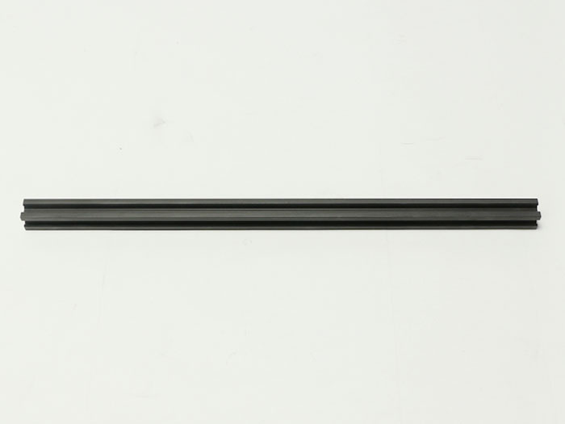</td>
<td>1</td>
</tr>
<tr>
<td>2</td>
<td>V-slot 410mm</td>
<td></td>
<td></td>
<td>4</td>
</tr>
<tr>
<td>7</td>
<td>直角ブラケット</td>
<td>一部の製品には黒色の直角ブラケットが入っています</td>
<td></td>
<td>4</td>
</tr>
<tr>
<td>8</td>
<td>タイミングベルト</td>
<td></td>
<td>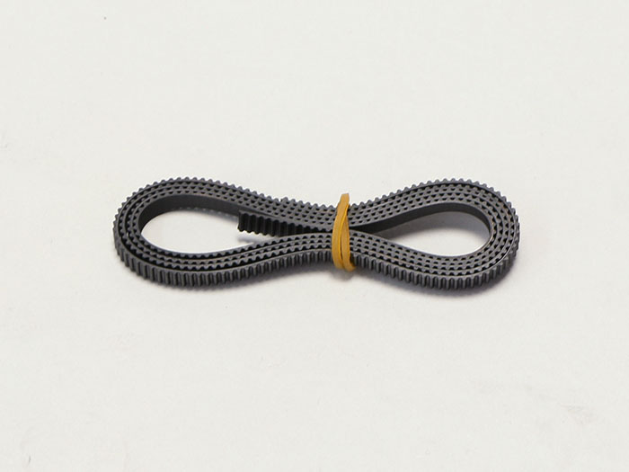</td>
<td>3</td>
</tr>
<tr>
<td>10</td>
<td>mini v plate_C</td>
<td></td>
<td>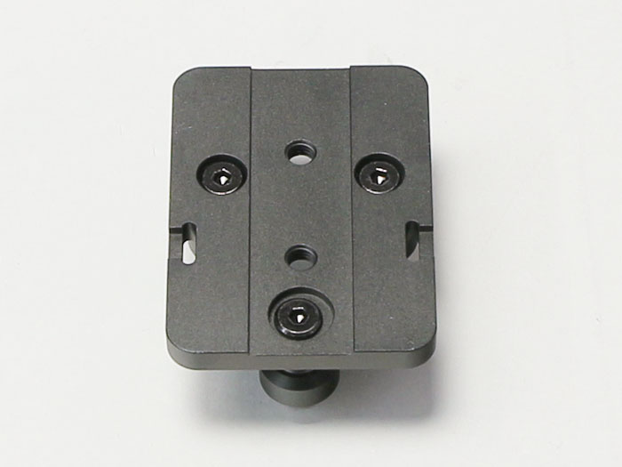</td>
<td>1</td>
</tr>
<tr>
<td>11</td>
<td>mini v plate_L</td>
<td></td>
<td></td>
<td>1</td>
</tr>
<tr>
<td>12</td>
<td>mini v plate_R</td>
<td></td>
<td></td>
<td>1</td>
</tr>
<tr>
<td>13</td>
<td>PCBケーブル</td>
<td></td>
<td>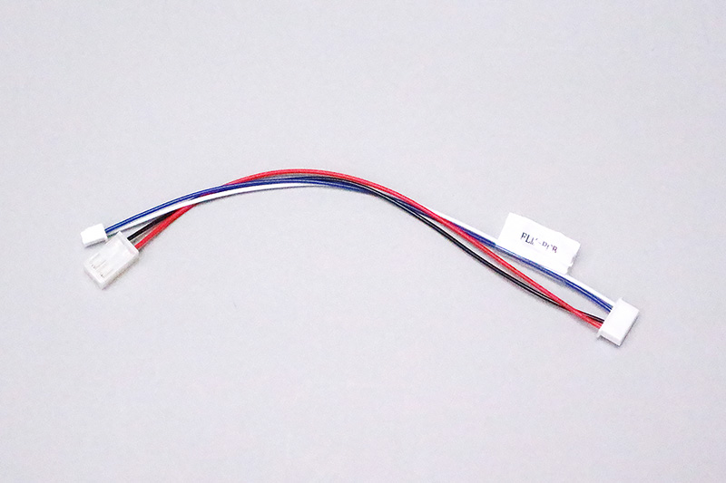</td>
<td>1</td>
</tr>
<tr>
<td>14</td>
<td>Laserケーブル</td>
<td>一部の製品には形状の違うケーブルが入っています</td>
<td>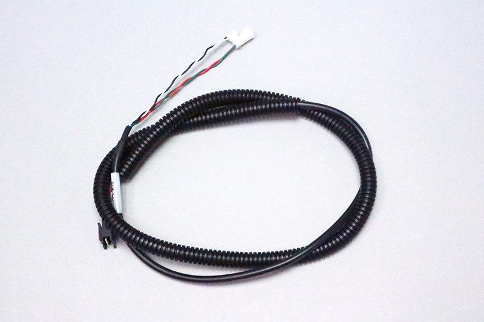</td>
<td>1</td>
</tr>
<tr>
<td>15</td>
<td>X-Axisケーブル</td>
<td></td>
<td>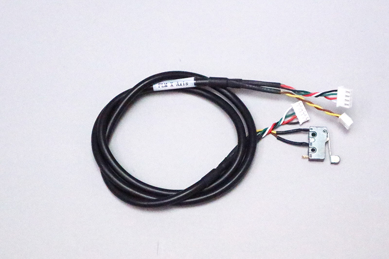</td>
<td>1</td>
</tr>
<tr>
<td>16</td>
<td>Y-Axis-Rケーブル</td>
<td></td>
<td></td>
<td>1</td>
</tr>
<tr>
<td>17</td>
<td>Y-Axis-Lケーブル</td>
<td></td>
<td></td>
<td>1</td>
</tr>
<tr>
<td>18</td>
<td>Foot Switchケーブル</td>
<td></td>
<td>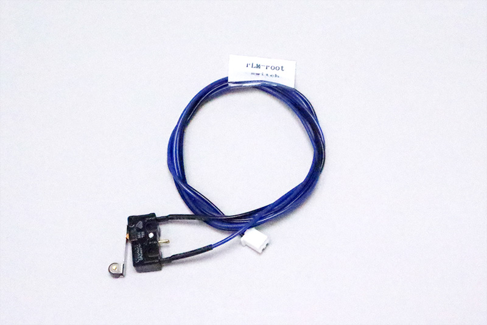</td>
<td>1</td>
</tr>
<tr>
<td>19</td>
<td>レーザーユニット</td>
<td></td>
<td></td>
<td>1</td>
</tr>
<tr>
<td></td>
<td>レーザー基板 （1.6W/3.5W）</td>
<td></td>
<td>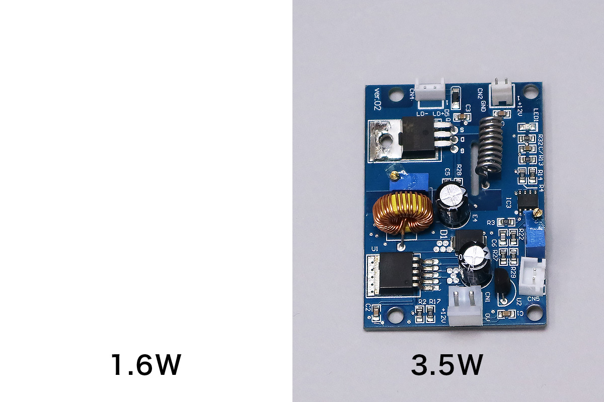</td>
<td>1</td>
</tr>
<tr>
<td>20</td>
<td>タイミングプーリー</td>
<td></td>
<td>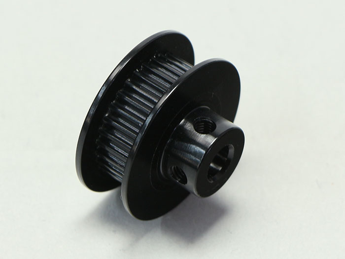</td>
<td>3</td>
</tr>
<tr>
<td>21</td>
<td>光学ステージ</td>
<td></td>
<td></td>
<td>1</td>
</tr>
<tr>
<td>22</td>
<td>光学キャリア</td>
<td></td>
<td>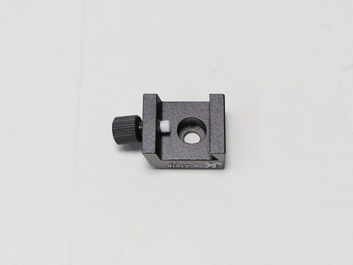</td>
<td>1</td>
</tr>
<tr>
<td>23</td>
<td>PCBケース</td>
<td></td>
<td>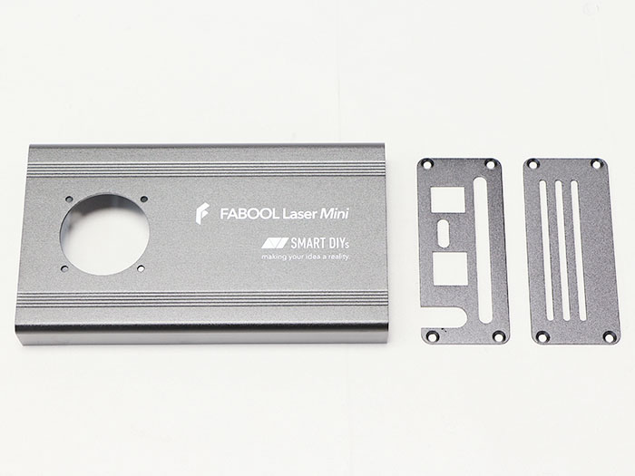</td>
<td>1</td>
</tr>
<tr>
<td>24</td>
<td>結束バンド固定具</td>
<td></td>
<td></td>
<td>3</td>
</tr>
<tr>
<td>25</td>
<td>結束バンド</td>
<td></td>
<td>18</td>
<td>1</td>
</tr>
<tr>
<td>26</td>
<td>idler pulley plate</td>
<td></td>
<td>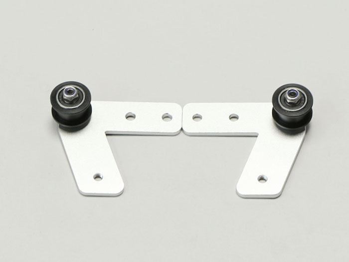</td>
<td>2</td>
</tr>
<tr>
<td>27</td>
<td>motor mount plate x-axis</td>
<td></td>
<td></td>
<td>1</td>
</tr>
<tr>
<td>28</td>
<td>motor mount plate y-axis</td>
<td></td>
<td></td>
<td>2</td>
</tr>
<tr>
<td>29</td>
<td>ACアダプター</td>
<td></td>
<td></td>
<td>1</td>
</tr>
<tr>
<td>30</td>
<td>ACケーブル</td>
<td></td>
<td></td>
<td>1</td>
</tr>
<tr>
<td>31</td>
<td>USBケーブル</td>
<td></td>
<td></td>
<td>1</td>
</tr>
<tr>
<td>32</td>
<td>ステッピングモーター</td>
<td></td>
<td>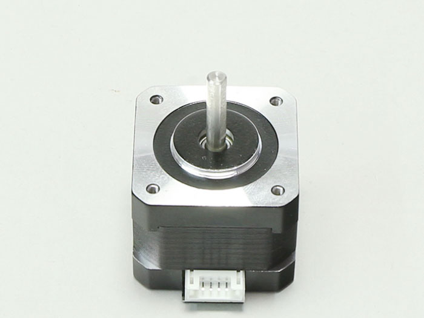</td>
<td>3</td>
</tr>
<tr>
<td>33</td>
<td>コントロール基板</td>
<td></td>
<td></td>
<td>1</td>
</tr>
<tr>
<td>34</td>
<td>DCファン</td>
<td></td>
<td></td>
<td>1</td>
</tr>
<tr>
<td>35</td>
<td>M2&times;10 六角穴付きボルト</td>
<td rowspan="13">ネジケース</td>
<td></td>
<td>6</td>
</tr>
<tr>
<td>36</td>
<td>M3&times;3 イモネジ</td>
<td></td>
<td>6</td>
</tr>
<tr>
<td>37</td>
<td>M3&times;5 ナイロンネジ</td>
<td></td>
<td>9</td>
</tr>
<tr>
<td>38</td>
<td>M3&times;6 六角穴付きボルト</td>
<td></td>
<td>14</td>
</tr>
<tr>
<td>39</td>
<td>M3&times;6 六角穴付き皿ボルト</td>
<td></td>
<td>8</td>
</tr>
<tr>
<td>40</td>
<td>M3&times;10 ナイロンネジ</td>
<td></td>
<td>4</td>
</tr>
<tr>
<td>41</td>
<td>M3後入れナット</td>
<td></td>
<td>2</td>
</tr>
<tr>
<td>42</td>
<td>M4&times;8 低頭ボルト</td>
<td>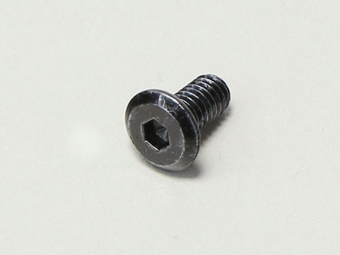</td>
<td>1</td>
</tr>
<tr>
<td>44</td>
<td>M5&times;6 低頭ボルト</td>
<td>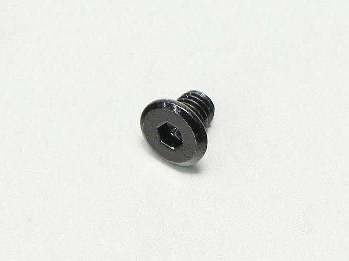</td>
<td>2</td>
</tr>
<tr>
<td>45</td>
<td>M5&times;8 低頭ボルト</td>
<td></td>
<td>22</td>
</tr>
<tr>
<td>46</td>
<td>M5 Tナット</td>
<td></td>
<td>24</td>
</tr>
<tr>
<td>47</td>
<td>M6&times;8 六角穴付きボルト</td>
<td>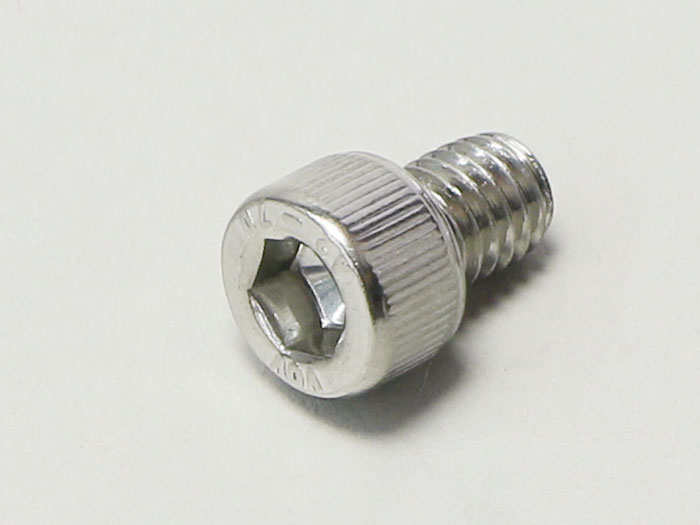</td>
<td>3</td>
</tr>
</tbody>
</table>
