## 部品リスト
<table class="packing-list">
<tbody>
<tr>
<td>No</td>
<td>部品名</td>
<td>備考</td>
<td class="packing-img">画像</td>
<td>個数</td>
</tr>
<tr>
<td>23</td>
<td>PCBケース</td>
<td></td>
<td></td>
<td>1</td>
</tr>
<tr>
<td></td>
<td>レーザー基板 （1.6W/3.5W）</td>
<td></td>
<td></td>
<td>1</td>
</tr>
<tr>
<td>33</td>
<td>コントロール基板</td>
<td></td>
<td></td>
<td>1</td>
</tr>
<tr>
<td>44</td>
<td>M5×6低頭ボルト板</td>
<td>ネジケース</td>
<td></td>
<td>4</td>
</tr>
<tr>
<td>37</td>
<td>M3×5ナイロンネジ</td>
<td>ネジケース</td>
<td>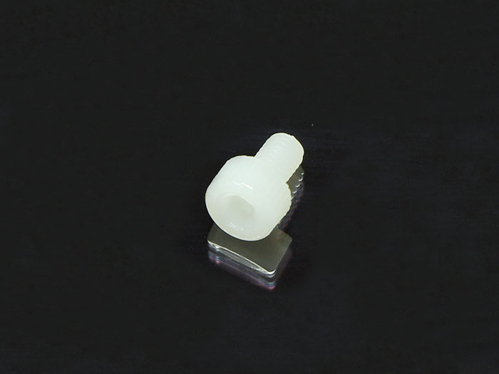</td>
<td>11</td>
</tr>
<tr>
<td>24</td>
<td>結束バンド固定具</td>
<td></td>
<td></td>
<td>1</td>
</tr>
</tbody>
</table>

 

本工程は1.6Wモデルと3.5Wモデルで手順が異なります。以下にてそれぞれ説明しておりますので、該当箇所をご参照ください。

## 基板の取り付け（1.6W）
<a href="/manual/fabool-laser-mini-300-230-y-axis-assembly/">Y軸の組み立て</a>で予め入れておいたM5Tナットを使用しPCBケースをM5&times;6低頭ボルト2個で取り付けます。
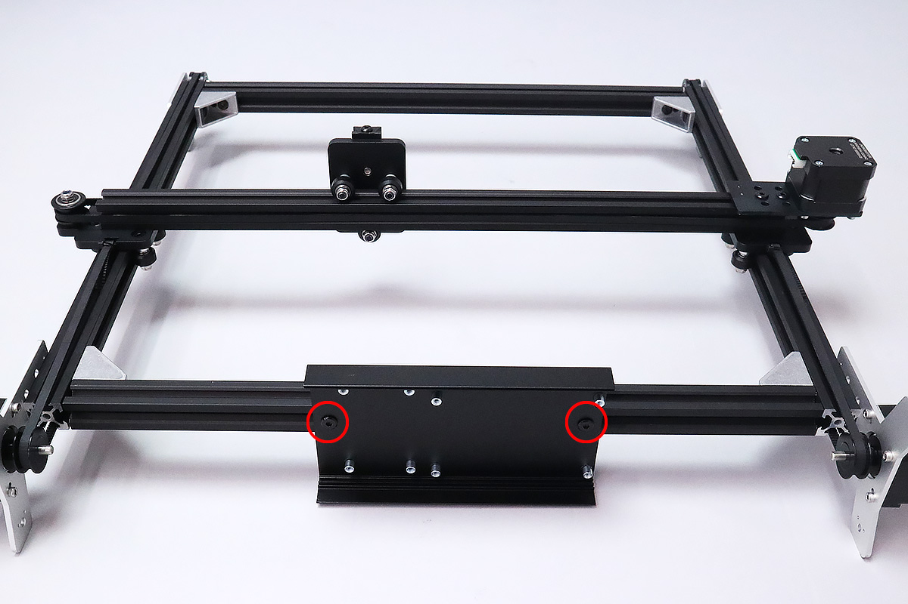

PCBケースにレーザー基板をM3&times;5ナイロンネジ4個で取り付けます。
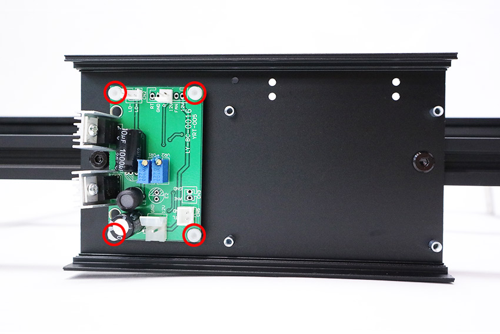

PCBケースにコントロール基板をM3&times;5ナイロンネジ4個で取り付けます。
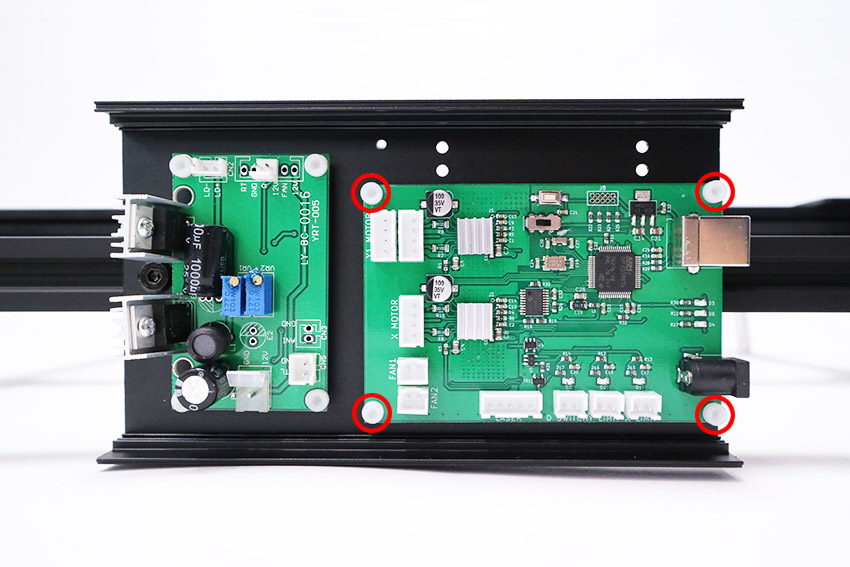

コントロール基板のスイッチが左側にあることを確認してください。
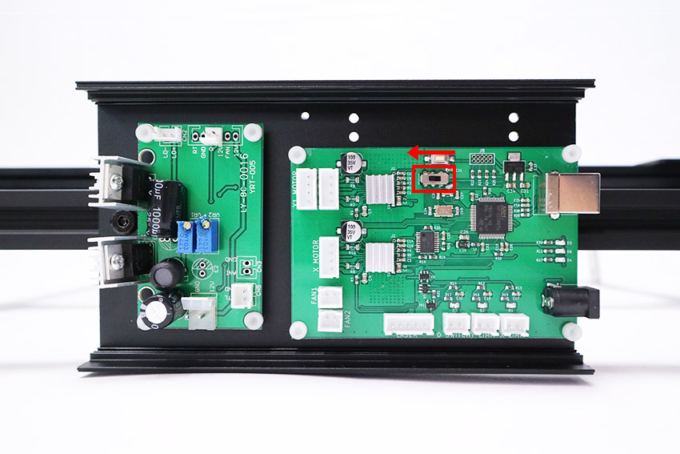

PCBケースの裏に結束バンド固定具をM3&times;5ナイロンネジで取り付けます。
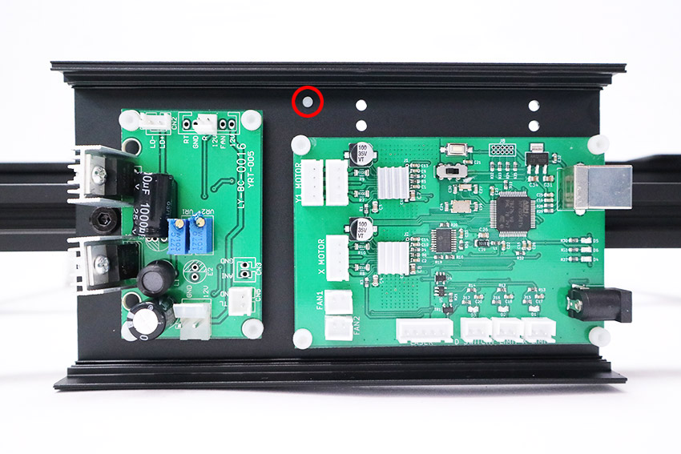

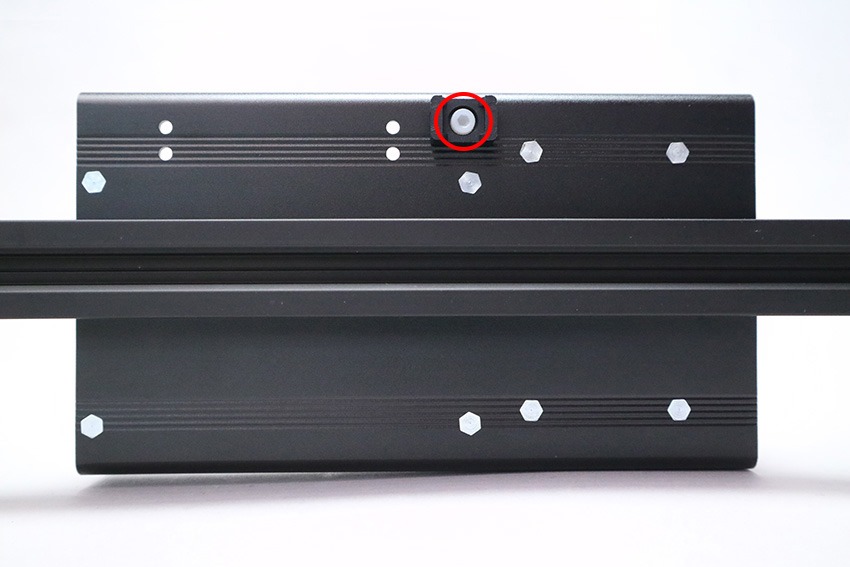

## 基板の取り付け（3.5W）
Y軸の組み立てで予め入れておいたM5Tナットを使用しPCBケースをM5&times;6低頭ボルト2個で取り付けます。
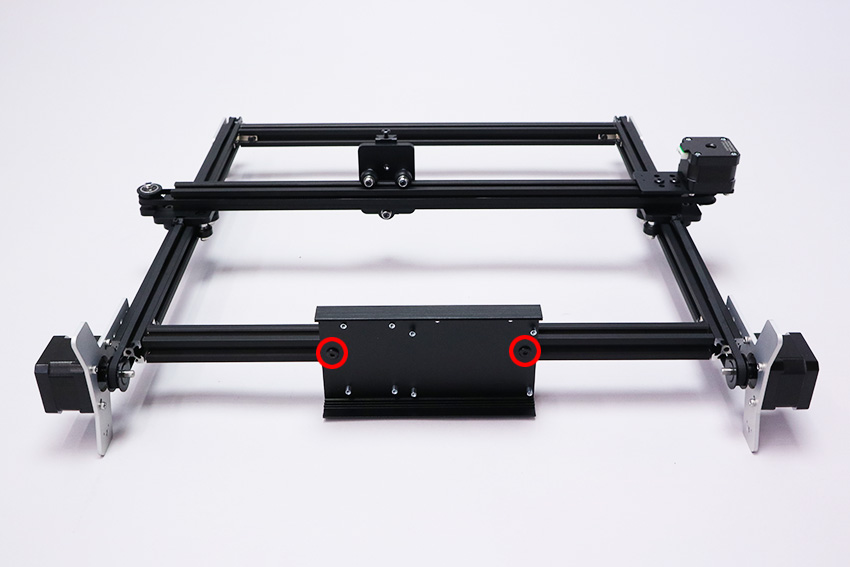

PCBケースにレーザー基板をM3&times;5ナイロンネジ4個で取り付けます。
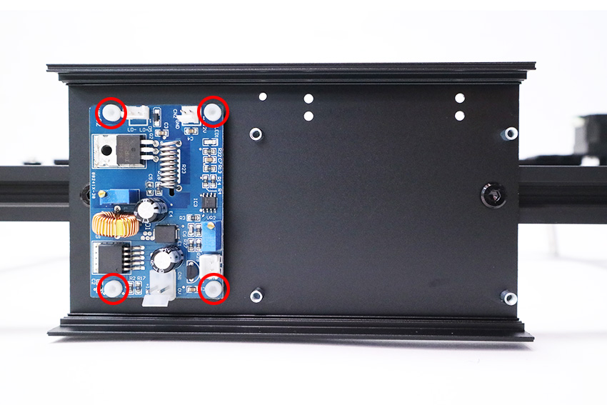

PCBケースにコントロール基板をM3&times;5ナイロンネジ4個で取り付けます。
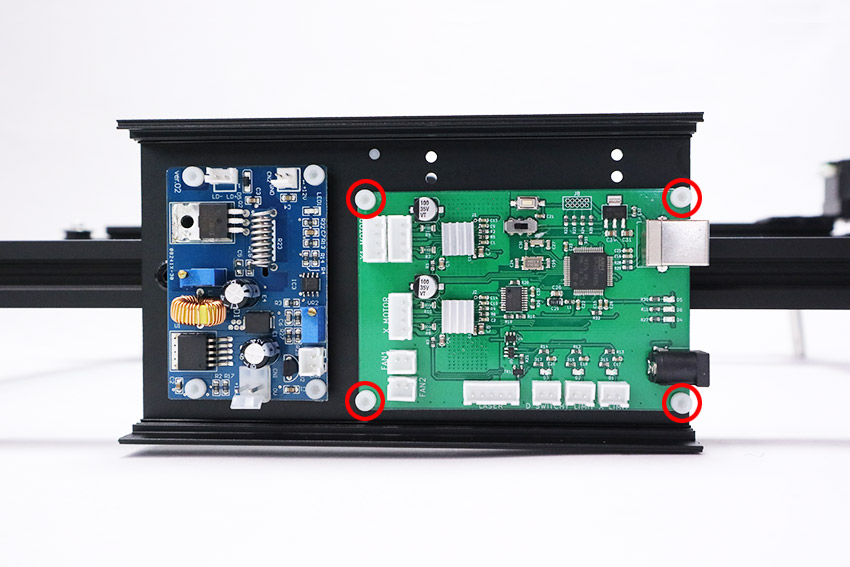

コントロール基板のスイッチが左側にあることを確認してください。
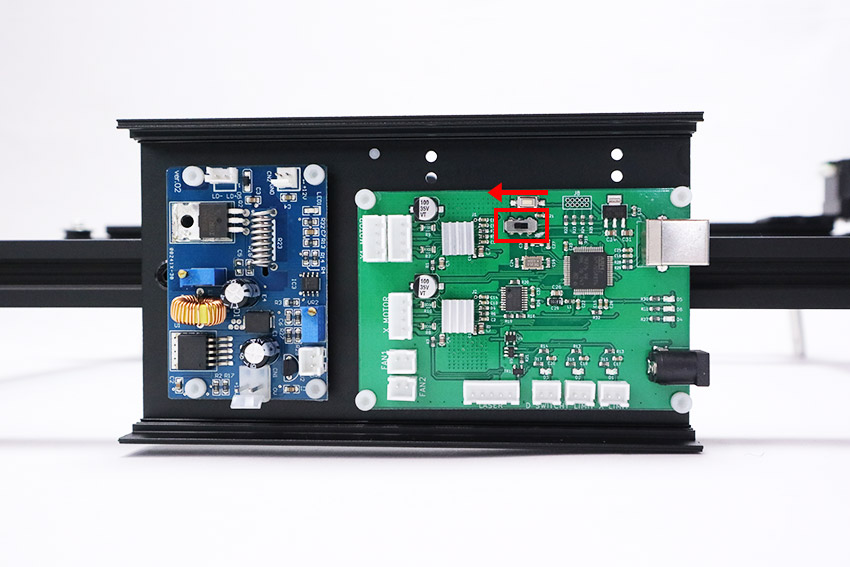

PCBケースの裏に結束バンド固定具をM3&times;5ナイロンネジで取り付けます。
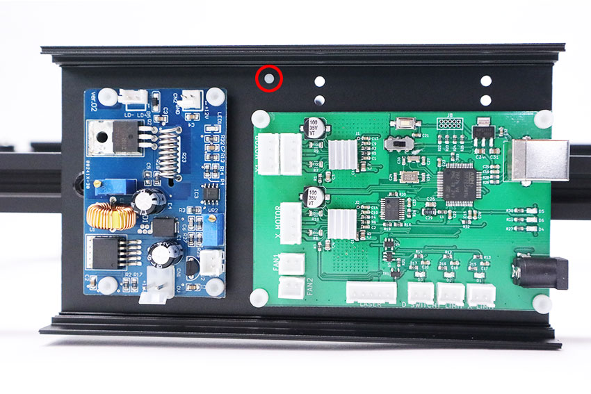

