## 部品リスト
<table class="packing-list">
<tbody>
<tr>
<td>No</td>
<td>部品名</td>
<td>備考</td>
<td class="packing-img">画像</td>
<td>個数</td>
</tr>
<tr>
<td>13</td>
<td>PCBケーブル</td>
<td></td>
<td></td>
<td>1</td>
</tr>
<tr>
<td>14</td>
<td>Laserケーブル</td>
<td></td>
<td></td>
<td>1</td>
</tr>
<tr>
<td>15</td>
<td>X-Axisケーブル</td>
<td></td>
<td></td>
<td>1</td>
</tr>
<tr>
<td>16</td>
<td>Y-Axis-Rケーブル</td>
<td></td>
<td></td>
<td>1</td>
</tr>
<tr>
<td>17</td>
<td>Y-Axis-Lケーブル</td>
<td></td>
<td></td>
<td>1</td>
</tr>
<tr>
<td>18</td>
<td>Foot Switchケーブル</td>
<td></td>
<td></td>
<td>1</td>
</tr>
<tr>
<td>25</td>
<td>結束バンド</td>
<td></td>
<td>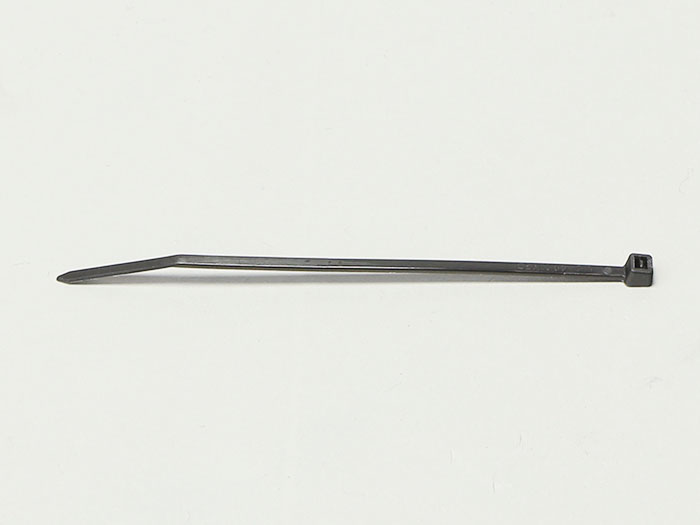</td>
<td>1</td>
</tr>
</tbody>
</table>

本工程は1.6Wモデルと3.5Wモデルで手順が異なります。以下にてそれぞれ説明しておりますので、該当箇所をご参照ください。

## 配線（1.6W）
以下の写真を参考に計6種類のケーブルの配線を行います。

### PCBケーブル
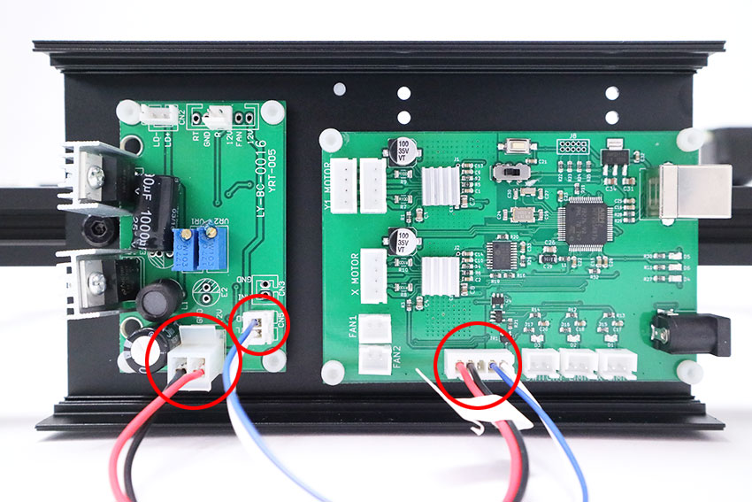

### Laserケーブル ※反対側は後ほど配線
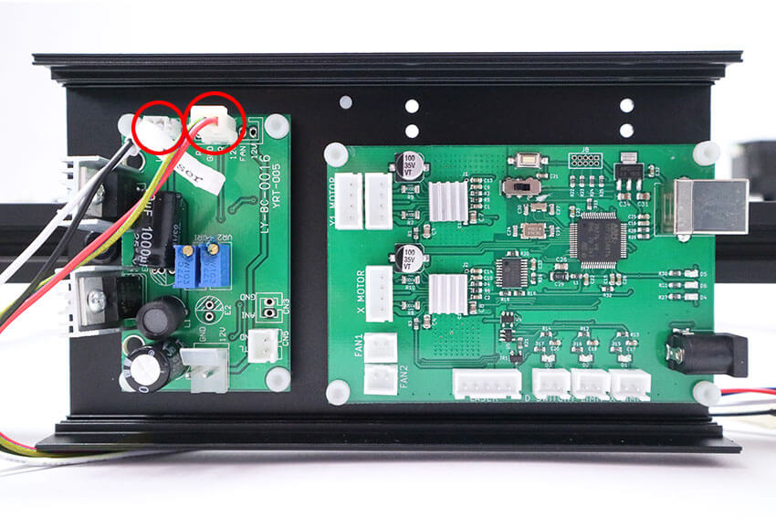

### X-Axisケーブル ※反対側は後ほど配線
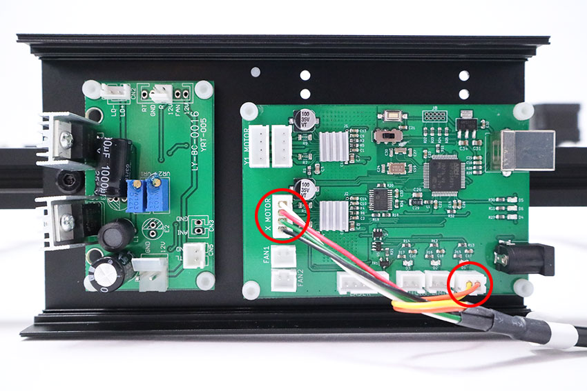

### Y-Axis-Rケーブル ※反対側は後ほど配線

### Y-Axis-Lケーブル ※反対側は後ほど配線
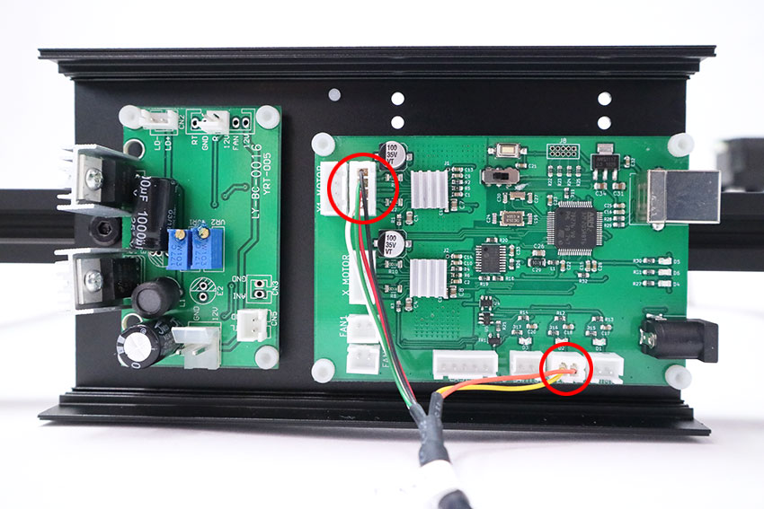

### Foot Switchケーブル ※反対側は後ほど配線
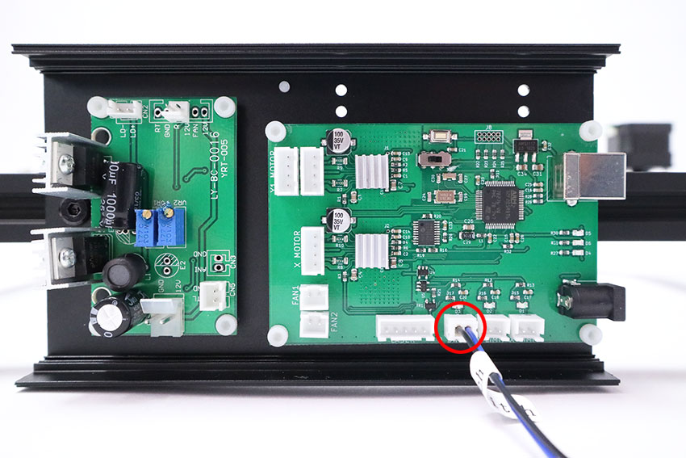

### ケーブルをすべて接続した状態
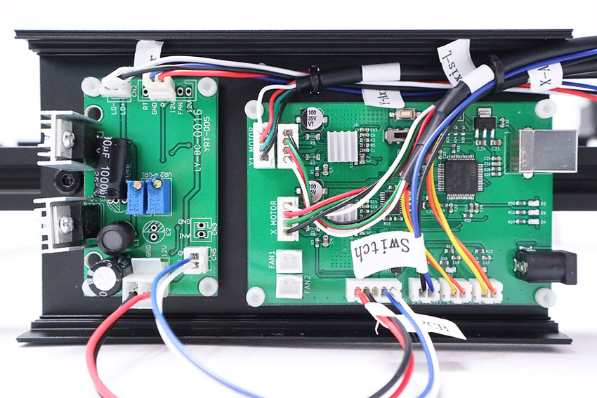

PCBケース内の配線を2本の結束バンドを使ってまとめます。固定方法は下記の動画を参考にしてください。  
[動画　1.6W配線取りまとめ]

配線まとめ後の結束バンドを裏から見ると写真の通りになります。結束バンドの不要な部分を切り取ります。
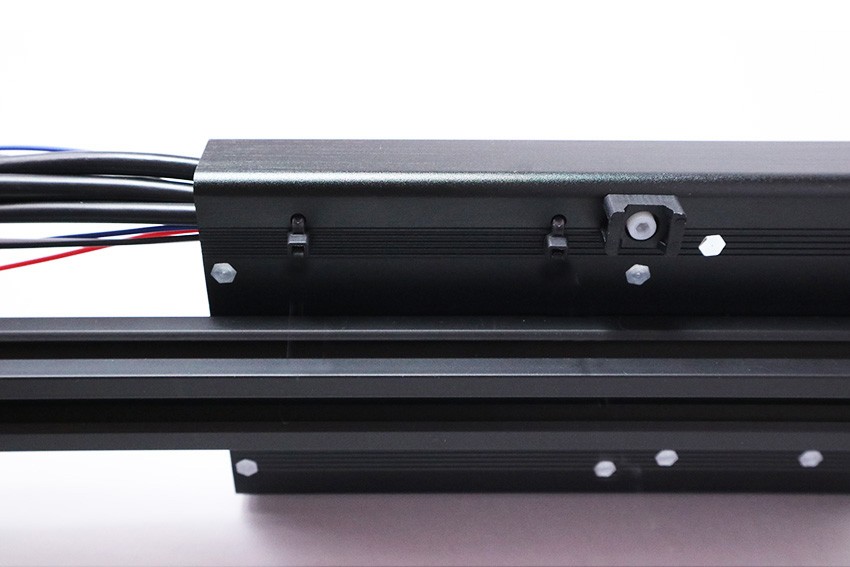

## 配線（3.5W）
以下の写真を参考に計6種類のケーブルの配線を行います。
### PCBケーブル

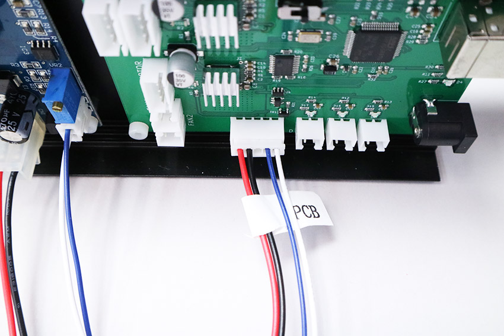

### Laserケーブル ※反対側は後ほど配線
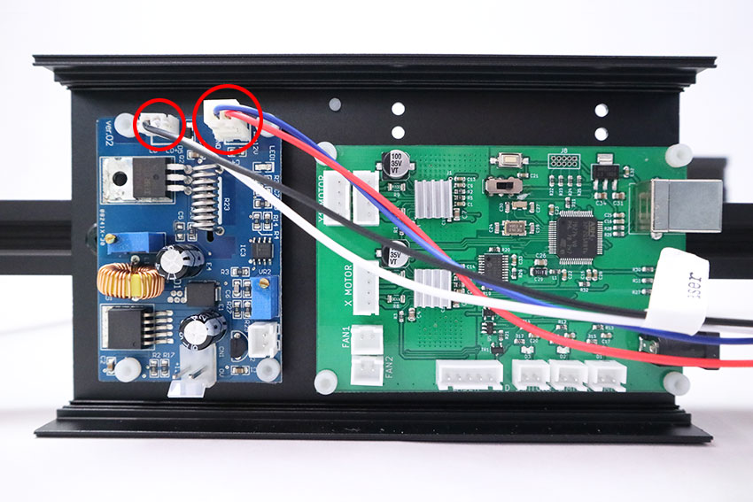

### X-Axisケーブル ※反対側は後ほど配線

### Y-Axis-Rケーブル ※反対側は後ほど配線
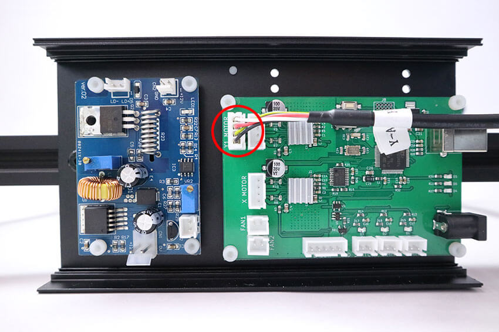

### Y-Axis-Lケーブル ※反対側は後ほど配線

### Foot Switchケーブル ※反対側は後ほど配線
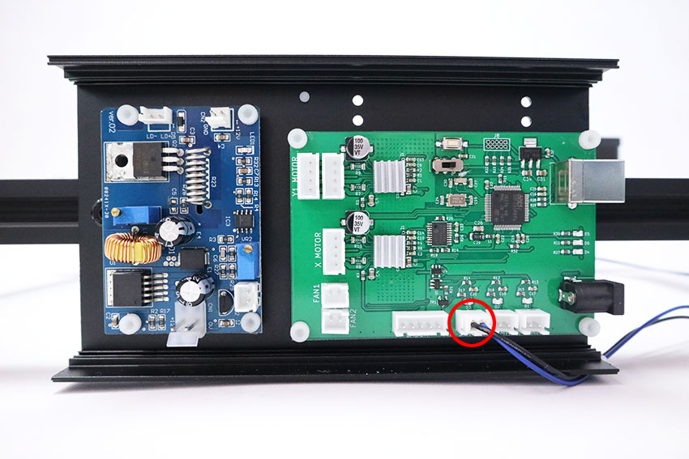

### ケーブルをすべて接続した状態
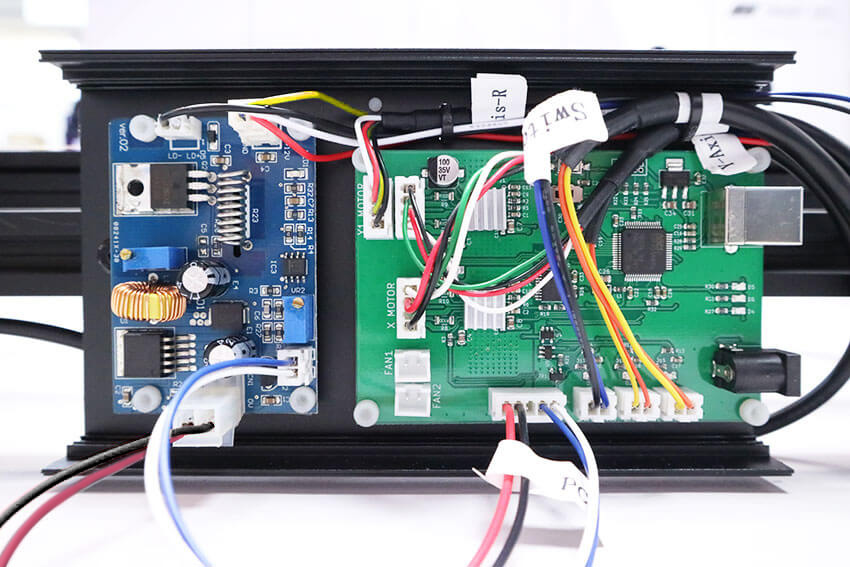

PCBケース内の配線を2本の結束バンドを使ってまとめます。固定方法は下記の動画を参考にしてください。  
[動画　3.6W配線取りまとめ]

配線まとめ後の結束バンドを裏から見ると写真の通りになります。結束バンドの不要な部分を切り取ります。

