## 部品リスト
<table class="packing-list">
<tbody>
<tr>
<td>No</td>
<td>部品名</td>
<td>備考</td>
<td class="packing-img">画像</td>
<td>個数</td>
</tr>
<tr>
<td>41</td>
<td>M3後入れナット</td>
<td>ネジケース</td>
<td>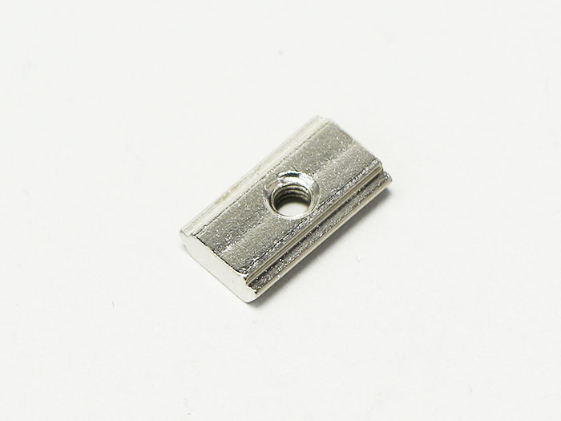</td>
<td>3</td>
</tr>
<tr>
<td>40</td>
<td>M3×6六角穴付きボルト</td>
<td>ネジケース</td>
<td></td>
<td>6</td>
</tr>
<tr>
<td>24</td>
<td>結束バンド固定具</td>
<td></td>
<td></td>
<td>1</td>
</tr>
<tr>
<td>25</td>
<td>結束バンド</td>
<td></td>
<td></td>
<td>1</td>
</tr>
<tr>
<td>35</td>
<td>M2x10六角穴付ボルト</td>
<td>ネジケース</td>
<td></td>
<td>8</td>
</tr>
</tbody>
</table>

## X-Axisケーブルの配線
X軸モーターユニットにX-AxisケーブルのリミットスイッチをM2&times;10六角穴付きボルト2個で取り付けます。  
※リミットスイッチには取り付ける向きがあるので注意して下さい。
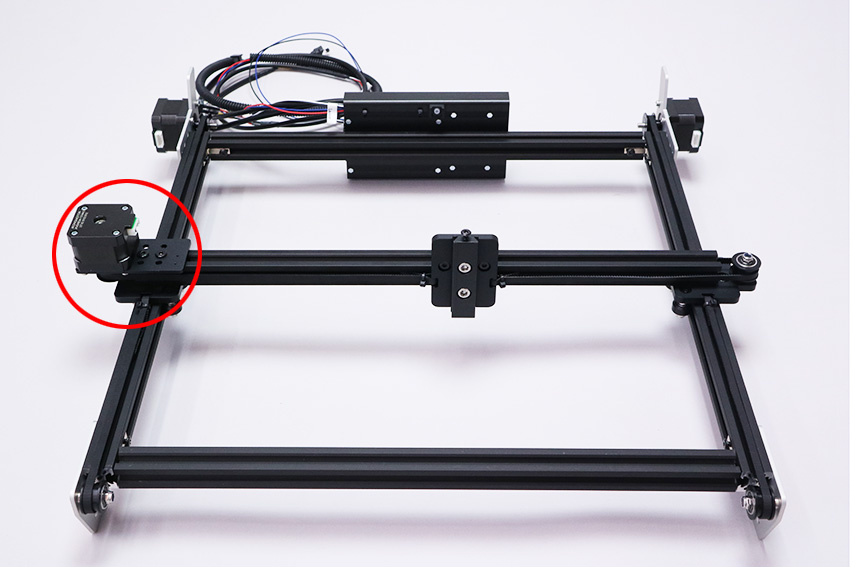

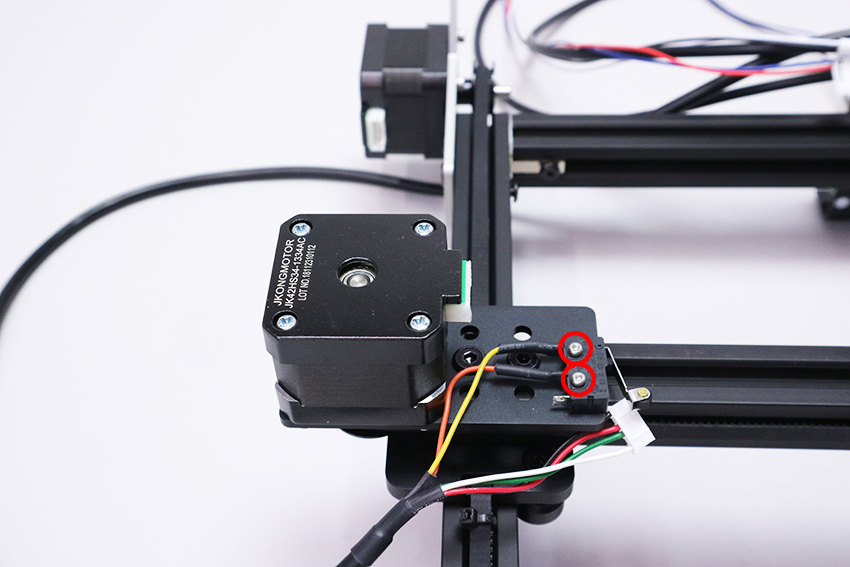

ステッピングモーターにX-Axisケーブルを接続します。
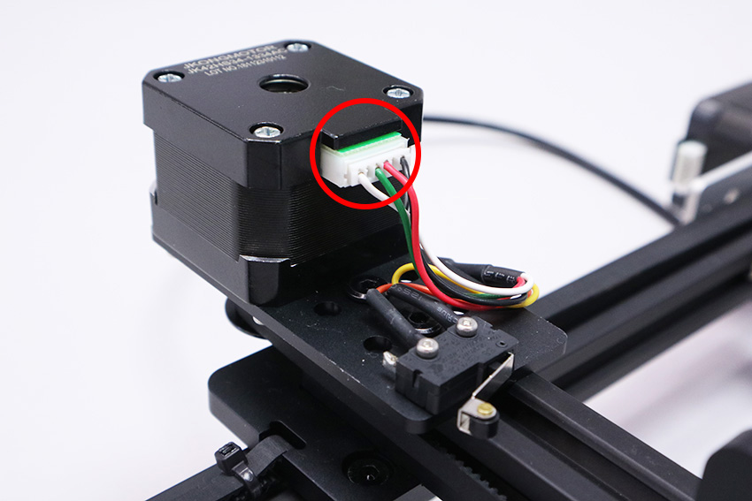

X軸モーターユニットにX-Axisケーブルを結束バンドで2ヵ所固定します。
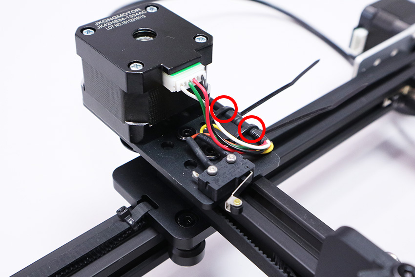

## Y-Axis-Lケーブルの配線
Y軸モーターユニットにY-Axis-LケーブルのリミットスイッチをM2&times;10六角穴付きボルト2個で取り付けます。取り付け後、ステッピングモーターにY-Axis-Lケーブルを接続します。  
※リミットスイッチには取り付ける向きがあるので注意して下さい。
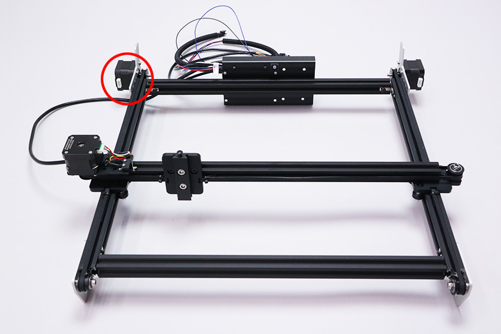

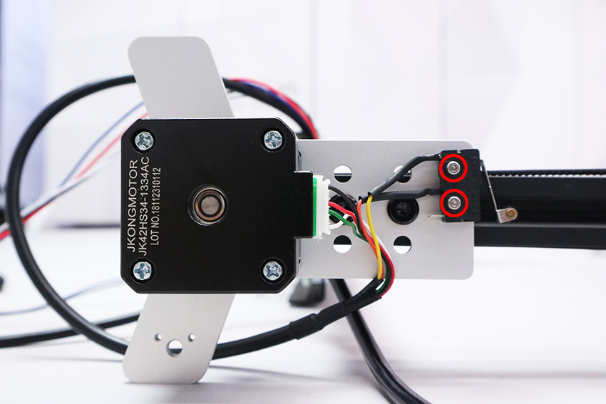

## Foot Switchケーブル配線
Y軸モーターユニットにFoot SwitchケーブルのリミットスイッチをM2&times;10六角穴付きボルト2個で取り付けます。
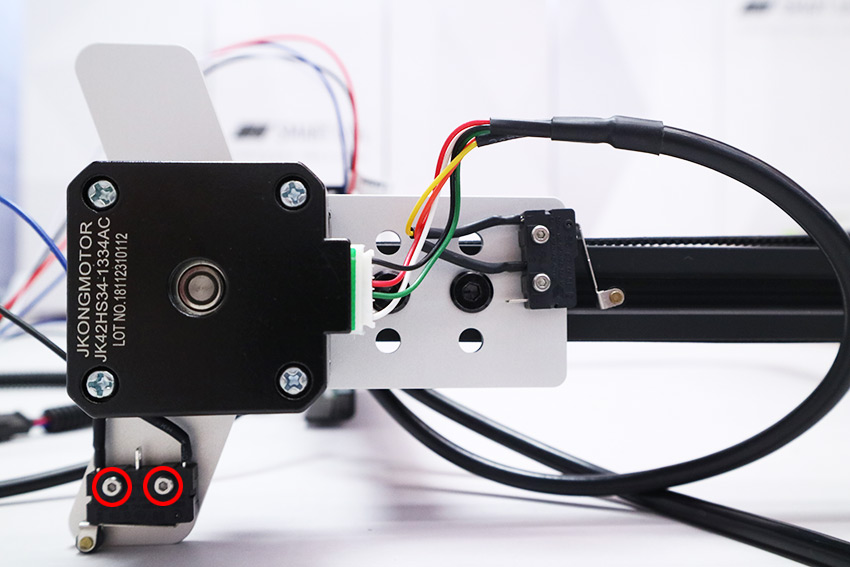

## ケーブル（4種類）の配線
右上にあるステッピングモーターにY-Axis-Rケーブルを接続します。
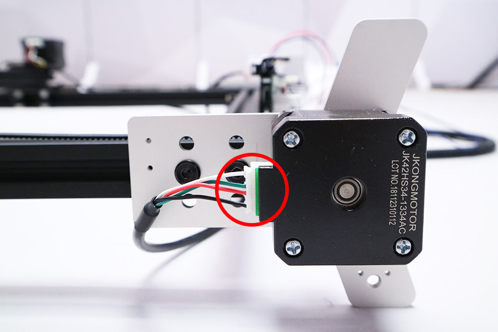

本体を立て、写真の赤丸にM3後入れナット2個を挿入します。
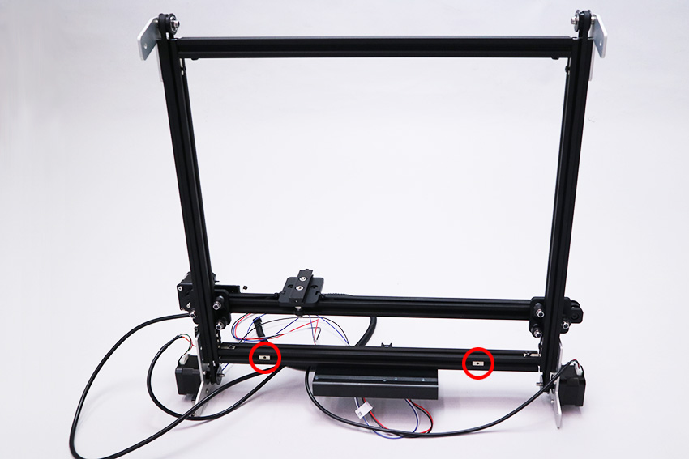

先ほど入れたM3後入れナットに結束バンド固定具をM3&times;6六角穴付ボルトで取り付けます。
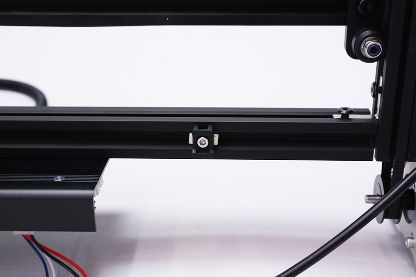

先ほど取り付けた結束バンド固定具（左側）に、X-Axisケーブル、Y-Axis-Lケーブル、Foot Switchケーブルを結束バンドで固定します。  
※USBケーブル接続部分（赤丸）にケーブルがかぶらないように配線してください。
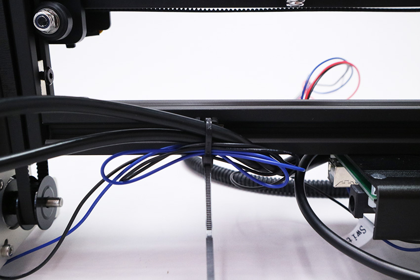

## Laserケーブルの固定
PCBケースの背面にコルゲートチューブを結束バンドで固定します。
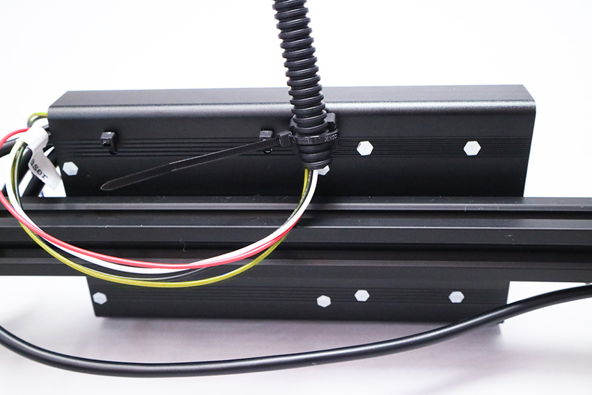

コルゲートチューブの反対側を光学ステージ（mini v plate_C）のM4&times;8低頭ボルトに結束バンドで固定します。
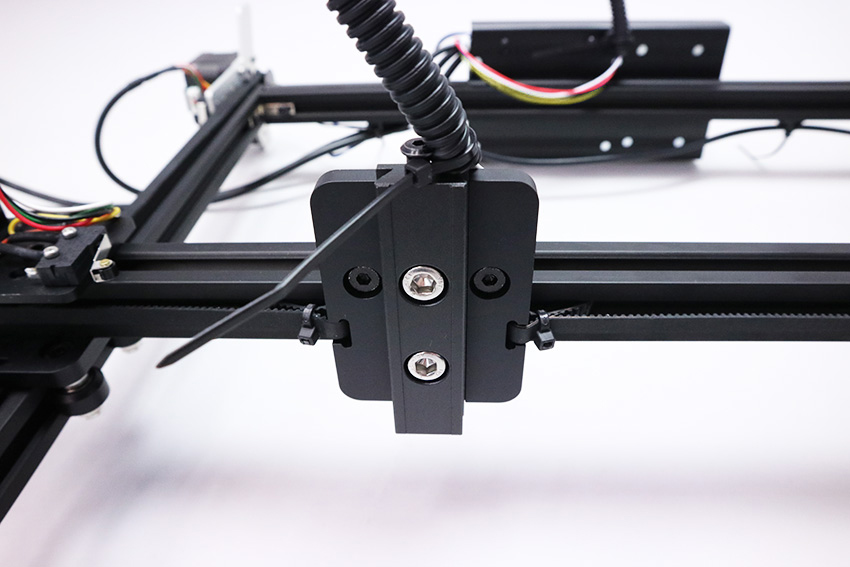

LaserケーブルとY-Axis-Rケーブルを結束バンドで2ヵ所固定します。
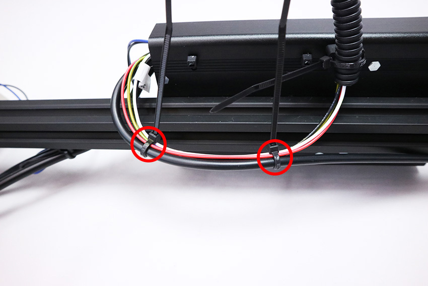

最後に、結束バンドの不要な部分を切り取ります。
