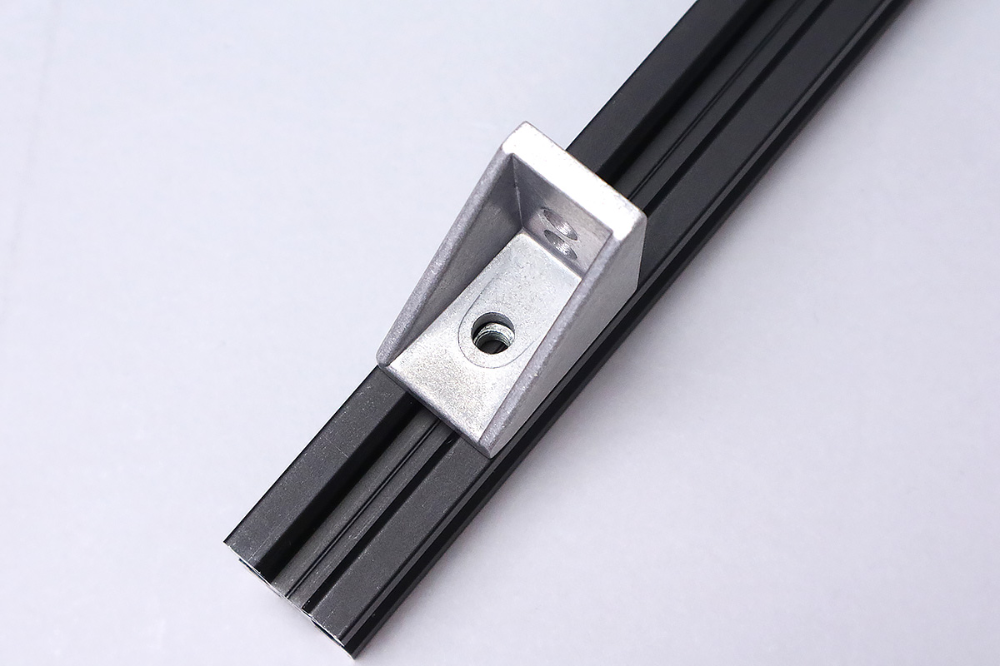
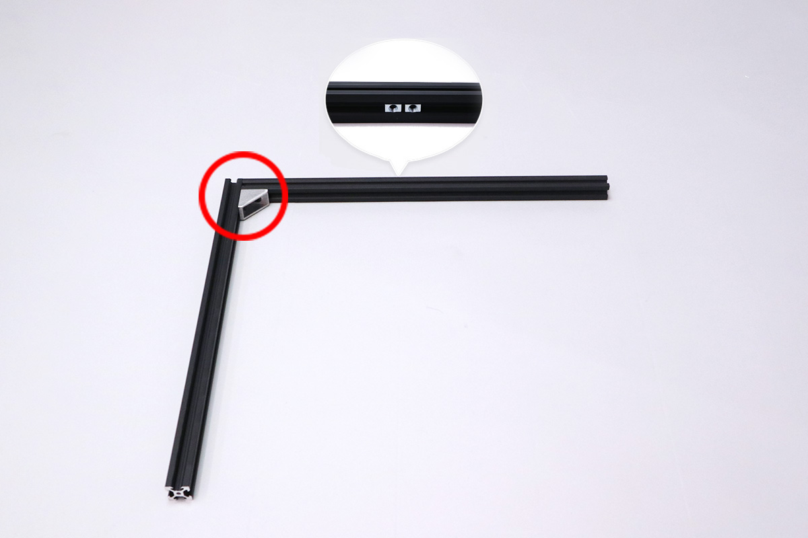
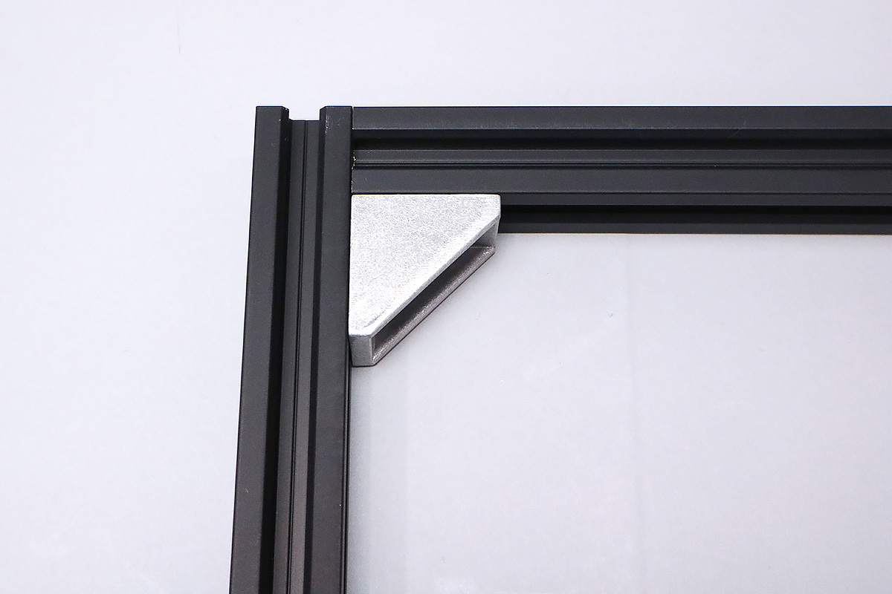
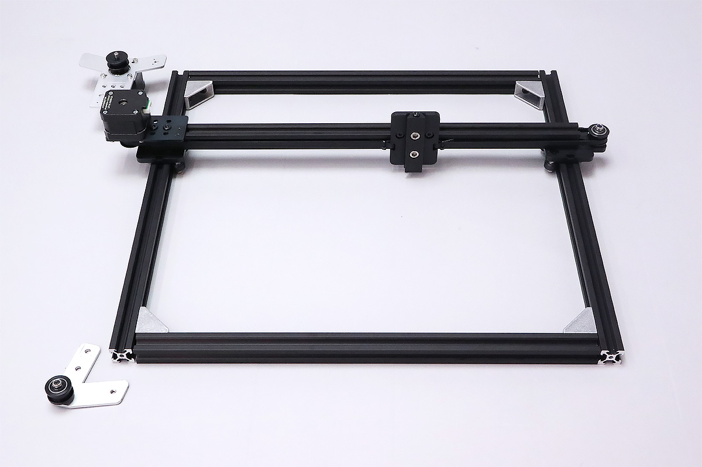
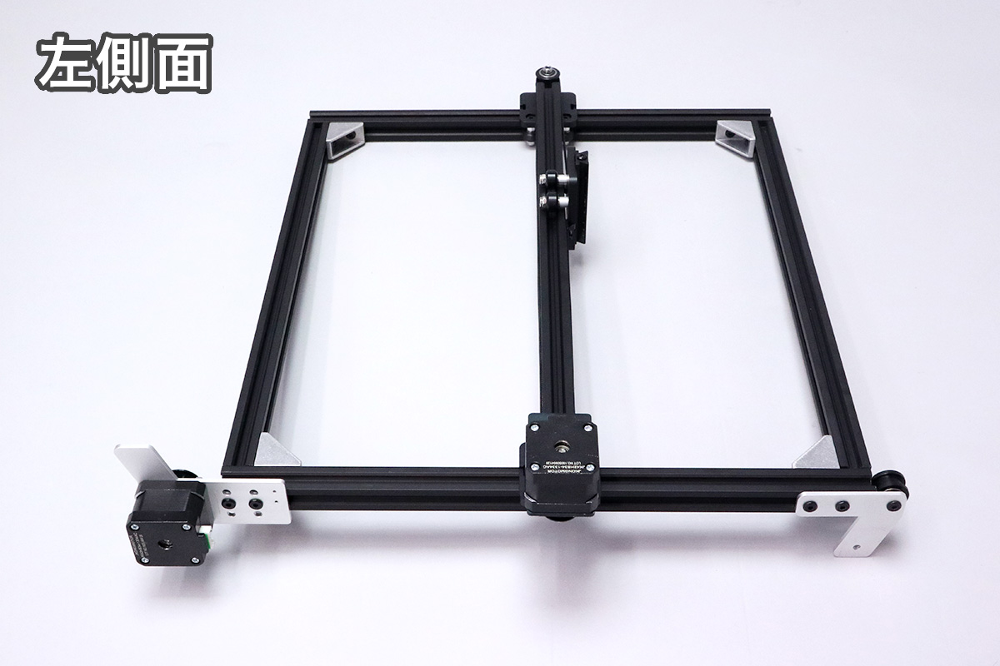
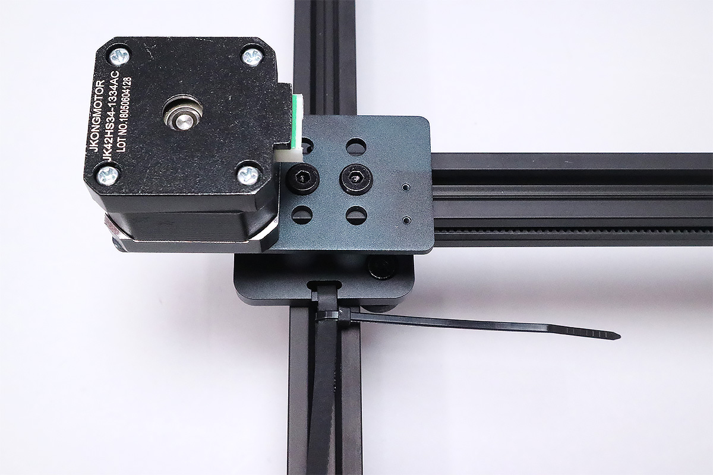
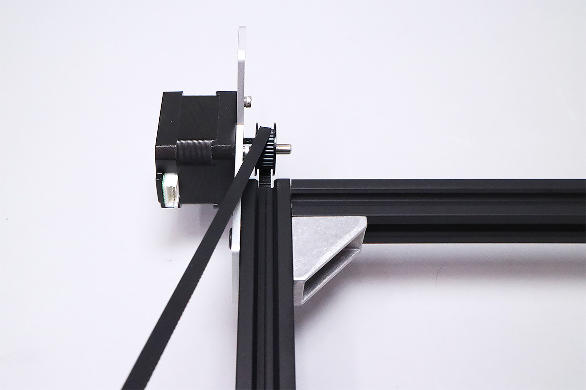
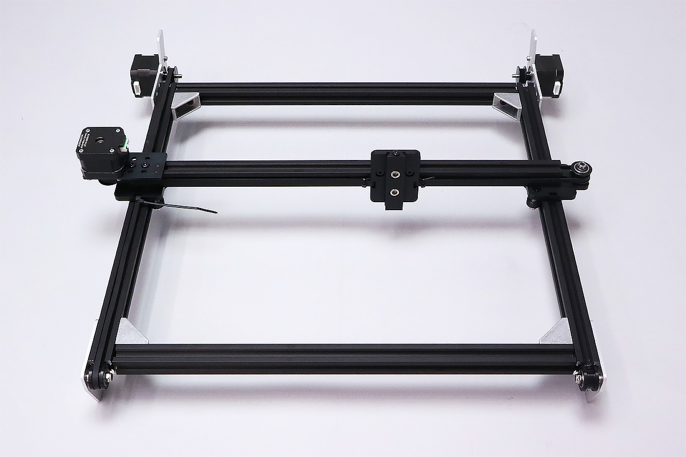

## 部品リスト
<table class="packing-list">
<tbody>
<tr>
<td>No</td>
<td>部品名</td>
<td>備考</td>
<td class="packing-img">画像</td>
<td>個数</td>
</tr>
<tr>
<td></td>
<td>X軸ユニット</td>
<td></td>
<td></td>
<td>1</td>
</tr>
<tr>
<td>2</td>
<td>V-slot 410mm</td>
<td>300x230mmで使用</td>
<td></td>
<td>4</td>
</tr>
<tr>
<td></td>
<td>Y軸モーター</td>
<td></td>
<td></td>
<td>2</td>
</tr>
<tr>
<td>26</td>
<td>idler pulley plate</td>
<td></td>
<td></td>
<td>2</td>
</tr>
<tr>
<td></td>
<td>タイミングベルト100cm</td>
<td></td>
<td></td>
<td>2</td>
</tr>
<tr>
<td>46</td>
<td>M5Tナット</td>
<td>ネジケース</td>
<td></td>
<td>36</td>
</tr>
<tr>
<td>4</td>
<td>ブラケット</td>
<td>一部の製品には黒色のブラケットが入っています</td>
<td></td>
<td>4</td>
</tr>
<tr>
<td>45</td>
<td>M5×8低頭ボルト</td>
<td>ネジケース</td>
<td></td>
<td>36</td>
</tr>
<tr>
<td>25</td>
<td>結束バンド</td>
<td></td>
<td></td>
<td>1</td>
</tr>
</tbody>
</table>

## Tナット・ブラケットの取り扱いついて
フレーム組み立てに使用するTナット・ブラケットの取り扱いについて説明します。この説明をご覧いただいた後に実際の組み立てに入ってください。

Tナットには、表と裏があるので注意してください。

アルミフレームの溝に表を上にしたTナットを入れます。

ブラケットには穴が２つ空いている面がありますが、中心に近い穴のみを使用します。

Tナットの上にブラケットを載せ、2つの穴位置を合わせます。

ネジ締めを行うことでブラケットを固定でき、写真のように2つのアルミフレームを固定できます。

## フレームの組み立て
平で水平な机の上でフレーム組み立てを行ってください。

まず、V-slot 410mmにM5Tナット2個を入れます。

先程のV-slot 410mm と（写真奥のフレーム、M5Tナットを入れた面を奥に向けてください）、V-slot 410mm 2本を組み合わせます。左上の角にブラケットを入れておきます。

M5&times;8低頭ボルトでブラケットを固定します。

右上の角も、同様の手順で固定します。

X軸ユニットを先程組み立てたフレームに通します。X軸ユニットの向きに注意して、V-slot 410mmの溝と、mini v wheelを合わせて通します。

最後の1辺にフレームを取り付けます。写真の赤丸の位置にブラケットを入れて、M5&times;8低頭ボルトで固定してください。

### チェックポイント　Y軸確認 １
Y軸の動作を手動で確認します。以下の動画のように、X軸ユニットがスムーズに動く状態が正常となります。

<iframe width="560" height="315" src="https://www.youtube.com/embed/3kBx3myEY30" frameborder="0" allow="accelerometer; autoplay; encrypted-media; gyroscope; picture-in-picture" allowfullscreen></iframe>

X軸が揺れる場合は偏心スペーサーの調整をしてください。

引っかかりを感じる場合は、アルミフレームの調整を行います。アルミフレームの製造上の公差により、アルミフレームの寸法が合わない場合があります。こういった場合は、アルミフレームに隙間を設けて調整してください。

このように隙間ができても問題ありません。

## idler pulley plate・Y軸モーターユニットの取り付け
左手前にidler pulley plate、左奥にY軸モーターユニットを取り付けます。

左手前にM5Tナット2個を入れ、idler pulley plateをM5&times;8低頭ボルト2個で取り付けます。（写真は左側面を写しています）  
※後工程で最終的な位置調整は行いますので、写真を参考にidler pulley plateのidler pulley（黒い円盤状の部品）がv-slot 410mmに触れる程度で仮止めをします。

次に左奥にM5Tナット2個を入れ、Y軸モーターユニットをM5&times;8低頭ボルト2個で取り付けます。  
※Y軸モーターユニットは、取り付けた際に右側の小さい穴が上部にくるものを使用してください。

取り付けた際に、Y軸モーターユニットの線と、奥に見えるアルミフレームの端が一直線上に来るように位置を調整してください。内側にも同じ位置に線があるので、その線とV-slot 410mmの先端がぴったり合っているかを確認してください。

タイミングプーリーの位置を調整し固定します。タイミングプーリーをv-slot 410mmの溝と同位置に調整し、イモネジ2個をしっかりと締め固定してください。ずれている場合は、位置を調節した上で固定します。

反対側も同じ要領でidler pulley plateとY軸モーターユニットを取り付けます。

## タイミングベルトの取り付け
加工エリア300&times;230の製品をご購入の方は、付属のタイミングベルト2本を1000mm残して切り取ってご使用ください。  
X軸と同じように、結束バンドを使いながらタイミングベルトを取り付けます。タイミングベルトをmini v plate_Rに通し結束バンドで固定します。

手前と奥のプーリーを通し、mini v plate_Rに結束バンドで固定してください。ベルトの張りは後ほど調整するため、多少ゆるみをもたせてください。

タイミングベルトをしっかりと張るため、idler pulley plate側のねじを一度緩め、写真を参考に引っ張りながら再度ねじを締めます。しっかりとタイミングベルトが張っていることを確認してください。

反対側も同じ要領で、タイミングベルトを取り付けたのち、idler pulley plateを引っ張りタイミングベルトをしっかり張ってください。

タイミングベルトが余っている場合は、20〜30mm程度残して切り取ってください。
最後に、結束バンドの不要な部分を切り取ります。

### チェックポイント　Y軸確認 2
タイミングベルトを取り付けた状態で再度Y軸の確認を行います。X軸ユニットを手動で動かし、少しでも引っかかりがある場合は偏心スペーサーを調整してください。

