## ユニット/パーツの取り外し
PCBケースをあけ、ケーブルをまとめている結束バンドを切断します。
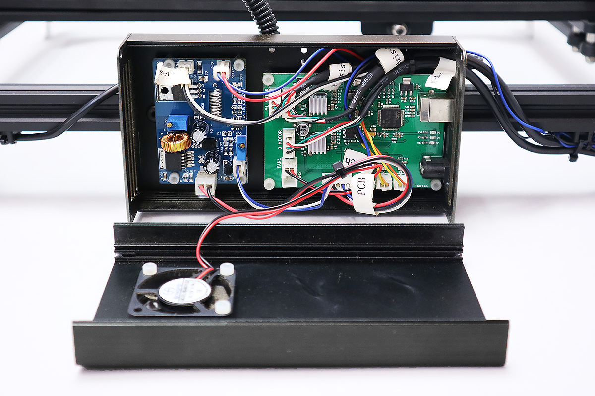

基板に取り付けられているケーブル類を取り外し、またPCBケース右側面も外します。
（ファンをケースから取り外す必要はありません。）
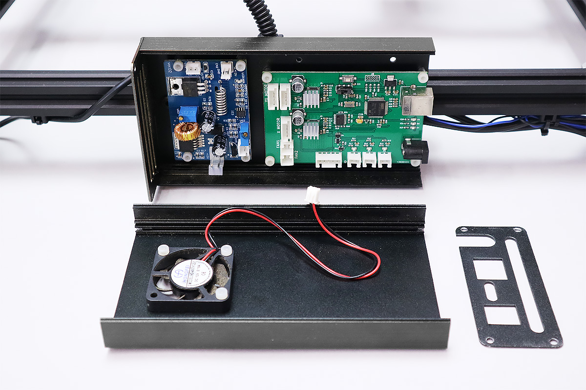

レーザー基板・コントロール基盤を取り外します。
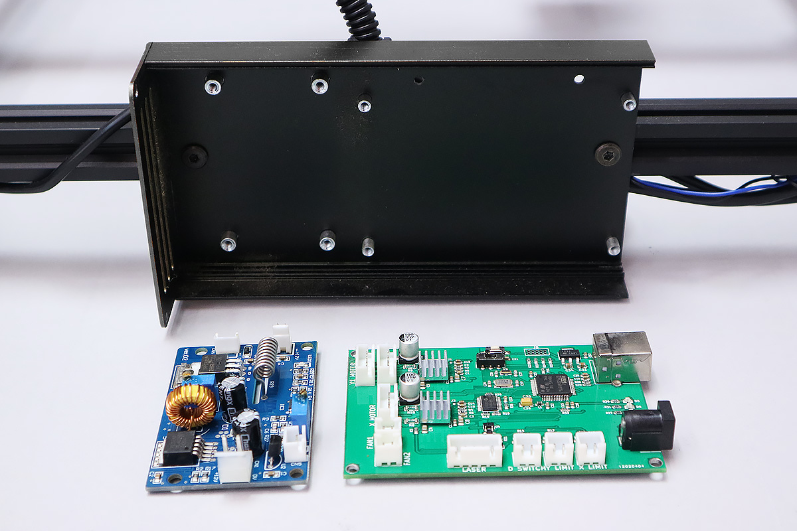

すべてのケーブル類を本体から取り外します。
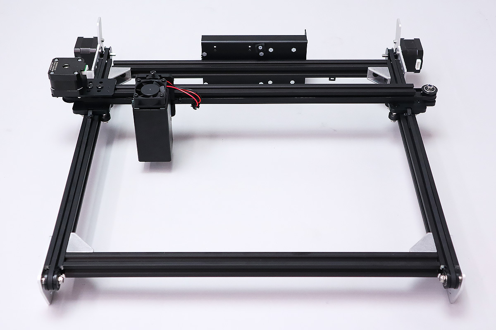

すべてのユニットを本体フレームから取り外し、フレーム自体もバラバラにします。
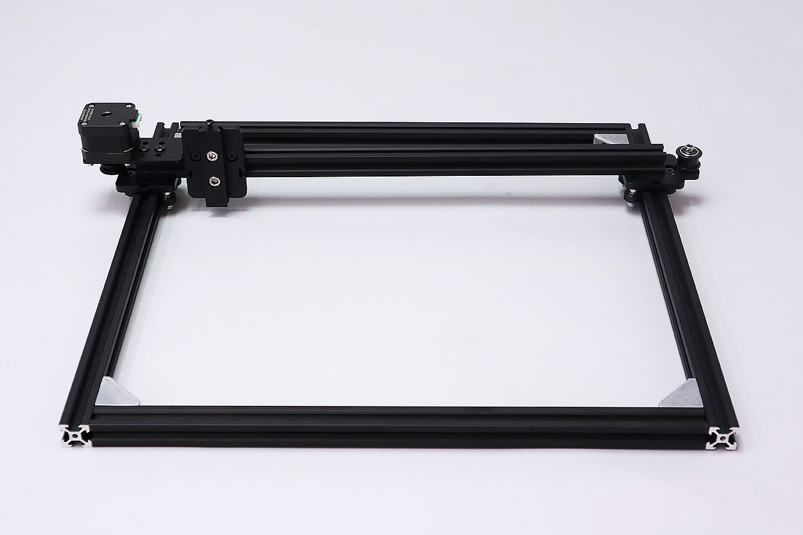

フレームに取り付けてある結束バンド固定具・M5Tナットなどすべて取り外してください。
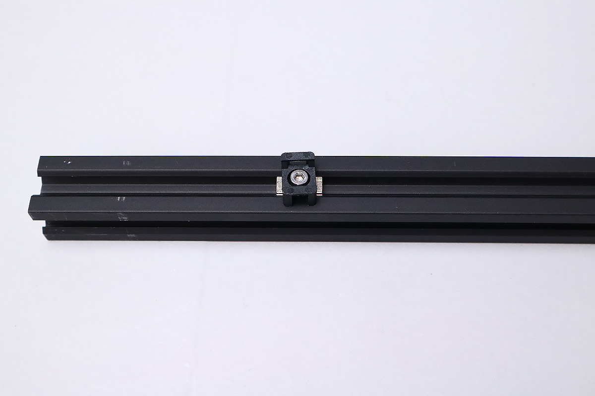

## 組み換えで使用する取り外した部品
<table class="packing-list">
<tbody>
<tr>
<td>部品名</td>
<td>備考</td>
<td class="packing-img">画像</td>
<td>個数</td>
</tr>
<tr>
<td>直角ブラケット</td>
<td>ご使用のFABOOL Laser Miniが2019年7月9日以前の出荷の方は、拡張フレームの箱に同梱しています</td>
<td>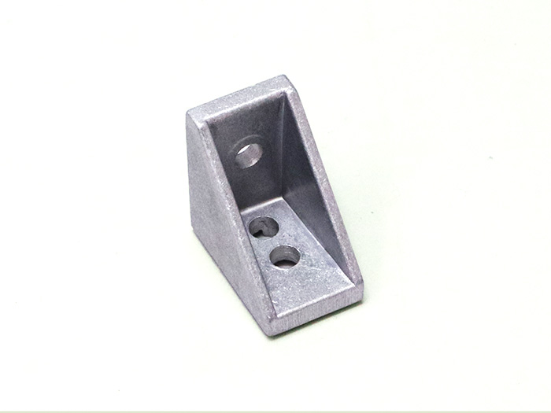</td>
<td>4</td>
</tr>
<tr>
<td>mini v plate_C</td>
<td>光学ステージ取り付け済み</td>
<td></td>
<td>1</td>
</tr>
<tr>
<td>mini v plate_L</td>
<td>加工エリア60cm×42cmに組み換えの場合のみ使用</td>
<td></td>
<td>1</td>
</tr>
<tr>
<td>mini v plate_R</td>
<td>加工エリア60cm×42cmに組み換えの場合のみ使用</td>
<td></td>
<td>1</td>
</tr>
<tr>
<td>レーザーユニット</td>
<td>光学キャリア取り付け済み</td>
<td></td>
<td>1</td>
</tr>
<tr>
<td>レーザー基板 （1.6W/3.5W）</td>
<td></td>
<td></td>
<td>1</td>
</tr>
<tr>
<td>X軸モーターユニット</td>
<td></td>
<td>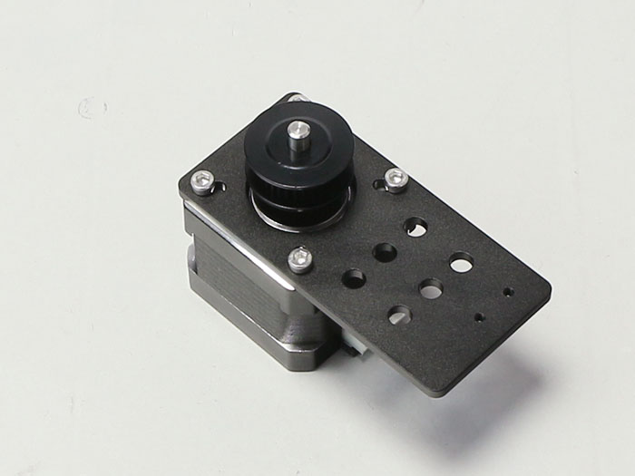</td>
<td>3</td>
</tr>
<tr>
<td>Y軸モーターユニット</td>
<td></td>
<td>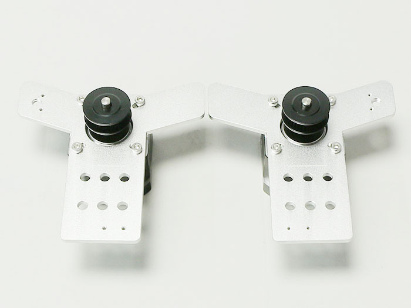</td>
<td>3</td>
</tr>
<tr>
<td>PCBケース</td>
<td>DCファン取り付け済み</td>
<td></td>
<td>1</td>
</tr>
<tr>
<td>結束バンド固定具</td>
<td></td>
<td></td>
<td>3</td>
</tr>
<tr>
<td>ACアダプター</td>
<td></td>
<td></td>
<td>1</td>
</tr>
<tr>
<td>ACケーブル</td>
<td></td>
<td></td>
<td>1</td>
</tr>
<tr>
<td>USBケーブル</td>
<td></td>
<td></td>
<td>1</td>
</tr>
<tr>
<td>コントロール基板</td>
<td></td>
<td></td>
<td>1</td>
</tr>
<tr>
<td>M2&times;10 六角穴付ボルト</td>
<td rowspan="12">ネジケース</td>
<td>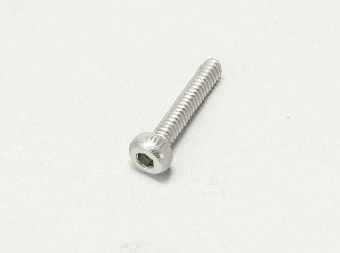</td>
<td>6</td>
</tr>
<tr>
<td>M3&times;5 ナイロンネジ</td>
<td></td>
<td>8</td>
</tr>
<tr>
<td>M3&times;6 六角穴付ボルト</td>
<td></td>
<td>2</td>
</tr>
<tr>
<td>M3&times;6 六角穴付皿ボルト</td>
<td>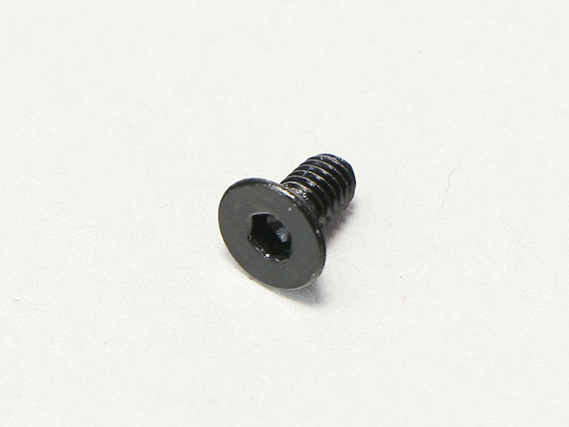</td>
<td>6</td>
</tr>
<tr>
<td>M3後入れナット</td>
<td></td>
<td>2</td>
</tr>
<tr>
<td>M5&times;6 低頭ボルト</td>
<td></td>
<td>2</td>
</tr>
<tr>
<td>M5&times;8 低頭ボルト</td>
<td></td>
<td>22</td>
</tr>
<tr>
<td>M5 Tナット</td>
<td></td>
<td>24</td>
</tr>
</tbody>
</table>

後の工程は各加工エリアのマニュアルをご覧ください。
<a href="/manual/fabool-laser-mini-300-230-x-axis-assembly/">加工エリア 60cm&times;42cm X軸の組み立て</a>
<a href="/manual/fabool-laser-mini-plus-1000-1000-x-axis-assembly/">加工エリア 100cm&times;100cm、150cm&times;150cm X軸の組み立て</a>
