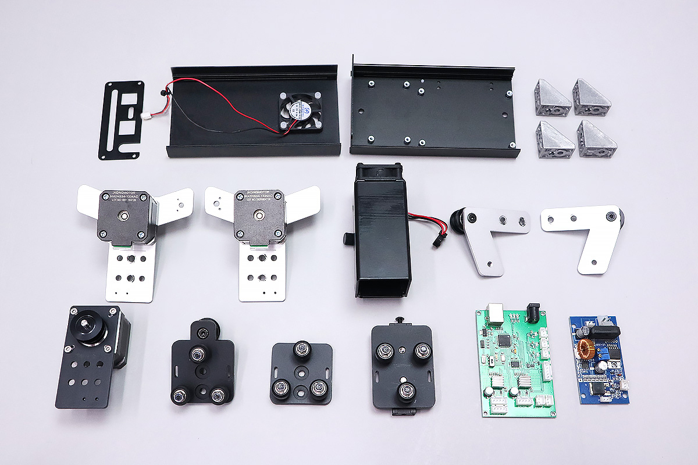
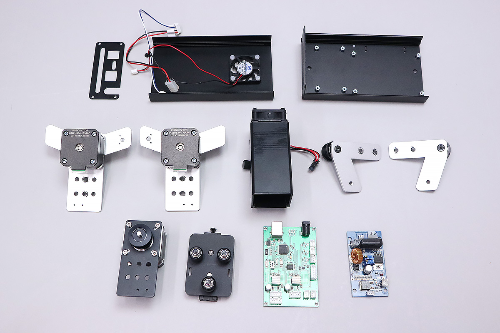

こちらのマニュアルは、FABOOL Laser Miniの加工エリア30cm×23cmをご使用の方が、他の加工エリアのサイズに組み替える際にご覧ください。

## ユニット/パーツの取り外し
PCBケースをあけ、ケーブルをまとめている結束バンドを切断します。

基板に取り付けられているケーブル類を取り外し、またPCBケース右側面も外します。
（ファンをケースから取り外す必要はありません。）

レーザー基板・コントロール基盤を取り外します。

すべてのケーブル類を本体から取り外します。

すべてのユニットを本体フレームから取り外し、フレーム自体もバラバラにします。

フレームに取り付けてある結束バンド固定具・M5Tナットなどすべて取り外してください。

加工エリアを60cm&times;42cmに組み換えする方は、この後の工程で使用するFabool Laser Miniの部品は以下の写真に写る部品です。
ここまでの工程で取り外したボルト類も後の工程で使用します。
※ご使用の製品によって、フレームを固定する部品が直角ブラケットではなくL字ブラケットの場合がございます。その場合、L字ブラケットをそのまま使用してください。

加工エリアを100cm&times;100cm、150cm&times;150cmに組み換えする方は、この後の工程で使用するFabool Laser Miniの部品は以下の写真に写る部品です。
ここまでの工程で取り外したボルト類も後の工程で使用します。

後の工程は各加工エリアのマニュアルをご覧ください。

<a href="/manual/fabool-laser-mini-300-230-x-axis-assembly/">加工エリア 60cm&times;42cm X軸の組み立て</a>

<a href="/manual/fabool-laser-mini-plus-1000-1000-x-axis-assembly/">加工エリア 100cm&times;100cm、150cm&times;150cm X軸の組み立て</a>
