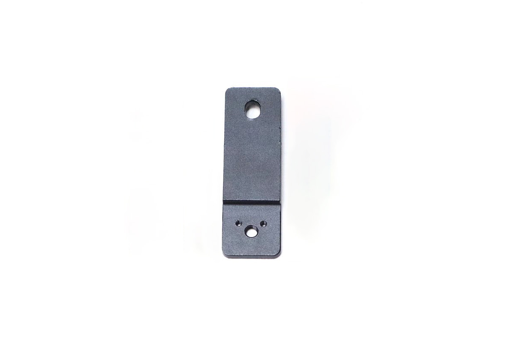
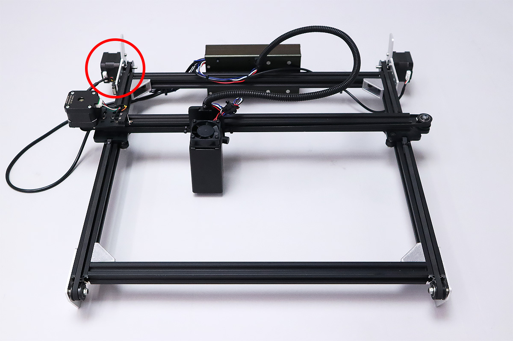
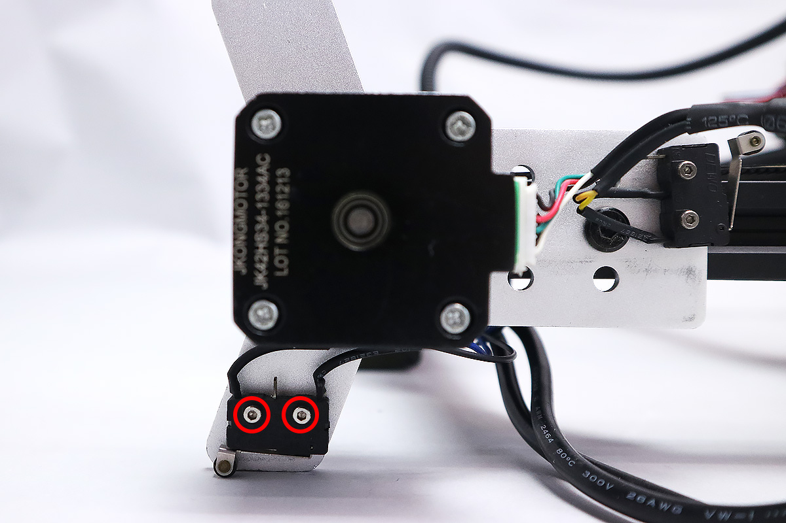
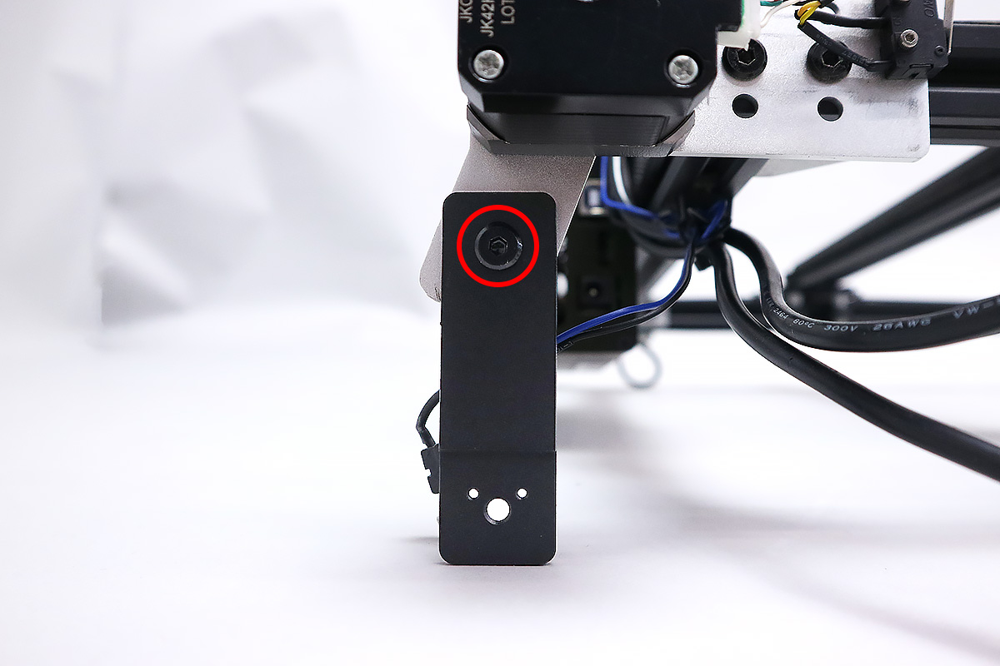
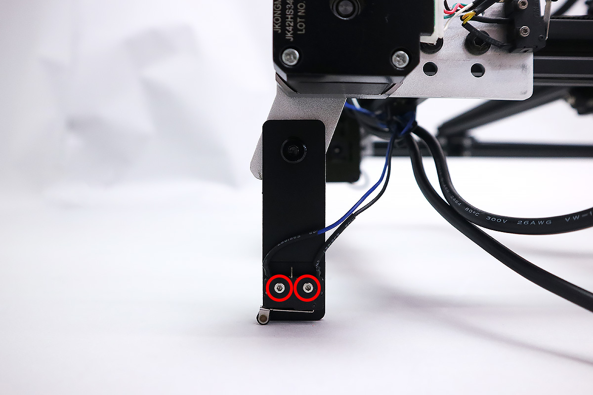
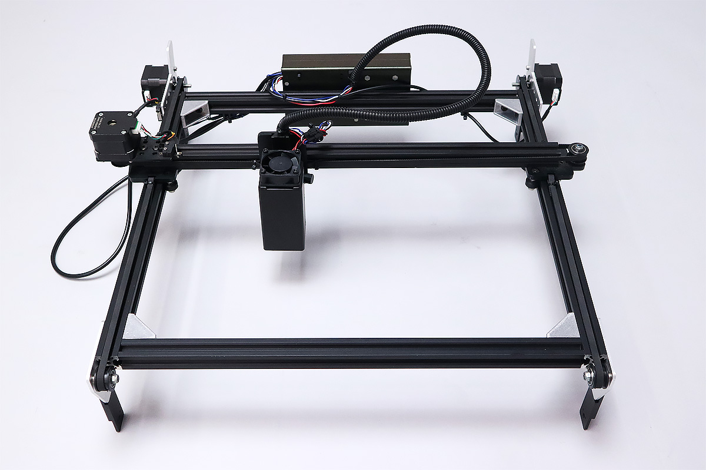

## 部品リスト
<table class="packing-list">
<tbody>
<tr>
<td>部品名</td>
<td>備考</td>
<td class="packing-img">画像</td>
<td>個数</td>
</tr>
<tr>
<td>高さプレート</td>
<td></td>
<td></td>
<td>4</td>
</tr>
<tr>
<td>M5&times;6低頭ボルト</td>
<td></td>
<td></td>
<td>4</td>
</tr>
</tbody>
</table>

## 高さプレート取り付け
FABOOL Laser Miniに取り付けられているFoot Switchケーブルのリミットスイッチを取り外します。M2&times;10 六角穴付ボルトは後の工程で使用しますのでなくさないように注意してください。

高さプレートをすべての足にM5&times;6低頭ボルトで取り付けます。

取り外しておいたFoot SwitchケーブルのリミットスイッチをM2×10六角穴付ボルトで取り付けます。

